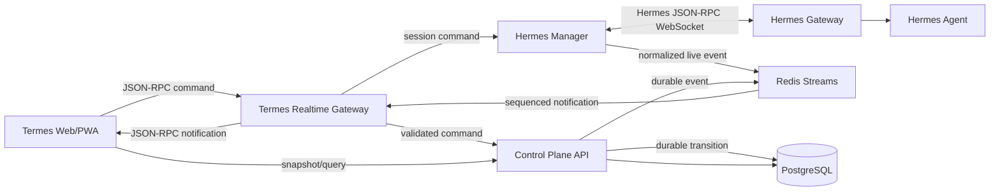

# Hermes App 기능의 Termes 통합 분석 및 실행 계획

> **정본 아키텍처:** 이 문서의 분석을 바탕으로 확정한 기능·프로토콜·성능 설계는
> [`hermes-termes-parity-master-plan.md`](./hermes-termes-parity-master-plan.md)를 따른다.
> 두 문서가 충돌하면 Parity-First Master Plan이 우선한다.
> 단계별 구현과 안정화 Gate는
> [`hermes-termes-implementation-execution-plan.md`](./hermes-termes-implementation-execution-plan.md)를 따른다.

## 1. 문서 목적

이 문서는 `realfishsam/hermes-agent`의 데스크톱·모바일 앱을 현재 코드 기준으로 분석하고, Hermes 앱의 강점을 Termes에 흡수하되 Termes의 Project First, Task, Device, Plan, Approval, Verification 중심 제품 개념과 서버 원장을 훼손하지 않는 구현 계획을 정의한다.

이 문서는 UI 복제 계획이 아니다. Hermes의 실시간 대화 런타임과 풍부한 도구 표현은 채택하고, Termes가 이미 가진 프로젝트·작업·장치 실행·검증·감사 구조는 상위 제품 모델로 유지한다.

## 2. 분석 기준과 범위

- Hermes 기준 저장소: <https://github.com/realfishsam/hermes-agent>
- 분석 기준 커밋: [`7fb875451bcef8c379ece6779c6b147eef42c05d`](https://github.com/realfishsam/hermes-agent/tree/7fb875451bcef8c379ece6779c6b147eef42c05d)
- 커밋 일시: 2026-06-30
- Termes 기준 커밋: `b3444e7`
- Termes의 작업 트리에 존재하는 미커밋 변경까지 현재 코드로 간주하여 분석했다.
- 집중 범위:
  - Hermes Desktop Renderer와 Electron bridge
  - Hermes Mobile Expo/WebView shell과 모바일 전용 CSS
  - JSON-RPC gateway, 세션 수명주기, 스트림 reducer
  - 메시지·reasoning·tool·승인·질문 UI
  - 테마 토큰과 테마 적용 과정
  - Termes Web/API/Hermes Manager/Orchestrator/DB 이벤트 경로

### 2.1 사실 구분 원칙

Hermes 모바일 README와 아키텍처 문서에는 네이티브 캡처, 오디오, 업로드 큐, AsyncStorage 기반 구성이 기술되어 있으나 현재 코드에서는 해당 구현을 확인할 수 없다. 현재 모바일 앱의 실제 구현은 Expo 네이티브 셸 안에 데스크톱 웹 렌더러를 WebView로 실행하는 구조다. 따라서 이 문서는 다음 표기를 따른다.

- **구현 확인**: 현재 코드 경로와 실행 흐름이 존재한다.
- **문서상 의도**: 문서에는 있으나 현재 실행 코드가 없다.
- **Termes 제안**: 두 프로젝트 어디에도 아직 완성 구현이 없으며 이 계획에서 새로 설계한다.

## 3. 핵심 결론

1. Hermes의 가장 가치 있는 자산은 화면 외형이 아니라 `세션 기반 JSON-RPC + 구조화된 메시지 파트 + 33ms 단위 UI 병합 + 인라인 승인/질문`으로 이어지는 실시간 런타임이다.
2. Termes의 가장 중요한 자산은 `Project → Task → Plan → Agent Run → Device Command → Verification`의 영속 원장이다. 이 모델을 Hermes의 session 중심 모델로 대체하면 안 된다.
3. JSON-RPC 2.0은 Hermes 연동 경계와 UI의 양방향 실시간 명령에 사용한다. Task·Plan·Device·Verification의 확정 이력은 PostgreSQL 이벤트 원장을 유지한다.
4. 브라우저나 모바일 WebView가 Hermes에 직접 연결하지 않는다. `hermes-manager`가 Hermes gateway와 연결하고, Termes API가 인증된 단일 실시간 endpoint를 제공한다.
5. Hermes의 데스크톱 렌더러를 복사하거나 WebView에 그대로 넣지 않는다. 현재 Termes PWA를 우선 고도화하고, 네이티브 기능이 실제로 필요해질 때 얇은 네이티브 셸을 추가한다.
6. Hermes의 색과 브랜딩을 복제하지 않는다. 테마 시스템의 구조만 도입하고, Termes의 현재 짙은 남색·청색 신호 계열과 프로젝트/검증 중심 정보 위계를 새 semantic token으로 재정립한다.

## 4. Hermes Desktop 실제 구현 분석

### 4.1 애플리케이션 구조

Desktop은 Electron main process와 React renderer로 나뉜다. renderer 최상위는 Error Boundary, React Query, i18n, Theme, Haptics, Router provider를 조합한다. 화면은 chat, skills, messaging, artifacts, cron, profiles, agents, settings, command center로 확장되며, chat 화면 자체도 독립된 pane orchestration을 가진다.

주요 특성:

- 좌측: 새 세션, Skills & Tools, Messaging, Artifacts, 세션 검색과 프로필/채널별 세션 목록
- 중앙: 대화 thread, 메시지 composer, 모델·reasoning·첨부·음성 제어
- 우측: preview, file, review, terminal을 필요할 때 여는 작업 pane
- 좁은 폭: 좌우 pane을 접고 overlay 또는 단일 pane으로 전환
- pane 폭은 조절 가능하고 좌우 위치를 바꿀 수 있음
- terminal은 다른 rail과 경쟁할 때 하단 row로 이동 가능
- 서버 상태 조회는 React Query, 고빈도 실시간 상태는 nanostores로 분리

이 구조에서 중요한 점은 앱 전체를 하나의 컴포넌트 상태로 관리하지 않는다는 것이다. session, gateway, prompt, clarify, subagent, todo, tool diff, preview, pane, project, notification이 별도 store로 분리된다.

### 4.2 대화 렌더링 경계

Hermes의 `ChatView`는 토큰마다 전체 화면이 다시 렌더링되지 않도록 설계되어 있다. 메시지 store를 구독하는 경계를 `ChatRuntimeBoundary`에 제한하고, assistant-ui External Store runtime으로 thread를 구성한다. 스트림이 초당 수십 번 갱신되어도 sidebar, header, pane orchestration이 같이 다시 그려지지 않는다.

메시지는 단일 `content: string`이 아니라 다음과 같은 ordered parts로 표현된다.

| 파트 | UI 표현 | 스트림 중 처리 |
| --- | --- | --- |
| text | Markdown 본문 | 인접 text segment에 delta 병합 |
| reasoning | 접이식 reasoning 블록 | 별도 버퍼로 병합 후 완료 표시 |
| tool-call | 도구명, 상태, 요약, 인수/결과 | stable tool ID로 start/progress/complete upsert |
| clarify | 선택지와 자유 입력 카드 | 같은 tool 위치에 대기 UI 삽입 |
| approval | 명령·위험도·승인 범위 카드 | 응답 전까지 해당 세션 needs-input 유지 |
| image/media | 생성 또는 첨부 이미지 | tag를 구조화된 media part로 변환 |
| diff | 파일별 변경 요약과 patch | tool result의 diff metadata로 연결 |
| terminal/process | 명령, 출력, 종료 상태 | 진행 상태와 완료 결과를 같은 part에 병합 |
| error | 실패 메시지와 복구 상태 | incomplete assistant message를 명시적 error로 종결 |

도구 호출은 텍스트 파트 사이의 순서 경계다. 도구 실행 전후의 assistant text를 무조건 한 문자열로 합치지 않기 때문에 사용자가 실제 실행 순서를 읽을 수 있다.

### 4.3 실시간 스트림 처리

Hermes frontend의 `useMessageStream`은 session별 `ClientSessionState`를 유지한다.

1. `message.start`에서 pending assistant message를 만든다.
2. `message.delta`, `reasoning.delta`는 즉시 React state에 반영하지 않고 session별 버퍼에 쌓는다.
3. `requestAnimationFrame` 또는 timer를 이용해 약 33ms 간격으로 버퍼를 flush한다.
4. `tool.start` 전에 text/reasoning 버퍼를 먼저 flush하여 화면 순서를 보존한다.
5. `tool.progress`, `tool.complete`는 stable ID를 기준으로 기존 tool part를 갱신한다.
6. `clarify.request`, `approval.request`, `sudo.request`, `secret.request`는 session의 blocking interaction으로 등록한다.
7. `message.complete`에서 남은 delta를 flush하고 최종 text와 live text를 중복 없이 병합한다.
8. live stream이 불충분할 때만 durable transcript를 다시 읽어 정합성을 맞춘다.
9. background session의 이벤트도 보존하고 해당 세션에 needs-input badge를 남긴다.

핵심은 **delta마다 전체 transcript를 다시 조회하지 않는 것**과 **실시간 projection을 영속 transcript와 구분하는 것**이다.

### 4.4 Hermes JSON-RPC gateway

공유 gateway client는 WebSocket 위에 JSON-RPC 2.0을 구현한다.

- 요청마다 numeric ID와 pending promise를 등록한다.
- timeout과 AbortSignal을 지원한다.
- 연결 종료 시 처리 중 요청을 모두 명시적으로 reject한다.
- server event는 JSON-RPC notification으로 전달한다.
- 연결 상태를 store에 게시한다.
- wake, network, visibility 변경 후 재접속한다.
- 재접속 간격은 1, 2, 4초 형태로 증가하며 최대 15초로 제한한다.
- profile별 background session이 필요할 때 보조 gateway connection을 만들고 유휴 연결을 제거한다.

주요 이벤트는 다음과 같다.

```text
gateway.ready
session.info
message.start | message.delta | message.complete
thinking.delta | reasoning.delta | reasoning.available
status.update
tool.start | tool.progress | tool.complete | tool.generating
clarify.request | approval.request | sudo.request | secret.request
background.complete
error
skin.changed
```

주요 method 범위:

```text
session.create/list/resume/activate/delete/title/status/history/undo/compress/save/close/branch
session.interrupt/steer
prompt.submit/background
attachment.*
clarify.respond/approval.respond/sudo.respond/secret.respond
project.tree
process.*
config.*
model.*
voice.*
cron.*
skills.*
tools.*
```

Python WebSocket gateway는 TUI stdio가 사용하는 dispatch를 그대로 재사용한다. `prompt.submit`은 세션이 busy일 때 단순 실패시키지 않고 queue, steer, interrupt 정책을 적용한다. 첫 prompt 전에는 빈 세션을 DB에 영속하지 않고, prompt가 실제 제출될 때 durable session을 만든다.

### 4.5 Agent callback과 blocking interaction

Agent 실행 콜백은 UI가 해석 가능한 안정된 payload를 만든다.

- tool start: `tool_id`, name, context, 제한·마스킹된 args
- tool progress: 진행 메시지 또는 부분 결과
- tool complete: parsed result, summary, duration, todo, inline diff, error
- reasoning: 별도 reasoning delta
- blocking request: request ID를 만들고 request event를 보낸 후 사용자 응답을 기다림

Approval UI는 once, session, always, deny 범위를 제공하며 영구 승인은 추가 확인을 요구한다. Clarify UI는 키보드 선택 가능한 옵션과 Other, Continue, Skip을 제공한다. `tool.start`가 `clarify.request`보다 먼저 도착하는 경우에도 동일 tool part가 spinner에서 질문 카드로 자연스럽게 바뀐다.

### 4.6 Theme 시스템

Hermes 테마는 색상 값을 컴포넌트에 직접 넣지 않는다. 계층은 다음과 같다.

```text
Theme seed
  → semantic theme variables
  → --ui-* surface/text/stroke variables
  → --dt-* component/Tailwind variables
  → component styles
```

테마 데이터에는 background, foreground, card, muted, popover, primary, secondary, accent, border, input, ring, midground, composer, destructive, sidebar, user bubble과 terminal ANSI palette, font 정보가 포함된다.

ThemeProvider는 다음을 수행한다.

- profile별 theme와 light/dark/system mode를 별도 저장
- built-in theme와 사용자 theme registry 병합
- root dataset, class, `color-scheme`, CSS variables 적용
- native title bar와 Electron nativeTheme 동기화
- 첫 paint 전 저장된 theme를 적용하여 flash 방지
- font URL 동적 적용
- VS Code theme import와 대비 보정
- dark-only theme의 light palette 합성

Termes가 가져와야 할 것은 이 토큰 계층과 적용 수명주기다. Hermes의 Nous 색상·서체·브랜드는 가져오지 않는다.

## 5. Hermes Mobile 실제 구현 분석

### 5.1 현재 앱의 실제 구조

현재 `App.native.tsx`는 Expo React Native 앱이지만 UI 대부분은 하나의 `react-native-webview`에서 실행된다.

- release: desktop renderer build의 HTML, JS, CSS, font, image를 data URI로 inlining하여 번들
- development: Vite dev server URL 로드
- WebView 시작 전 `window.hermesDesktop` bridge와 mobile marker 주입
- HTTP 요청은 RN bridge가 대신 수행하여 WKWebView CORS 회피
- 실시간 WebSocket은 WebView 안의 JSON-RPC gateway가 직접 연결
- 모바일 전용 `.native` 파일은 일부 desktop 기능을 no-op 또는 대체 구현으로 덮음
- TypeScript alias가 mobile 경로를 먼저 보고 없으면 복사된 desktop source를 사용

즉, native component로 다시 구현한 앱이 아니라 desktop renderer의 WebView 포팅이다.

### 5.2 모바일 UI 처리

모바일 전용 CSS는 `html.hermes-mobile-standalone` 범위에 적용된다.

- docked pane, desktop status bar, desktop chrome 숨김
- session sidebar를 drawer로 전환
- 중앙 chat을 full-bleed로 사용
- composer를 하단 safe area 위에 고정
- overlay를 화면 전체 detail view로 표시
- 터치 target을 대체로 44pt 이상 확보
- 키보드 inset을 반영해 composer 위치 조정
- hamburger 중심의 단순 navigation

실제 화면은 큰 여백, 최소한의 chrome, 하단 대형 composer, 파란 primary 신호가 중심이다. 다만 일부 상단 여백과 titlebar 값이 특정 iPhone 치수에 맞춰 하드코딩되어 있어 범용 장치 대응에는 취약하다.

### 5.3 모바일 연결과 보안

RN HTTP bridge는 base URL, profile ID, session token을 넣고 native fetch를 수행하며 30초 timeout을 둔다. WebSocket은 `/api/auth/ws-ticket`에서 single-use ticket을 발급한 뒤 `wss://.../api/ws?ticket=...`에 연결한다.

현재 코드의 문제:

- 연결 URL, token, profile이 WebView localStorage에 저장됨
- ticket 발급 실패 시 long-lived token을 query string에 넣는 경로가 존재함
- 누락된 desktop bridge method가 resolved `undefined`가 되는 광범위 proxy가 있음
- 지원하지 않는 기능이 명시적으로 실패하지 않아 모바일에서 조용히 기능이 사라질 수 있음
- desktop source를 copy script로 복제하므로 원본과 모바일 사본이 어긋날 위험이 큼

Termes에는 이 fallback 패턴을 도입하지 않는다. ticket 발급 실패는 연결 실패로 명시하고, 지원 기능은 capability handshake로 확정하며, credential은 네이티브 셸이 필요할 경우 OS secure storage에만 둔다.

### 5.4 문서와 실제 코드의 차이

| 항목 | Hermes 문서 | 현재 코드 확인 | Termes 판단 |
| --- | --- | --- | --- |
| 네이티브 화면 | 네이티브 경험을 지향 | WebView 기반 | PWA 우선, 네이티브는 필요한 capability만 |
| 오디오 캡처 | Expo Audio 흐름 기술 | 실제 capture/upload 흐름 미확인 | 별도 기능 단계로 검증 후 구현 |
| capture upload queue | spec에 기술 | 실행 코드 미확인 | 구현된 기능으로 간주하지 않음 |
| AsyncStorage | 저장소로 기술 | 연결 정보는 WebView localStorage | Termes native shell에서는 SecureStore 사용 |
| desktop parity | 높은 기능 동등성 | 동일 renderer 재사용으로 달성 | source 공유는 package 경계로 달성, 파일 복사 금지 |
| safe area | 대응 의도 | CSS와 일부 기기별 상수 혼재 | native/window metrics 단일 계약 사용 |

## 6. Termes 현재 구현 분석

### 6.1 유지해야 하는 제품 핵심

Termes는 단순 Hermes chat client가 아니다.

- Project First: repository와 workspace root가 모든 작업의 상위 문맥
- Task: 사용자 요구의 추적 단위
- Plan: capability 선택과 step 진행의 가시화
- Agent Run: Hermes 실행 단위
- Approval: 위험한 작업에 대한 통제
- Device: Android, Tizen, Linux, Windows, local mock 실행 표면
- Verification: 코드·장치 결과를 판정하는 증거
- Event/Audit: 모든 중요한 전이를 서버에서 보존

이 구조가 Hermes session보다 상위다. 한 Task가 하나 이상의 Hermes runtime session/run을 소유할 수 있지만, Task가 session으로 축소되어서는 안 된다.

### 6.2 현재 UI

`apps/web/src/main.tsx`는 프로젝트 목록, task 목록, chat, workbench, device, plan, verification, Hermes diagnostics와 많은 drawer/form 상태를 한 컴포넌트 안에서 관리한다.

- 데스크톱: 프로젝트/task navigation + chat detail + 선택적 workbench
- 모바일: list, chat, workbench 중 하나를 선택하는 단계형 화면
- workbench tab: diff, terminal, files, logs, hermes
- Hermes tab: profile/model/skills/tools/session/job/run을 조회·실행하는 제어·진단 화면
- chat: DB에 저장된 user/assistant 문자열만 렌더링
- tool, reasoning, approval, clarify는 chat timeline의 first-class part가 아님

현재 UI는 Project/Task/Device 중심이라는 Termes 정체성은 분명하지만, Hermes 동작이 사용자의 대화 흐름 안에 들어오지 않고 별도 진단 panel에 분리되어 있다.

### 6.3 현재 데이터 흐름

#### 기존 task 생성 실행

```text
Web createTask
  → API task row 생성
  → Orchestrator task claim
  → Hermes Manager /v1/runs 생성
  → 750ms polling
  → 완료/승인대기 상태 반영
  → checkpoint/artifact/verification/event 저장
  → Web SSE event 수신
  → task/runtime 전체 재조회
```

#### 기존 task 후속 메시지

```text
Web POST /api/tasks/:id/messages
  → user chat_message 저장
  → Hermes session 보장
  → Hermes Manager /v1/chat/completions 완료까지 대기
  → 최종 assistant text만 저장
  → Web 전체 runtime 재조회
```

#### 기존 Hermes 실험 스트림

`apps/web/src/api.ts`에는 SSE chat/responses/session/run parser가 있으나, `event`, `data`를 읽어 compact string 목록으로 보여주는 수준이다. event ID, sequence, session scope, reconnect cursor, cancellation, delta coalescing이 없다.

#### 기존 Termes event

API는 DB `events` row를 만든 뒤 Redis Pub/Sub으로 게시한다. Web은 EventSource로 이벤트를 받아 목록에 prepend하고, 여러 이벤트 유형에서 task list와 선택 task runtime 전체를 다시 조회한다. 이 방식은 낮은 빈도의 상태 전이에는 적합하지만 token/tool progress처럼 초당 수십 번 발생하는 스트림에는 적합하지 않다.

### 6.4 현재 테마와 CSS

- current layer는 hard-coded dark navy/glass, sky/rose gradient를 사용한다.
- root에는 viewport/safe-area 변수는 있으나 semantic color token 체계가 없다.
- component가 색상 literal을 직접 소유한다.
- 파일 후반부에 이전 `.ohShell` 스타일 계층이 대량으로 남아 있어 현재 스타일과 중복된다.
- breakpoint와 drawer 처리는 존재하지만 제품 전체의 density, typography, elevation 규칙이 중앙화되어 있지 않다.

테마 도입 전에 죽은 CSS 계층을 제거하고 현재 selector의 실제 사용 여부를 검증해야 한다. 기존 layer를 남긴 채 새 theme variable을 덧씌우면 우선순위 충돌과 모바일 회귀가 발생한다.

### 6.5 현재 Hermes 연동의 강점과 한계

강점:

- `hermes-manager`가 Termes와 upstream Hermes 사이의 adapter 역할을 이미 수행
- profile, model, skill, toolset, session, job, run API가 존재
- API가 `/api/hermes/*`를 proxy하고 stream response도 전달 가능
- Task와 Hermes session ID 매핑이 DB에 존재
- Orchestrator가 run, approval, artifact, verification을 Termes 상태로 연결

한계:

- manager, Termes DB, upstream에 session 상태가 중복될 수 있음
- main 파일들이 지나치게 커서 protocol/state 변경의 영향 범위가 큼
- Orchestrator는 run을 polling하고 중간 tool/reasoning 상태를 잃음
- 후속 chat은 blocking completion이며 최종 text만 남김
- 공식 upstream image를 `latest`로 사용하고 내부 파일을 문자열 치환하는 Docker patch가 있어 upstream 변경에 취약
- Web의 Hermes 화면이 raw event 진단 도구이지 제품 대화 경험이 아님

## 7. 채택·변경·제외 결정

| Hermes 요소 | 결정 | Termes 적용 방식 |
| --- | --- | --- |
| JSON-RPC WebSocket gateway | 채택 | Hermes Manager가 upstream과 연결, API가 Termes 인증 endpoint 제공 |
| 구조화 message parts | 채택 | task conversation에 text/reasoning/tool/interaction/diff/process part 추가 |
| 33ms delta batching | 채택 | task/session별 client projection reducer에 적용 |
| inline clarify/approval | 채택 | Task chat 안에서 Plan/Policy와 연결 |
| steer/interrupt | 채택 | busy task의 명시적 runtime command로 제공 |
| React Query + fine-grained stores | 채택 | snapshot과 live projection 분리 |
| resizable work panes | 변경 채택 | Termes Plan/Verification/Device pane을 우선 배치 |
| theme token pipeline | 채택 | Termes 전용 semantic token으로 재구성 |
| Hermes 브랜드/색상 | 제외 | Termes identity 유지 |
| desktop source copy to mobile | 제외 | 공유 package와 responsive component 사용 |
| WebView direct Hermes connection | 제외 | Termes API만 외부에 노출 |
| token query fallback | 제외 | single-use ticket 또는 인증 cookie만 허용 |
| broad no-op bridge fallback | 제외 | capability contract와 명시적 unsupported 상태 |
| 기기별 safe-area 상수 | 제외 | CSS env + viewport/native metrics 사용 |
| session을 최상위 제품 단위로 사용 | 제외 | Project/Task가 최상위, session은 runtime resource |

## 8. 목표 아키텍처

### 8.1 제어면과 실시간면 분리



역할:

- JSON-RPC: 연결 상태, prompt, delta, tool progress, interrupt, steer, approval/clarify 응답
- PostgreSQL: task, plan, runtime session mapping, finalized message/part, tool boundary, pending interaction, approval, artifact, verification, audit
- Redis Streams: cursor가 있는 실시간 전달과 짧은 구간 재생
- React Query: durable snapshot 조회와 mutation 결과 정합성
- client live store: 현재 연결에서 조립 중인 projection

Redis Pub/Sub은 cursor가 없으므로 고빈도 runtime stream에는 Redis Streams를 사용한다. 기존 낮은 빈도 event publish는 단계적으로 동일 stream envelope로 통합한다.

### 8.2 JSON-RPC 적용 범위

JSON-RPC를 모든 DB event의 저장 형식으로 사용하지 않는다. JSON-RPC는 wire protocol이며 Termes event envelope와 목적이 다르다.

#### UI request methods

```text
runtime.subscribe
runtime.unsubscribe
task.prompt.submit
task.prompt.steer
task.run.interrupt
task.session.resume
task.session.branch
interaction.clarify.respond
interaction.approval.respond
interaction.sudo.respond
interaction.secret.respond
terminal.input
terminal.resize
```

#### Server notifications

```text
runtime.ready
runtime.resync.required
task.status.changed
plan.step.changed
message.started
message.delta
reasoning.delta
message.completed
tool.started
tool.progressed
tool.completed
interaction.requested
interaction.resolved
artifact.created
verification.created
device.command.changed
terminal.output
runtime.error
```

Hermes 원본 event name을 UI에 그대로 노출하지 않고 Termes domain event로 정규화한다. 원본 event와 payload는 제한·마스킹한 audit metadata로 보존할 수 있다.

### 8.3 공통 event envelope

```ts
type RuntimeEventEnvelope<T> = {
  schemaVersion: 1;
  eventId: string;
  sequence: number;
  occurredAt: string;
  projectId: string;
  taskId: string;
  runtimeSessionId: string;
  hermesSessionId: string | null;
  turnId: string | null;
  kind: RuntimeEventKind;
  payload: T;
};
```

불변 조건:

- `sequence`는 runtime session 안에서 단조 증가한다.
- UI는 `eventId`로 중복 제거한다.
- session-scoped event에 session ID가 없으면 UI가 추측해 현재 task에 붙이지 않고 protocol error로 기록한다.
- tool event는 stable `toolCallId`를 반드시 가진다.
- blocking interaction은 stable `requestId`와 `toolCallId`를 가진다.
- delta에는 전체 메시지를 반복하지 않고 append할 문자열과 part ID만 포함한다.
- complete event는 최종 checksum 또는 final text/parts version을 포함한다.

### 8.4 데이터 모델 확장

기존 `chat_messages`의 role/source/content/metadata만으로는 도구 순서와 interaction을 안전하게 복원할 수 없다. 다음 모델을 추가한다.

| 테이블 | 핵심 필드 | 목적 |
| --- | --- | --- |
| `conversation_turns` | id, task_id, runtime_session_id, status, started_at, completed_at | 한 번의 user prompt와 agent 실행 경계 |
| `message_parts` | id, message_id, turn_id, ordinal, kind, status, text, metadata | ordered rich content |
| `tool_calls` | id, turn_id, part_id, hermes_tool_id, name, status, args, result, summary, duration_ms | 도구 실행 복원·감사 |
| `runtime_event_cursors` | runtime_session_id, last_sequence, updated_at | sequence 발급과 recovery 기준 |
| `pending_interactions` | id, request_id, task_id, turn_id, kind, status, prompt, options, policy | clarify/approval/sudo/secret 대기 |

기존 `chat_messages`는 message header와 finalized text 검색에 유지한다. delta마다 DB row를 쓰지 않는다. 다음만 영속한다.

- turn/message start boundary
- tool start/complete와 interaction request/resolve
- 일정 주기의 조립 snapshot이 필요할 경우 제한된 checkpoint
- message complete의 최종 parts
- error/interrupt terminal state

이 정책은 token별 write amplification을 막으면서 reconnect 복구에 필요한 경계를 보존한다.

### 8.5 ID 소유권

| ID | 소유자 | 설명 |
| --- | --- | --- |
| projectId/taskId | Termes | 제품·감사 최상위 식별자 |
| runtimeSessionId | Termes | Task와 Hermes 실행을 연결하는 안정 ID |
| hermesSessionId | Hermes | upstream runtime 식별자, 외부 UI에 직접 의존 금지 |
| turnId/messageId/partId | Termes | UI projection과 영속 transcript 식별자 |
| hermesToolId | Hermes | adapter가 Termes toolCallId에 매핑 |
| requestId | Termes adapter | blocking interaction 응답 상관관계 |

`hermes-manager`의 임시 JSON session 파일과 Termes DB가 동시에 canonical source가 되지 않도록 한다. upstream resume에 필요한 opaque state만 manager가 관리하고, 제품 상태는 PostgreSQL이 소유한다.

## 9. UI 정보 구조

### 9.1 Desktop

```text
Project rail
  └─ Task list / status / needs-input
       └─ Main conversation
            ├─ Task header: repo, branch, model, run state
            ├─ Plan strip: active step, capability, verification
            ├─ Rich message thread
            └─ Composer: attach, model, reasoning, send/steer/stop
       └─ Activity workspace
            ├─ Plan & approvals
            ├─ Changes / diff
            ├─ Files / artifacts
            ├─ Terminal / process
            ├─ Devices
            └─ Runtime diagnostics
```

Hermes의 Skills, Models, Sessions, Jobs 화면은 독립된 최상위 제품이 아니라 Termes의 다음 위치에 배치한다.

- model/reasoning/personality: task composer와 project runtime profile
- skills/tools/capabilities: project capability configuration과 plan step
- sessions/jobs: task activity와 runtime diagnostics
- artifacts: task verification/workspace pane
- cron/messaging: 향후 Automation/Input Channel 모듈로 추가

### 9.2 Mobile PWA

모바일은 기존 Termes 단계형 구조를 유지한다.

```text
Projects/Tasks → Task Chat → Activity Detail
```

- chat을 기본 화면으로 유지하고 composer는 safe area 위에 고정
- hamburger drawer에는 project/task 전환과 needs-input badge를 표시
- plan active step은 chat 상단의 compact strip
- tool/reasoning은 timeline에서 접고 펼침
- approval/clarify는 timeline inline card이며 미응답일 때 composer 위에도 고정 action bar 표시
- diff, terminal, device, verification은 full-screen activity detail로 전환
- 최소 touch target 44px
- `100dvh`, `env(safe-area-inset-*)`, VisualViewport keyboard metric을 사용
- 특정 iPhone 모델의 px/rem 상수를 사용하지 않음

### 9.3 메시지 이벤트 → UI 매핑

| Termes event | reducer 동작 | 사용자 표시 |
| --- | --- | --- |
| `message.started` | pending assistant message 생성 | typing/run indicator |
| `message.delta` | part buffer append, 33ms flush | Markdown이 점진적으로 확장 |
| `reasoning.delta` | reasoning buffer append | 접힌 reasoning 진행 상태 |
| `tool.started` | stable ID로 tool part 삽입 | 이름, args summary, spinner |
| `tool.progressed` | 같은 part update | 진행 문구·부분 출력 |
| `tool.completed` | status/result/diff/duration 병합 | 성공/실패, 결과, diff 링크 |
| `interaction.requested` | pending map 등록 | inline 질문/승인 카드, task badge |
| `interaction.resolved` | 카드 완료 처리 | 선택 결과와 수행 재개 |
| `message.completed` | 모든 buffer flush, final reconcile | 완료 메시지, usage |
| `verification.created` | query cache patch/invalidate | verification badge와 증거 링크 |
| `device.command.changed` | device substate update | 실행 상태·로그·결과 |
| `runtime.error` | 해당 turn 종결 | 명시적 오류와 재시도 가능한 조건 |

### 9.4 Client 상태 설계

- React Query: project, task list, task snapshot, plan, artifacts, devices, profiles/capabilities
- nanostores 또는 동등한 fine-grained store:
  - connection store
  - task별 live session projection
  - pending interaction map
  - composer/queued prompt state
  - pane state
- reducer는 pure function으로 만들고 event fixture로 검증
- 현재 task가 아닌 background event도 session별로 반영
- task 전환 시 store를 파괴하지 않고 LRU 기준으로 유지
- `message.completed` 후 React Query cache에 finalized message를 직접 반영하고 필요한 query만 invalidate
- event 하나마다 `/runtime` 전체를 다시 요청하지 않음

### 9.5 busy 상태의 prompt 정책

버튼 동작을 모호하게 만들지 않는다.

- Send: idle일 때 새 turn 시작
- Steer: 현재 agent에게 지시를 주입
- Queue: 현재 turn 이후 실행할 prompt로 명시적 등록
- Stop: 현재 run interrupt

서버 capability가 steer/queue를 제공하지 않으면 버튼을 숨기고 capability 설명을 표시한다. 다른 명령으로 몰래 대체하지 않는다.

## 10. Termes Theme 계획

### 10.1 목표

Hermes처럼 theme system은 가져오되, Termes의 제품 인상을 다음처럼 정의한다.

- 구조: 단단한 control surface, 작업과 검증이 명확한 도구
- 배경: deep graphite/navy
- primary signal: cobalt/sky
- verification/success: warm gold 또는 명확한 green
- destructive/error: rose/red에만 제한
- user bubble와 agent surface는 색보다 elevation과 stroke로 구분
- dense desktop와 touch mobile에서 같은 semantic 의미 유지

### 10.2 토큰 계층

```text
--termes-seed-*
  → --surface-canvas/panel/raised/overlay
  → --text-primary/secondary/muted/inverse
  → --stroke-subtle/default/strong/focus
  → --signal-primary/success/warning/danger/info
  → --component-composer/task-card/tool-card/approval-card
```

terminal ANSI palette는 일반 UI palette와 분리한다. radius, spacing, density, animation duration은 색상 테마와 분리된 layout token으로 둔다.

### 10.3 Theme 적용 순서

1. 기존 selector 사용 여부를 확인하고 `.ohShell` 등 죽은 layer 삭제
2. 현재 literal color inventory 작성
3. semantic token으로 치환
4. `ThemeProvider`에서 light/dark/system과 root dataset 적용
5. 첫 paint 전 inline bootstrap으로 저장된 mode 적용
6. terminal, code block, diff, chart의 별도 palette 연결
7. contrast 자동 테스트와 screenshot regression 추가
8. 첫 release에는 Termes Dark/Light만 제공하고 사용자 theme import는 뒤 단계로 미룸

## 11. 파일 단위 구현 계획

### 11.1 Shared contracts

- `packages/shared/src/realtime.ts` 신규
  - JSON-RPC method params/result
  - runtime event envelope와 discriminated payload
  - message part/tool/interaction types
- `packages/shared/src/index.ts`
  - 새 계약 export
  - 기존 task/device/verification type과 ID 관계 명시
- runtime schema validation을 위한 Zod schema를 server와 client에서 공유

### 11.2 Database

- `infra/db/migrations/004_runtime_conversations.sql` 신규
  - conversation turns, message parts, tool calls, pending interactions, cursors
  - task/runtime session foreign key
  - `(runtime_session_id, sequence)` unique constraint
  - `(runtime_session_id, event_id)` dedupe constraint
  - pending interaction status/index
- 기존 chat message는 호환 read model로 유지하되 새 write path 완료 후 이중 쓰기 범위를 축소

### 11.3 Hermes Manager

현재 `services/hermes-manager/src/main.ts`를 다음 모듈로 분리한다.

```text
src/gateway/json-rpc-client.ts
src/gateway/hermes-gateway.ts
src/runtime/session-registry.ts
src/runtime/event-normalizer.ts
src/runtime/command-router.ts
src/runtime/persistence.ts
src/http/routes/*
```

구현 항목:

- upstream gateway capability handshake
- task/runtimeSession/Hermes session mapping
- upstream event validation, redaction, size limit
- Hermes event → Termes runtime event 정규화
- stable tool/request ID mapping
- reconnect 후 session resume와 cursor reconcile
- command timeout/cancel/interrupt
- 중복 local session state 제거
- official upstream image를 immutable digest 또는 검증된 commit으로 고정
- upstream 내부 파일 문자열 치환 Docker patch 제거 후 공식 extension point 또는 명시적 adapter 사용

### 11.4 API와 Realtime Gateway

초기에는 `apps/api` 안에 `/api/realtime` WebSocket route를 두고, 부하·격리 필요가 입증될 때만 별도 서비스로 분리한다.

- Termes login/session 인증 후 WebSocket upgrade
- origin/profile/project/task authorization
- JSON-RPC schema validation
- subscribe 시 snapshot version과 current sequence 반환
- Redis Stream consumer와 client fan-out
- slow consumer queue limit과 명시적 disconnect reason
- heartbeat/ping-pong과 connection diagnostics
- reconnect cursor가 retention 밖이면 `runtime.resync.required`
- approval/secret payload redaction
- secrets는 event stream과 DB에 평문 저장 금지

기존 `/events/stream`은 device/task 저빈도 화면의 과도기 경로로 유지할 수 있으나, 새 runtime UI는 `/api/realtime`만 사용한다. 동일 상태를 두 transport에서 동시에 소비하지 않는다.

### 11.5 Orchestrator

- run 생성 후 750ms polling만 사용하던 경로를 Hermes runtime event subscription으로 변경
- task/plan 상태 전이는 정규화된 boundary event에서 갱신
- polling은 정상 실행 경로에서 제거
- approval waiting을 `pending_interactions`와 기존 approvals에 원자적으로 반영
- artifact/verification은 tool/run 완료 event의 ID와 연결
- event 중복 수신에도 같은 task 전이가 한 번만 일어나도록 idempotent transition 적용

### 11.6 Web

현재 `main.tsx`, `api.ts`, `styles.css`를 기능 경계로 분리한다.

```text
src/app/providers/*
src/features/projects/*
src/features/tasks/*
src/features/chat/*
src/features/runtime/*
src/features/interactions/*
src/features/workbench/*
src/features/devices/*
src/stores/*
src/realtime/*
src/theme/*
```

우선 분리 순서:

1. API client와 pure formatting helper
2. task snapshot query
3. realtime client와 reducer
4. message thread와 composer
5. approval/clarify/tool cards
6. activity workspace
7. mobile navigation/drawer
8. theme tokens와 legacy CSS 제거

## 12. 단계별 실행 계획

### Phase 0. 불변 계약과 회귀 기준 고정

- 이 문서의 Project/Task 상위 모델과 ID 소유권을 ADR로 확정
- 현재 desktop/mobile 핵심 화면 screenshot baseline 생성
- current task/device/local_mock smoke 고정
- `main.tsx`, manager, API의 책임 경계 테스트 추가
- upstream commit/image pin 정책 확정

완료 조건:

- 기능 변경 전 기존 Project/Task/Device 흐름이 자동 검증됨
- Hermes upstream 버전이 재현 가능함

### Phase 1. Protocol과 DB 기반

- shared JSON-RPC/runtime event schema 구현
- DB migration 구현
- pure event reducer와 fixture test 구현
- event redaction/size/sequence 규칙 구현

완료 조건:

- out-of-order, duplicate, missing-session, parallel tool event test 통과
- migration up/down 또는 clean bootstrap 검증

### Phase 2. Hermes realtime adapter

- manager WebSocket client와 session registry 구현
- capability handshake와 명시적 unsupported 처리
- prompt, interrupt, steer, interaction response routing
- event normalizer와 Redis Stream publish
- reconnect/resume 구현

완료 조건:

- 실제 Hermes agent에서 text/reasoning/tool/complete 순서를 fixture와 동일하게 수신
- 연결 중단 후 같은 task/session으로 복구하고 중복 message를 만들지 않음

### Phase 3. Termes realtime endpoint와 chat projection

- authenticated `/api/realtime`
- React Query snapshot + live store
- 33ms delta batching
- rich message thread와 finalized reconciliation
- background task needs-input badge

완료 조건:

- 30Hz 이상 delta에서 전체 app shell이 token마다 rerender되지 않음
- event마다 task runtime 전체 fetch가 발생하지 않음
- 새로고침 후 durable transcript가 동일 순서로 복원됨

### Phase 4. Interaction과 실행 제어

- clarify/approval/sudo/secret inline card
- once/session/always/deny policy 연결
- send/queue/steer/stop 명시적 composer 상태
- plan step과 interaction 연결

완료 조건:

- 질문·승인 대기 상태가 task 전환 후에도 유지됨
- 다른 task의 응답을 현재 task에 적용할 수 없음
- 영구 승인과 secret 처리의 audit/redaction 검증

### Phase 5. Activity workspace

- tool details, diff, file/artifact, terminal/process
- Plan, Device, Verification과 같은 workspace에서 상호 링크
- Hermes diagnostics는 일반 사용자 화면에서 분리하고 운영자 모드로 이동

완료 조건:

- tool call에서 변경 파일, artifact, verification으로 이동 가능
- terminal output과 device log가 bounded/virtualized rendering을 사용

### Phase 6. Termes Theme와 UI 정리

- legacy CSS 제거
- semantic theme/token provider
- Termes Dark/Light
- code/diff/terminal palette
- contrast, reduced motion, keyboard focus 검증

완료 조건:

- 색 literal lint/inventory 기준 충족
- 주요 화면 WCAG AA 대비 및 focus visibility 충족
- 390x844, tablet, desktop screenshot regression 통과

### Phase 7. Mobile PWA 완성

- list → chat → activity navigation
- safe area와 VisualViewport keyboard 대응
- drawer, composer, inline interaction touch 최적화
- PWA reconnect/background/visibility 복구
- device command와 verification detail 연결

완료 조건:

- 390x844에서 가로 overflow와 composer 가림 없음
- 모든 주 동작 touch target 44px 이상
- 네트워크 전환 후 task/session이 잘못 바뀌지 않음

### Phase 8. 선택적 native shell

PWA에서 제공할 수 없는 요구가 실제로 생긴 경우에만 시작한다.

- push notification
- secure credential storage
- background upload
- native share/file picker
- microphone capture와 haptics

원칙:

- WebView localStorage에 token 저장 금지
- desktop source copy 금지
- typed bridge와 capability manifest 필수
- unsupported method는 명시적 error
- native shell도 Termes API에만 연결

### Phase 9. Hermes 고급 기능 흡수

- subagent progress와 task child node 연결
- skills/tools를 capability registry와 통합
- session branch/undo/compress
- cron을 Termes Automation으로 모델링
- messaging channel을 task input source로 모델링
- voice와 theme import는 실제 사용 요구가 확인된 뒤 추가

## 13. 테스트 전략

### 13.1 Protocol unit test

- request timeout, abort, disconnect rejection
- duplicate JSON-RPC response/event
- missing/invalid session ID
- parallel same-name tool call
- tool start 없이 complete가 먼저 온 경우
- delta 이후 tool event 순서 보존
- complete 전 마지막 buffer flush
- interaction request/resolve 상관관계
- sequence gap과 resync 요구

### 13.2 Integration test

- Task 생성 → Hermes session 생성 → prompt stream → final transcript
- tool call → artifact/diff → verification
- clarify → 사용자 응답 → 같은 run 재개
- approval → policy 기록 → 같은 run 재개
- interrupt와 steer
- gateway disconnect/reconnect/resume
- background task needs-input
- device command와 runtime timeline 연결

### 13.3 UI/E2E

- desktop pane open/resize/close와 keyboard navigation
- mobile 390x844, tablet, desktop viewport
- 긴 Markdown, 큰 tool output, 긴 경로, 다국어
- 가상화된 1,000개 이상 message/tool row
- slow stream, burst stream, reconnect
- screen reader label, focus trap, reduced motion
- theme light/dark first-paint flash와 contrast

### 13.4 성능 기준

- delta UI flush: 최대 약 30fps
- token delta 중 app shell/task list 불필요 rerender 없음
- 한 session의 live buffer에 크기 상한 적용
- 큰 log/result는 요약 + 요청 기반 상세 로드
- event마다 full task runtime fetch 금지
- reconnect 후 snapshot 1회 + cursor replay로 수렴

## 14. 보안·안정성 계약

- Hermes gateway credential은 server-side에서만 보유
- 외부 client는 Termes auth와 task authorization만 사용
- WebSocket ticket은 single-use, 짧은 TTL, query/log redaction
- tool args/result, process output, device credential에 기존 redaction 규칙 적용
- secret interaction의 값은 event payload, DB, client store에 재노출하지 않음
- 모든 명령은 task/project/runtime ownership 검증
- destructive device/tool command는 API policy가 최종 승인자
- payload size, line count, timeout, stream buffer 상한 필수
- upstream `latest`와 내부 문자열 patch 금지
- capability handshake에 없는 기능은 숨기거나 명시적으로 unsupported 처리
- silent fallback, synthetic success, 다른 transport로의 자동 대체 금지

## 15. 관측성

연결과 turn을 다음 correlation chain으로 추적한다.

```text
requestId → projectId → taskId → runtimeSessionId → turnId
          → hermesSessionId → toolCallId/deviceCommandId → verificationId
```

필수 metric:

- realtime active connections/subscriptions
- JSON-RPC request latency/error/timeout
- event normalize reject count
- sequence gap/resync count
- delta buffer depth/flush latency
- Redis Stream lag
- pending interaction age
- Hermes reconnect/resume success
- turn duration/tool duration
- finalized transcript reconciliation mismatch

운영자 diagnostics에는 raw payload 전체가 아니라 ID, event kind, size, redaction status, timing만 기본 표시한다.

## 16. 위험과 대응

| 위험 | 영향 | 대응 |
| --- | --- | --- |
| upstream protocol 변경 | runtime 전체 중단 | commit/image pin, schema validation, compatibility test |
| manager/API/DB 상태 중복 | session 불일치 | ID 소유권과 canonical source 고정 |
| token delta DB 폭증 | DB/Redis 부하 | boundary/final persistence, batched projection |
| reconnect 중 이벤트 중복 | 메시지·도구 중복 | eventId dedupe, monotonic sequence, final reconcile |
| session scope 누락 | 다른 task 오염 | session 없는 event reject |
| monolithic web refactor 회귀 | 기존 device/task 손상 | Phase 0 baseline과 feature boundary별 이동 |
| CSS 신규/구 layer 충돌 | 모바일 layout 회귀 | legacy selector 제거 후 token 전환 |
| WebView credential 노출 | 계정·gateway 탈취 | PWA auth 또는 native secure storage, direct Hermes 연결 금지 |
| 너무 많은 Hermes 메뉴 도입 | Termes 정체성 약화 | 기능을 Task/Plan/Workbench 문맥에 재배치 |

## 17. 명시적으로 하지 않을 것

- Hermes 화면을 그대로 복제하지 않는다.
- Hermes session을 Project/Task 대신 최상위 navigation으로 만들지 않는다.
- raw SSE 문자열을 사용자용 activity UI로 사용하지 않는다.
- event마다 전체 task runtime을 다시 가져오지 않는다.
- browser/mobile에 Hermes token을 제공하지 않는다.
- long-lived token query fallback을 만들지 않는다.
- unsupported bridge method를 `undefined` 성공으로 처리하지 않는다.
- desktop source를 mobile 디렉터리에 복사하지 않는다.
- 특정 iPhone 모델에 맞춘 layout 상수를 넣지 않는다.
- `latest` upstream image와 취약한 내부 소스 문자열 patch에 의존하지 않는다.
- 기존 legacy CSS를 남긴 채 새 theme layer를 덧붙이지 않는다.

## 18. 최종 완료 정의

다음 시나리오가 한 흐름으로 동작해야 Hermes 앱 기능의 Termes 흡수가 완료된 것으로 본다.

1. 사용자가 Project에서 Task를 생성한다.
2. Plan과 선택 capability가 표시된다.
3. Hermes assistant text와 reasoning이 실시간으로 표시된다.
4. tool start/progress/result가 메시지 순서대로 나타난다.
5. diff, artifact, terminal, device command가 Activity workspace에 연결된다.
6. clarify/approval 요청을 같은 Task 안에서 응답한다.
7. 필요하면 steer 또는 interrupt한다.
8. 최종 message, plan, artifact, verification이 PostgreSQL 원장에 남는다.
9. 새로고침·재접속·다른 장치 접속 후에도 동일한 Task 상태가 복원된다.
10. 모바일 390x844와 데스크톱에서 같은 Task 의미와 승인 정책이 유지된다.
11. Hermes가 일시 중단되어도 허위 성공이나 다른 실행 경로로 자동 대체되지 않고 명확한 오류 상태가 남는다.

## 19. 우선 구현 백로그

첫 번째 실제 구현 묶음은 다음 6개로 제한한다.

1. shared runtime event/JSON-RPC schema
2. runtime conversation DB migration
3. Hermes Manager gateway client와 event normalizer
4. authenticated Termes realtime endpoint
5. Web live reducer와 text/reasoning/tool stream
6. inline clarify/approval

이 6개가 완료되기 전에는 theme marketplace, native audio, cron, messaging, pet/skin 같은 주변 기능을 시작하지 않는다. 먼저 Hermes의 핵심 실행 경험을 Termes의 Task·Plan·Verification 원장 안에서 완결한다.

## 20. 주요 근거 코드

### Hermes

- [Desktop app](https://github.com/realfishsam/hermes-agent/tree/7fb875451bcef8c379ece6779c6b147eef42c05d/apps/desktop)
- [Mobile app](https://github.com/realfishsam/hermes-agent/tree/7fb875451bcef8c379ece6779c6b147eef42c05d/apps/mobile)
- [Shared JSON-RPC gateway](https://github.com/realfishsam/hermes-agent/blob/7fb875451bcef8c379ece6779c6b147eef42c05d/apps/shared/src/json-rpc-gateway.ts)
- [TUI/WebSocket gateway](https://github.com/realfishsam/hermes-agent/tree/7fb875451bcef8c379ece6779c6b147eef42c05d/hermes_cli/tui_gateway)
- [Agent core](https://github.com/realfishsam/hermes-agent/blob/7fb875451bcef8c379ece6779c6b147eef42c05d/run_agent.py)

### Termes

- `apps/web/src/main.tsx`
- `apps/web/src/api.ts`
- `apps/web/src/styles.css`
- `apps/api/src/server.ts`
- `services/hermes-manager/src/main.ts`
- `services/orchestrator/src/main.ts`
- `packages/shared/src/index.ts`
- `infra/db/migrations/001_initial.sql`
- `infra/db/migrations/002_hermes_runtime.sql`
- `infra/db/migrations/003_devices_capabilities_plans.sql`
- `infra/hermes-agent/Dockerfile`
- `docs/hermes-os/00-production-system-contract.md`
- `docs/hermes-os/06-mobile-pwa-ui.md`
