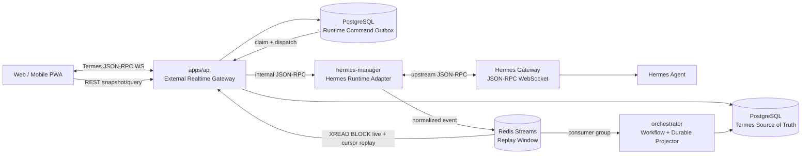

# Termes × Hermes App 권장 아키텍처

> **상위 정본:** 기능·프로토콜·성능 parity와 Termes 전문 에이전트 결합은
> [`hermes-termes-parity-master-plan.md`](./hermes-termes-parity-master-plan.md)를 따른다.
> 이 문서의 Redis Streams 기반 UI 전달·Termes event 정규화 설계는 폐기되었으며,
> 상위 정본의 unchanged Hermes frame relay + async Termes projection으로 대체한다.
> 실제 구현 순서와 완료 조건은
> [`hermes-termes-implementation-execution-plan.md`](./hermes-termes-implementation-execution-plan.md)를 따른다.

## 1. 설계 결정

아래 내용은 이전 설계 기록이다. 실제 구현 결정에는 상위 정본을 적용한다.

- 외부 UI 통신은 **Termes 인증 JSON-RPC 2.0 WebSocket**을 사용한다.
- `hermes-manager`는 **Hermes upstream JSON-RPC adapter**이자 upstream connection owner다.
- 실행 명령은 PostgreSQL **command outbox**에 먼저 기록한 뒤 전달한다.
- 실시간 event는 **Redis Streams에 순서대로 기록**하고 API가 `XREAD BLOCK`으로 읽어 fan-out한다.
- Task, Plan, Approval, Device, Artifact, Verification의 확정 상태는 **PostgreSQL이 유일한 원장**이다.
- UI는 **DB snapshot + live projection**을 합성한다.
- 기존 `/events/stream` SSE는 device와 일반 audit용으로만 남기고 Hermes runtime에는 사용하지 않는다.
- browser/PWA는 Hermes 주소와 credential을 알지 못하며 Hermes에 직접 연결하지 않는다.
- Hermes 기능이 없거나 protocol version이 맞지 않으면 명시적 오류로 종료한다. 다른 실행 방식으로 자동 대체하지 않는다.

이 구조는 JSON-RPC를 영속 event store로 오해하지 않는다. JSON-RPC는 명령과 notification의 wire protocol이고, PostgreSQL과 Redis가 각각 durable state와 replayable live stream을 담당한다.

## 2. Termes 불변 개념

제품 계층은 아래 순서를 유지한다.

```text
Project
  └─ Task
      ├─ Plan
      ├─ Runtime Session
      │   └─ Turn
      │       ├─ Message Parts
      │       ├─ Tool Calls
      │       └─ Pending Interactions
      ├─ Device Commands
      ├─ Artifacts
      └─ Verification Results
```

Hermes session은 Task의 runtime resource다. Hermes session을 Project 또는 Task 대신 최상위 제품 단위로 노출하지 않는다.

소유권:

| 개념 | canonical owner | 비고 |
| --- | --- | --- |
| Project, Task, Plan | Termes PostgreSQL | 제품·감사 최상위 |
| Runtime Session | Termes PostgreSQL | Hermes session과의 안정된 매핑 |
| Hermes Session | Hermes upstream | opaque external ID |
| Turn, Message, Part | Termes PostgreSQL | 최종 transcript 복원 기준 |
| 실행 중 delta | Redis Streams + UI memory | 완료 후 최종 part로 수렴 |
| Tool Call | Termes PostgreSQL | upstream tool ID 매핑 포함 |
| Approval/Clarify | Termes PostgreSQL | 상태와 감사 정보 저장 |
| Secret 값 | 어디에도 영속하지 않음 | 승인 사실만 감사 기록 |
| Device Command | Termes PostgreSQL | API가 최종 정책 결정자 |
| Artifact/Verification | Termes PostgreSQL | 실행 결과의 증거 |

## 3. 전체 구성



### 3.1 왜 API와 hermes-manager를 분리하는가

`apps/api`가 소유하는 것:

- 사용자 인증과 Project/Task 권한
- external WebSocket ticket
- 외부 JSON-RPC method schema
- command의 영속 접수와 idempotency
- client subscription과 fan-out
- snapshot REST API

`hermes-manager`가 소유하는 것:

- Hermes profile별 upstream connection
- Hermes protocol version/capability handshake
- Termes runtime session ↔ Hermes session mapping 사용
- Termes command ↔ Hermes method 변환
- Hermes event validation/redaction/normalization
- upstream reconnect/resume

첫 구현에서 `hermes-manager`는 stateful upstream connection owner이므로 replica를 1개로 고정한다. 시작 시 service lease를 얻지 못하면 기동에 실패하고, lease를 잃으면 upstream socket과 event publish를 즉시 중단한다. 여러 replica로 확장하는 일은 profile별 command routing까지 함께 설계하기 전에는 허용하지 않는다.

API가 Hermes protocol을 직접 알면 upstream 변경이 UI·인증·DB 코드까지 전파된다. 반대로 manager가 외부 사용자 인증을 처리하면 Termes의 Project/Task 권한 모델을 우회하게 된다. 두 경계를 분리해야 한다.

### 3.2 별도 realtime microservice를 만들지 않는 이유

첫 구현에서는 외부 WebSocket route와 outbox dispatcher를 `apps/api` 안에 둔다. 현재 규모에서 새 service를 추가하면 배포·인증·DB transaction 경계만 늘어난다. 다음 수치가 실제로 관측될 때만 `services/realtime-gateway`로 분리한다.

- API replica별 동시 WebSocket 수가 일반 REST 처리에 영향을 줌
- fan-out CPU 또는 slow consumer queue가 API latency를 침범함
- realtime만 독립적으로 scale해야 함

분리하더라도 외부 protocol과 DB/outbox 계약은 바꾸지 않는다.

## 4. 연결 프로토콜

### 4.1 WebSocket 인증

모든 client는 같은 절차를 사용한다.

1. 기존 Termes 인증으로 `POST /api/realtime/tickets` 호출
2. API가 30초 TTL, single-use ticket 발급
3. client가 `wss://<termes>/api/realtime?ticket=<ticket>` 연결
4. API가 ticket을 원자적으로 소비
5. server가 `connection.ready` notification 전송

장기 token, GitHub token, Hermes token을 WebSocket query에 넣지 않는다. ticket 발급 실패 시 WebSocket 연결을 시도하지 않는다.

Ticket claim:

```ts
type RealtimeTicketClaims = {
  ticketId: string;
  subjectId: string;
  authSessionId: string;
  issuedAt: string;
  expiresAt: string;
};
```

ticket은 Redis `GETDEL` 또는 동등한 원자 연산으로 한 번만 소비한다.

### 4.2 Protocol handshake

Server notification:

```json
{
  "jsonrpc": "2.0",
  "method": "connection.ready",
  "params": {
    "connectionId": "conn_...",
    "protocolVersion": 1,
    "heartbeatIntervalMs": 15000,
    "maxPayloadBytes": 262144,
    "capabilities": {
      "prompt": true,
      "steer": true,
      "interrupt": true,
      "clarify": true,
      "approval": true,
      "reasoning": true,
      "toolProgress": true,
      "terminal": false
    }
  }
}
```

client는 지원하지 않는 protocol version이면 연결을 닫고 upgrade-required 화면을 보여준다. capability가 false인 명령은 UI에서 숨기거나 disabled reason을 표시하며 다른 명령으로 치환하지 않는다.

### 4.3 Heartbeat와 종료

- server ping: 15초
- pong timeout: 10초
- 연결 종료 사유는 JSON-RPC notification 후 WebSocket close code로 전달
- payload 상한 초과, 권한 변경, ticket 재사용, protocol violation은 명시적 close code 사용
- pending client request는 disconnect 시 모두 reject
- reconnect는 1, 2, 4, 8, 15초 간격이며 online/visibility 변화 시 즉시 한 번 재시도
- reconnect 후 이전 subscription을 cursor와 함께 다시 등록

### 4.4 Hermes upstream 연결

Hermes 실시간 JSON-RPC는 `hermes dashboard` 프로세스의 `/api/ws`를 사용한다. 기존 Termes의 `HERMES_API_BASE_URL=:8642` REST run polling 경로를 실시간 protocol로 오인하지 않는다.

Hermes container의 목표 실행 형태:

```text
hermes dashboard --no-open --host 0.0.0.0 --port 9119
```

배포 계약:

- dashboard는 compose internal network에만 노출하고 host/public port를 열지 않음
- dashboard auth provider를 비대화식으로 구성하고 `--insecure` 사용 금지
- manager에 `HERMES_DASHBOARD_BASE_URL=http://hermes-agent:9119`와 server-side service credential 제공
- manager가 `POST /api/auth/ws-ticket`으로 single-use ticket 발급
- manager가 `ws://hermes-agent:9119/api/ws?ticket=...`로 연결
- ticket과 service credential은 log, event, DB에 남기지 않음
- container image는 분석·호환성 테스트를 통과한 digest/commit으로 고정
- 현재 `infra/hermes-agent/Dockerfile`의 upstream 내부 파일 문자열 치환은 제거
- dashboard readiness와 JSON-RPC handshake가 모두 성공해야 manager를 ready로 판정

REST가 필요한 profile/model/skill/config 조회는 같은 dashboard의 공식 API를 사용하되, prompt와 run 상태는 `/api/ws` 한 경로로 통일한다. cutover가 끝나면 `/v1/runs` polling과 blocking `/v1/chat/completions`를 제품 실행 경로에서 제거한다.

### 4.5 OpenAI 인증: ChatGPT/Codex OAuth 전용

Termes의 OpenAI 사용 경로는 API Key가 아니라 **ChatGPT 계정으로 로그인하는 Codex OAuth**로 고정한다. OpenAI 공식 문서가 구분하는 “Sign in with ChatGPT for subscription access”를 사용하며, API Key 기반 usage billing 경로는 제품에서 제공하지 않는다. Headless 서버에서는 browser localhost callback 대신 device-code OAuth를 사용한다. 근거: [OpenAI Codex Authentication](https://learn.chatgpt.com/docs/auth).

지원 provider/runtime:

```text
model.provider = openai-codex
model.openai_runtime = codex_app_server
Codex authentication mode = chatgpt/oauth
```

금지:

- `OPENAI_API_KEY` 입력·저장·전달
- OpenAI API Key 설정 UI
- `OPENROUTER_API_KEY`, `ANTHROPIC_API_KEY`를 OpenAI OAuth 대체 경로로 사용
- OAuth 실패 시 API Key 또는 다른 provider로 자동 전환
- OAuth access/refresh token을 API response, JSON-RPC event, log, DB에 포함
- API/Web/Orchestrator가 Codex auth file을 직접 읽음

`HERMES_AGENT_API_KEY`와 `HERMES_API_KEY`는 현재 Hermes HTTP service 간 인증에 쓰이는 내부 token이며 OpenAI provider credential이 아니다. 명칭 혼동을 줄이기 위해 realtime cutover에서 `HERMES_AGENT_SERVICE_TOKEN`으로 명시적으로 변경한다.

Codex 강제 설정:

```toml
forced_login_method = "chatgpt"
cli_auth_credentials_store = "file"
```

Docker에서는 OS keyring을 기대하지 않고 persistent encrypted host volume의 `CODEX_HOME/auth.json`을 사용한다. 이 파일은 access token을 포함한 비밀로 취급하고 owner-only permission을 적용한다. Hermes Agent와 OAuth broker 외의 container에는 mount하지 않는다.

#### OAuth UI 흐름

Termes 서버는 headless이므로 공식 device-code flow를 제품 UI에 연결한다.

```text
Settings → OpenAI account → Connect
  → POST /api/openai-auth/device-sessions
  → internal OAuth Broker starts `codex login --device-auth`
  → verification URL + one-time user code
  → 사용자가 OpenAI/ChatGPT에서 승인
  → UI는 Termes session ID로 상태 polling
  → Codex login status = ChatGPT authenticated
  → Hermes `openai-codex` auth/config readiness 확인
  → manager capability = ready
```

브라우저는 OpenAI token을 받지 않는다. Termes가 반환하는 것은 verification URL, user code, expiry, polling interval, Termes device-session ID뿐이다.

OAuth 상태:

```ts
type OpenAiOAuthStatus =
  | "signed_out"
  | "device_code_pending"
  | "authenticated"
  | "reauth_required"
  | "workspace_denied"
  | "cancelled";
```

- `authenticated`: Codex ChatGPT login, Hermes `openai-codex`, `codex_app_server`가 모두 준비됨
- `reauth_required`: token refresh 실패, revoke 또는 login cache 손상
- `workspace_denied`: ChatGPT workspace 권한 또는 강제 workspace 조건 불일치
- `signed_out`: auth store 없음
- 상태가 `authenticated`가 아니면 새 Hermes command를 접수하지 않음
- 실행 중 OAuth가 만료되면 해당 turn을 명시적으로 실패시키고 재로그인 action을 표시

공식 Codex는 활성 ChatGPT OAuth session의 token을 사용 중 자동 갱신한다. Termes는 자체 refresh token 로직을 구현하지 않고 Codex의 auth cache와 refresh 동작을 사용한다.

#### OAuth Broker

OAuth command를 API container나 browser에서 실행하지 않는다. Hermes Agent와 같은 pinned image를 사용하는 internal `openai-auth-broker` service를 두고 `/opt/data/.codex`와 Hermes auth state만 공유한다.

책임:

- device login 시작·취소·상태 확인
- 동시 login session 1개로 제한
- `codex login status`를 구조화된 상태로 변환
- Codex 로그인 후 Hermes `openai-codex` auth/config readiness 확인
- 지원되는 logout/revoke command 실행
- stdout/stderr에서 code와 상태만 추출하고 token redaction

금지:

- Docker socket mount
- auth file 내용을 manager/API에 반환
- browser에서 Codex CLI 실행
- auth file 직접 JSON parsing으로 readiness 판정
- 로그인 실패 시 provider key 요청

#### 현재 코드에서 제거할 경로

현재 구현은 OAuth-only 계약과 다르므로 cutover 전에 다음을 제거한다.

- `infra/compose/docker-compose.yml`
  - `OPENAI_API_KEY_CONFIGURED`
  - `OPENROUTER_API_KEY_CONFIGURED`
  - `ANTHROPIC_API_KEY_CONFIGURED`
  - Hermes Agent로 전달하는 세 provider key 환경변수
- `services/hermes-manager/src/main.ts`
  - `codexAuth.OPENAI_API_KEY`를 인증 성공으로 보는 조건
  - `providerKeys`, `hasProvider`, `localProviderKeyRequired`
  - `(hasProvider || codexReady)` readiness 조건
  - provider key를 요구하는 diagnostics 문구
  - auth file 내용을 직접 읽는 readiness 판정
- `README.md`, `.env.example`, smoke script
  - OpenAI/OpenRouter/Anthropic provider key 설정 안내
  - OAuth와 API Key를 동등한 선택지로 설명하는 문구

OAuth-only readiness:

```text
dashboard reachable
AND dashboard JSON-RPC handshake succeeds
AND Codex login mode is ChatGPT/OAuth
AND Hermes provider is openai-codex
AND Hermes runtime is codex_app_server
AND workspace access is allowed
```

하나라도 충족되지 않으면 `CAPABILITY_UNAVAILABLE`과 정확한 OAuth 상태를 반환한다. API Key 또는 다른 runtime으로 실행하지 않는다.

## 5. 외부 JSON-RPC 계약

### 5.1 Request methods

| method | 목적 | durable command |
| --- | --- | --- |
| `runtime.subscribe` | Task runtime 구독/재구독 | 아니오 |
| `runtime.unsubscribe` | 구독 해제 | 아니오 |
| `task.prompt.submit` | 새 turn 제출 | 예 |
| `task.prompt.queue` | 현재 turn 뒤 prompt 예약 | 예 |
| `task.prompt.steer` | 실행 중 agent 지시 변경 | 예 |
| `task.run.interrupt` | 현재 실행 중단 | 예 |
| `task.session.resume` | upstream session 재개 | 예 |
| `task.session.branch` | 현재 turn에서 session 분기 | 예 |
| `interaction.clarify.respond` | 질문 응답 | 예 |
| `interaction.approval.respond` | 승인/거절 | 예 |
| `interaction.sudo.respond` | 권한 상승 승인/거절 | 예 |
| `interaction.secret.respond` | secret 전달 | 별도 비영속 경로 |

### 5.2 공통 request metadata

```ts
type RuntimeCommandMeta = {
  clientRequestId: string;
  taskId: string;
  runtimeSessionId: string;
  expectedTaskRevision: number;
};
```

- `clientRequestId`는 client가 UUID로 생성한다.
- `(subject_id, client_request_id)` unique constraint로 중복 접수를 막는다.
- `expectedTaskRevision`이 현재 값과 다르면 `STALE_TASK_STATE`를 반환한다.
- Hermes session ID는 client request에 받지 않는다.

일반 runtime event는 JSON-RPC notification 하나로 전달한다. event 종류를 JSON-RPC method로 다시 분산하지 않는다.

```json
{
  "jsonrpc": "2.0",
  "method": "runtime.event",
  "params": {
    "schemaVersion": 1,
    "eventId": "evt_uuid",
    "cursor": "1720787700000-4",
    "streamEpoch": "epoch_uuid",
    "sequence": 482,
    "taskId": "task_uuid",
    "runtimeSessionId": "runtime_uuid",
    "turnId": "turn_uuid",
    "commandId": "cmd_uuid",
    "kind": "message.delta",
    "payload": {
      "messageId": "message_uuid",
      "partId": "part_uuid",
      "append": "진행 중입니다"
    }
  }
}
```

### 5.3 Prompt submit

Request:

```json
{
  "jsonrpc": "2.0",
  "id": 41,
  "method": "task.prompt.submit",
  "params": {
    "meta": {
      "clientRequestId": "f120...",
      "taskId": "task_uuid",
      "runtimeSessionId": "runtime_uuid",
      "expectedTaskRevision": 7
    },
    "content": [{ "type": "text", "text": "테스트를 실행해 주세요." }],
    "model": null,
    "reasoningEffort": "medium"
  }
}
```

Response는 Hermes 완료가 아니라 Termes 접수를 의미한다.

```json
{
  "jsonrpc": "2.0",
  "id": 41,
  "result": {
    "status": "accepted",
    "commandId": "cmd_uuid",
    "turnId": "turn_uuid",
    "userMessageId": "message_uuid"
  }
}
```

API transaction 안에서 user message, turn, command outbox를 함께 만든다. transaction commit 전에 성공 response를 보내지 않는다.

### 5.4 Subscription

Request:

```json
{
  "jsonrpc": "2.0",
  "id": 5,
  "method": "runtime.subscribe",
  "params": {
    "taskId": "task_uuid",
    "runtimeSessionId": "runtime_uuid",
    "streamEpoch": "epoch_uuid",
    "afterCursor": "1720787699000-7",
    "afterSequence": 481
  }
}
```

Response:

```json
{
  "jsonrpc": "2.0",
  "id": 5,
  "result": {
    "subscriptionId": "sub_uuid",
    "streamEpoch": "epoch_uuid",
    "currentCursor": "1720787700000-8",
    "currentSequence": 489,
    "snapshotRevision": 22
  }
}
```

client의 epoch가 다르거나 요청 sequence가 retention보다 오래된 경우 server는 `RESYNC_REQUIRED` 오류와 현재 snapshot revision을 반환한다. client는 `GET /api/tasks/:taskId/runtime-snapshot`을 읽고 새 epoch/current sequence로 구독한다. 이것은 자동 transport fallback이 아니라 protocol에 정의된 유일한 복구 절차다.

구독 중 event 유실을 막기 위해 server는 다음 순서를 지킨다.

1. connection registry에 subscription을 `replaying` 상태로 등록한다.
2. Redis에서 현재 shard high-water cursor와 session sequence를 읽는다.
3. `afterCursor` 다음부터 high-water cursor까지 읽고 해당 runtime session event만 sequence 순서로 replay한다.
4. replay 중 들어온 high-water 이후 event는 connection별 bounded queue에 보관한다.
5. replay 완료 후 queue를 sequence 순서로 flush한다.
6. subscription을 `live`로 전환한다.

어느 단계에서도 sequence가 건너뛰면 event를 계속 적용하지 않고 `RESYNC_REQUIRED`로 종료한다.

### 5.5 오류 코드

| code | name | 의미 |
| --- | --- | --- |
| `-32600` | INVALID_REQUEST | JSON-RPC 형식 오류 |
| `-32601` | METHOD_NOT_FOUND | 지원하지 않는 method |
| `-32602` | INVALID_PARAMS | schema 오류 |
| `-32001` | UNAUTHENTICATED | 인증 만료 |
| `-32003` | FORBIDDEN | Project/Task 권한 없음 |
| `-32009` | CONFLICT | 현재 상태에서 실행 불가 |
| `-32010` | RESYNC_REQUIRED | cursor replay 불가 |
| `-32011` | CAPABILITY_UNAVAILABLE | Hermes capability 없음 |
| `-32012` | STALE_TASK_STATE | revision 충돌 |
| `-32013` | INTERACTION_EXPIRED | 응답 대상이 이미 종료됨 |
| `-32020` | UPSTREAM_UNAVAILABLE | Hermes 연결 불가 |
| `-32021` | UPSTREAM_PROTOCOL_ERROR | Hermes payload 검증 실패 |

### 5.6 API → hermes-manager 내부 RPC

API와 manager 사이도 JSON-RPC 2.0 WebSocket을 사용하지만 외부 protocol과 endpoint를 공유하지 않는다.

```text
ws://hermes-manager:8080/internal/rpc
```

- Docker internal network에서만 접근
- `HERMES_MANAGER_SERVICE_TOKEN`으로 service 인증
- user credential은 manager에 전달하지 않음
- API가 이미 검증한 subject/project/task ID와 command ID만 전달
- manager 응답은 upstream 접수 여부이며 실행 완료 결과가 아님
- 실행 event는 내부 RPC socket으로 되돌리지 않고 Redis Stream 한 경로로만 게시

Internal request:

```json
{
  "jsonrpc": "2.0",
  "id": 901,
  "method": "runtime.command.dispatch",
  "params": {
    "commandId": "cmd_uuid",
    "projectId": "project_uuid",
    "taskId": "task_uuid",
    "runtimeSessionId": "runtime_uuid",
    "turnId": "turn_uuid",
    "command": {
      "method": "task.prompt.submit",
      "params": {
        "content": [{ "type": "text", "text": "테스트를 실행해 주세요." }]
      }
    }
  }
}
```

manager는 `commandId`를 upstream idempotency key와 자신의 dispatch ledger key로 사용한다. 같은 command를 다시 받으면 새 실행을 만들지 않고 기존 dispatch 결과를 반환한다.

## 6. Event 계약

### 6.1 공통 envelope

```ts
type RuntimeEventRecord<T> = {
  schemaVersion: 1;
  eventId: string;
  streamEpoch: string;
  sequence: number;
  occurredAt: string;
  projectId: string;
  taskId: string;
  runtimeSessionId: string;
  turnId: string | null;
  commandId: string | null;
  kind: RuntimeEventKind;
  payload: T;
};

type RuntimeEventEnvelope<T> = RuntimeEventRecord<T> & {
  cursor: string;
};
```

manager는 `RuntimeEventRecord`를 Stream에 쓰고 API는 Redis Stream entry ID를 `cursor`로 붙여 `RuntimeEventEnvelope`를 client에 보낸다. `hermesSessionId`는 manager와 server audit metadata에만 두고 일반 UI envelope에는 노출하지 않는다.

### 6.2 Event 종류

```text
runtime.session.ready
runtime.session.status.changed
turn.started
message.started
message.delta
reasoning.delta
message.completed
tool.started
tool.progressed
tool.completed
interaction.requested
interaction.resolved
turn.completed
turn.failed
turn.interrupted
plan.step.changed
artifact.created
verification.created
device.command.changed
runtime.error
```

### 6.3 Hermes → Termes mapping

| Hermes event | Termes event | 추가 처리 |
| --- | --- | --- |
| `gateway.ready` | `runtime.session.ready` | protocol/capability 기록 |
| `session.info` | `runtime.session.status.changed` | model, cwd, busy 상태 제한 반영 |
| `message.start` | `message.started` | Termes message/part ID 매핑 |
| `message.delta` | `message.delta` | part ID와 append text, 크기 제한 |
| `reasoning.delta` | `reasoning.delta` | reasoning part 분리 |
| `tool.start` | `tool.started` | stable toolCallId 할당, args redaction |
| `tool.progress` | `tool.progressed` | bounded summary만 live 전달 |
| `tool.complete` | `tool.completed` | result/diff/artifact 연결 |
| `clarify.request` | `interaction.requested` | kind=`clarify` |
| `approval.request` | `interaction.requested` | Termes policy/approval row 연결 |
| `sudo.request` | `interaction.requested` | kind=`sudo`, 영구 승인 제한 |
| `secret.request` | `interaction.requested` | secret schema만 저장, 값 저장 금지 |
| `message.complete` | `message.completed` | final parts checksum 포함 |
| `background.complete` | `turn.completed` | background Task badge 갱신 |
| `error` | `runtime.error` 또는 `turn.failed` | scope에 따라 종결 상태 결정 |

manager는 session ID가 없는 session-scoped Hermes event를 현재 활성 Task에 추측해서 붙이지 않는다. 해당 event를 reject하고 protocol error metric과 제한된 audit record를 남긴다.

### 6.4 순서와 replay

manager는 Redis Lua script 한 번으로 다음을 원자 수행한다.

1. runtime session의 `streamEpoch` 확인
2. session sequence `HINCRBY`
3. envelope에 sequence 삽입
4. Redis Stream `XADD`
5. 반환된 Stream entry ID를 외부 event의 `cursor`로 사용

Redis Stream key는 shard 단위로 둔다.

```text
termes:runtime:events:{00..15}
```

shard는 `runtimeSessionId` hash로 고정한다. retention은 시간과 최대 길이를 함께 적용한다. 각 API instance는 16개 stream을 하나의 `XREAD BLOCK` loop로 읽고, local connection registry에 등록된 runtime session에만 fan-out한다. client는 shard cursor로 replay 위치를 찾고 session sequence로 누락·중복을 검증한다.

Redis state가 초기화되면 새 `streamEpoch`를 만든다. client는 이전 epoch로 이어 붙이지 않고 DB snapshot을 읽은 후 새 stream을 구독한다.

## 7. Command outbox

### 7.1 테이블

```sql
runtime_commands (
  id uuid primary key,
  subject_id uuid not null,
  project_id uuid not null,
  task_id uuid not null,
  runtime_session_id uuid not null,
  turn_id uuid,
  client_request_id uuid not null,
  method text not null,
  params jsonb not null,
  status text not null,
  attempt_count integer not null default 0,
  available_at timestamptz not null,
  expires_at timestamptz not null,
  leased_until timestamptz,
  last_error_code text,
  last_error_message text,
  created_at timestamptz not null,
  dispatched_at timestamptz,
  completed_at timestamptz,
  unique(subject_id, client_request_id)
)
```

상태:

```text
accepted → dispatching → dispatched → completed
accepted → dispatching → waiting_upstream → dispatching
accepted → dispatching → rejected
waiting_upstream → rejected
accepted → cancelled
```

`attempt_count`는 같은 idempotency key로 전달을 재시도하기 위한 값이다. 다른 Hermes method나 managed runner로 바꾸는 값이 아니다.

- validation, capability, policy 오류는 즉시 `rejected`
- 연결 끊김처럼 일시적인 전달 불가는 `waiting_upstream`
- command별 `expires_at` 전까지만 동일 command ID로 재전달
- `expires_at`이 지나면 `UPSTREAM_UNAVAILABLE`로 `rejected`
- UI는 `waiting_upstream`을 실행 중으로 표시하지 않고 전달 대기 상태로 표시

### 7.2 Dispatcher

- API background worker가 `FOR UPDATE SKIP LOCKED`로 command를 claim
- internal JSON-RPC로 manager에 전달
- manager response가 accepted이면 `dispatched`
- Hermes boundary event가 command ID와 함께 오면 `completed`
- capability 부족, invalid state, upstream protocol 오류는 `rejected`
- process crash로 lease가 만료되면 동일 command ID로 다시 dispatch
- manager는 command ID를 idempotency key로 사용해 중복 실행 방지

### 7.3 Secret 응답 예외

`interaction.secret.respond`의 secret 값은 outbox나 Redis Stream에 넣지 않는다.

1. API가 사용자와 pending request 권한 검증
2. 현재 연결에서 manager internal RPC로 값 전달
3. manager가 Hermes blocking request에 즉시 전달
4. DB에는 request ID, 응답자, 응답 시각, 성공 여부만 저장
5. 전송 실패 시 interaction을 pending으로 유지하고 명시적 오류 반환

secret 값을 포함한 자동 재전송은 하지 않는다.

## 8. Durable projector

`services/orchestrator` 안에 runtime event projector를 둔다. 이것이 Redis runtime event를 PostgreSQL 제품 상태로 반영하는 유일한 writer다.

처리:

- consumer group으로 Stream event 수신
- `runtime_processed_events(event_id)` unique key로 중복 제거
- DB transaction 안에서 domain row와 processed marker를 함께 기록
- commit 후 Redis event ACK
- 실패하면 ACK하지 않고 같은 event를 다시 처리

Event별 영속 범위:

| Event | DB write |
| --- | --- |
| `turn.started` | turn status/start |
| `message.started` | message header |
| `message.delta` | 매 delta 저장하지 않음 |
| `reasoning.delta` | 매 delta 저장하지 않음 |
| `tool.started` | tool call + part boundary |
| `tool.progressed` | 최신 bounded summary만 선택 저장 |
| `tool.completed` | result summary, diff/artifact link, final part |
| `interaction.requested` | pending interaction + approval if applicable |
| `interaction.resolved` | 상태/감사 기록 |
| `message.completed` | final ordered parts + checksum |
| `turn.completed/failed/interrupted` | turn/task/run 상태 전이 |
| `artifact.created` | artifact row |
| `verification.created` | verification row |

초기 Task와 후속 메시지의 Hermes 실행 경로를 동일하게 만든다.

```text
Task create
  → Orchestrator plan 생성
  → runtime command outbox에 task.prompt.submit 기록
  → 동일 dispatcher/manager/event/projector 경로
```

기존 Orchestrator의 `/v1/runs` 생성 후 750ms polling은 제거한다. 초기 실행만 별도 run API에 남기면 streaming, approval, reconnect 동작이 후속 chat과 다시 갈라진다.

## 9. Snapshot 계약

Endpoint:

```text
GET /api/tasks/:taskId/runtime-snapshot
```

응답:

```ts
type TaskRuntimeSnapshot = {
  snapshotRevision: number;
  generatedAt: string;
  project: ProjectSummary;
  task: TaskSummary;
  plan: TaskPlan | null;
  runtimeSession: RuntimeSessionSummary | null;
  turns: ConversationTurn[];
  messages: RichMessage[];
  pendingInteractions: PendingInteraction[];
  artifacts: ArtifactSummary[];
  verificationResults: VerificationResult[];
  deviceCommands: DeviceCommandSummary[];
  stream: {
    epoch: string;
    currentSequence: number;
  };
};
```

snapshot transaction은 서로 다른 시점의 message/plan/task를 섞지 않도록 repeatable-read 또는 revision 기준 query를 사용한다. 모든 변경 transaction은 task의 `snapshot_revision`을 증가시킨다.

## 10. UI 상태와 reducer

### 10.1 상태 분리

- React Query: Project, Task 목록, runtime snapshot, Device, Capability, Profile
- fine-grained live store: connection, subscription, session projection, pending interaction, composer, panes
- component local state: 열림/닫힘, hover, draft처럼 서버 의미가 없는 상태

`apps/web/src/main.tsx`의 전체 상태를 새 store 하나로 옮기지 않는다. domain별 store와 query로 분리한다.

### 10.2 Projection 구조

```ts
type RuntimeProjection = {
  streamEpoch: string;
  lastSequence: number;
  connectionState: "connecting" | "ready" | "reconnecting" | "closed";
  activeTurnId: string | null;
  messagesById: Map<string, RichMessage>;
  orderedMessageIds: string[];
  toolCallsById: Map<string, ToolCallView>;
  interactionsById: Map<string, InteractionView>;
  textBuffersByPartId: Map<string, string>;
  reasoningBuffersByPartId: Map<string, string>;
};
```

### 10.3 Delta 알고리즘

1. session/epoch/sequence를 검증한다.
2. 이미 처리한 sequence면 무시한다.
3. 이전 sequence + 1이 아니면 event 적용을 중지하고 resync 상태로 전환한다.
4. text/reasoning delta를 part별 buffer에 append한다.
5. `requestAnimationFrame` 또는 최대 33ms timer에서 한 번에 flush한다.
6. tool/interaction/boundary event 전에는 관련 buffer를 먼저 flush한다.
7. stable part/tool/request ID로 기존 객체를 update한다.
8. `message.completed`에서 모든 buffer를 flush하고 final checksum을 비교한다.
9. checksum 불일치는 projection을 완료로 표시하지 않고 snapshot resync를 요구한다.
10. 완료된 message를 React Query snapshot cache에 반영한다.

Task list, Project rail, Device drawer는 token delta store를 구독하지 않는다.

### 10.4 UI 표현

| 상태 | 표현 |
| --- | --- |
| text streaming | Markdown 점진 렌더링 |
| reasoning streaming | 접힌 진행 panel, 완료 후 펼침 가능 |
| tool running | tool 이름, 요약 args, spinner, elapsed time |
| tool complete | 성공/실패, summary, diff/artifact 링크 |
| clarify | inline options + Other + Continue/Skip |
| approval | command/위험/범위 + once/session/always/deny |
| needs input | Task badge + composer 위 action strip |
| reconnecting | 기존 transcript 유지, 새 명령 disabled |
| upstream unavailable | 원인과 마지막 정상 시각, 허위 실행 상태 없음 |
| resync required | snapshot 동기화 중 표시, 새 명령 disabled |

## 11. Desktop/Mobile 정보 구조

### Desktop

```text
Project/Task rail | Task Conversation | Activity Workspace
                                      ├─ Plan & Approval
                                      ├─ Changes / Files
                                      ├─ Terminal / Process
                                      ├─ Devices
                                      ├─ Artifacts
                                      └─ Verification
```

- Hermes Sessions/Jobs/Tools를 독립 제품 rail로 복제하지 않는다.
- Model/Reasoning은 composer와 Project runtime profile에 둔다.
- Skill/Tool은 Termes Capability와 Plan step에서 보여준다.
- Hermes diagnostic raw event는 운영자 모드에만 둔다.

### Mobile PWA

```text
Project/Task list → Conversation → Activity detail
```

- conversation을 기본 화면으로 유지
- Plan active step은 상단 compact strip
- approval/clarify는 메시지 inline + composer 위 고정 action
- diff/terminal/device/verification은 full-screen detail
- safe area는 `env(safe-area-inset-*)`, keyboard는 VisualViewport 사용
- 특정 기기 치수 하드코딩 금지
- native shell은 push, secure storage, background upload, microphone이 실제 요구될 때만 추가

## 12. Theme 구조

Hermes의 theme pipeline만 채택하고 색과 브랜드는 복제하지 않는다.
Typography, Light/Dark token, mobile layout, conversation, composer의 상세 구현 계약은
[`hermes-mobile-ui-design-system.md`](./hermes-mobile-ui-design-system.md)를 정본으로 따른다.

```text
Termes seed
  → surface/text/stroke/signal semantic token
  → component token
  → chat/tool/plan/device/verification UI
```

필수 token:

```text
surface.canvas/panel/raised/overlay
text.primary/secondary/muted/inverse
stroke.subtle/default/strong/focus
signal.primary/info/success/warning/danger
composer.background/border/focus
task.active/needsInput/completed/failed
tool.running/completed/failed
approval.pending/approved/denied
verification.passed/warning/failed
```

우선 `styles.css` 후반의 사용되지 않는 `.ohShell` 계층을 실제 selector 검색과 화면 회귀 테스트 후 제거한다. legacy CSS를 남기고 token override를 추가하지 않는다.

## 13. 코드 배치

```text
packages/shared/src/realtime/
  json-rpc.ts
  commands.ts
  events.ts
  messages.ts
  schemas.ts

apps/api/src/realtime/
  ticket-service.ts
  websocket-route.ts
  connection-registry.ts
  subscription-service.ts
  command-service.ts
  outbox-dispatcher.ts
  stream-reader.ts

services/hermes-manager/src/gateway/
  json-rpc-client.ts
  connection-pool.ts
  capability-registry.ts
  session-registry.ts
  command-adapter.ts
  event-normalizer.ts
  stream-publisher.ts

services/orchestrator/src/runtime/
  stream-consumer.ts
  durable-projector.ts
  task-transitions.ts
  message-projector.ts
  interaction-projector.ts

apps/web/src/realtime/
  client.ts
  protocol.ts
  subscription.ts
  reducer.ts
  buffers.ts

apps/web/src/features/conversation/
apps/web/src/features/interactions/
apps/web/src/features/activity/
apps/web/src/stores/
apps/web/src/theme/
```

DB migration:

```text
infra/db/migrations/004_runtime_realtime.sql
```

신규 테이블:

- `runtime_commands`
- `conversation_turns`
- `message_parts`
- `tool_calls`
- `pending_interactions`
- `runtime_processed_events`

기존 `runtime_sessions`, `chat_messages`, `approvals`, `artifacts`, `verification_results`, `events`와 foreign key로 연결한다.

## 14. 구현 순서

### Step 1. 계약과 fixture

- shared JSON-RPC schema
- event envelope와 Hermes mapping fixture
- error/capability contract
- protocol reducer unit test

Gate:

- invalid/missing session event reject
- duplicate/out-of-order/parallel tool test 통과

### Step 2. DB와 outbox

- migration
- prompt/interaction command transaction
- idempotency와 revision conflict
- outbox claim/lease

Gate:

- API crash 전후 중복 prompt 실행 없음
- accepted response 전에 user message/turn/command가 모두 commit됨

### Step 3. Manager upstream adapter

- Hermes JSON-RPC client
- capability handshake
- profile connection pool
- session registry
- command adapter/event normalizer
- Redis Stream atomic publisher

Gate:

- 실제 Hermes text/reasoning/tool/interaction/complete 수신
- protocol mismatch가 명시적으로 실패

### Step 4. Durable projector

- Orchestrator Stream consumer
- message/tool/interaction/task projection
- initial Task 실행을 outbox 경로로 전환
- 기존 `/v1/runs` polling 제거

Gate:

- reconnect/re-delivery에도 DB row 중복 없음
- Task/Plan/Verification 상태 전이가 기존 계약과 일치

### Step 5. External realtime gateway

- ticket
- WebSocket route
- subscribe/replay/resync
- shard Stream `XREAD BLOCK` live fan-out
- slow consumer 보호

Gate:

- browser에 Hermes credential 없음
- connection drop 후 cursor replay 성공
- retention 밖 cursor는 snapshot resync만 수행

### Step 6. Web rich conversation

- React Query snapshot
- live store/reducer/33ms batching
- text/reasoning/tool UI
- completion checksum reconciliation

Gate:

- event마다 runtime 전체 refetch 없음
- token마다 app shell rerender 없음
- 새로고침 후 동일 transcript 순서 복원

### Step 7. Interaction과 control

- clarify/approval/sudo/secret
- send/queue/steer/stop
- Task needs-input badge
- policy/audit 연결

Gate:

- 다른 Task interaction에 응답 불가
- secret 평문이 DB/Redis/log에 없음

### Step 8. Activity/Theme/Mobile

- Plan/diff/file/terminal/device/artifact/verification workspace
- semantic theme와 legacy CSS 제거
- mobile navigation/safe-area/keyboard/reconnect

Gate:

- desktop, tablet, 390×844 E2E
- local_mock device와 Hermes tool result가 같은 Task timeline에 연결

## 15. 장애 상태의 정확한 동작

| 장애 | 시스템 동작 |
| --- | --- |
| Hermes 연결 전 prompt | command를 accepted 상태로 보존하고 UI에 upstream unavailable 표시, 연결 없이 실행 완료 처리하지 않음 |
| dispatch 중 API crash | lease 만료 후 같은 command ID로 재전달 |
| manager crash | upstream session resume 후 같은 stream epoch 또는 새 epoch/resync |
| Redis Stream retention 초과 | `RESYNC_REQUIRED`, DB snapshot 후 새 cursor |
| projector crash | ACK되지 않은 event 재처리, event ID로 dedupe |
| client slow consumer | 명시적 close 후 cursor reconnect |
| invalid Hermes payload | event reject, protocol error, 해당 turn을 허위 완료하지 않음 |
| capability 없음 | `CAPABILITY_UNAVAILABLE`, 다른 method로 대체하지 않음 |
| secret 전송 실패 | interaction pending 유지, 값 저장/자동 재전송 없음 |

## 16. 완료 정의

다음이 모두 충족되어야 권장 구조 구현이 완료된다.

1. 모든 Hermes prompt가 command outbox를 거친다.
2. 초기 Task와 후속 chat이 동일 runtime 경로를 사용한다.
3. Hermes text, reasoning, tool, interaction, complete event가 구조화되어 표시된다.
4. browser와 모바일에 Hermes credential이 존재하지 않는다.
5. reconnect는 cursor replay 또는 명시적 snapshot resync로만 복구한다.
6. Task/Plan/Device/Artifact/Verification의 source of truth는 PostgreSQL이다.
7. token delta가 PostgreSQL에 row 단위로 쌓이지 않는다.
8. event마다 전체 Task runtime을 refetch하지 않는다.
9. Orchestrator의 Hermes run polling이 제거된다.
10. unsupported 기능과 upstream 장애가 허위 성공이나 대체 실행으로 처리되지 않는다.
11. Termes Project First UI와 mobile PWA 흐름이 유지된다.
12. Hermes의 기능은 Task conversation과 Activity workspace 안에 녹아든다.
