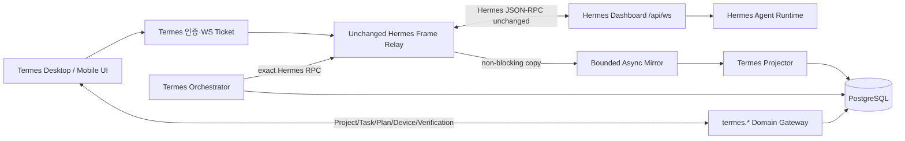
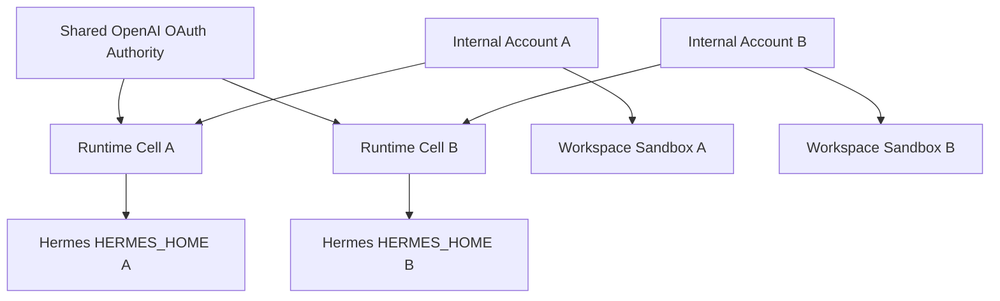

# Hermes × Termes 실제 구현 실행 계획

## 1. 문서 목적과 적용 원칙

이 문서는 [`hermes-termes-parity-master-plan.md`](./hermes-termes-parity-master-plan.md)의 아키텍처를 실제 구현 순서와 작업 단위로 전개한 실행 문서다.

질문 분류 지연 제거, Runtime Cell별 상시 Routing Specialist, Turn 단위 실행 이력, instant/direct/전문 협업 경로 분리는 [`question-routing-specialist-implementation-plan.md`](./question-routing-specialist-implementation-plan.md)를 구현 정본으로 사용한다. 해당 계획의 Gate R0~R8은 이 문서의 Orchestration 단계 완료 조건에 포함한다.

구현 우선순위는 다음 순서로 고정한다.

```text
계약 고정
→ OAuth·runtime 준비 상태 확립
→ 연결·relay 안정화
→ stream reducer·session 복구 안정화
→ 비동기 projection 정합성 확보
→ 단일 내부 계정 통합 안정화
→ 내부 계정·workspace sandbox 분리
→ Hermes 기능 parity
→ Termes 전문 에이전트·오케스트레이션 결합
→ UI 정보 구조와 visual theme 적용
→ Desktop/Mobile 검증
→ 성능·parity release gate
```

핵심 원칙:

- UI는 불안정한 데이터 흐름을 가리는 장식 계층으로 사용하지 않는다.
- Hermes JSON-RPC frame은 critical path에서 이름·payload·request ID를 변경하지 않는다.
- Termes Project/Task/Agent/Plan 데이터는 별도 `termes.*` 확장 계층으로 결합한다.
- 실시간 UI 전달은 PostgreSQL/projector 완료를 기다리지 않되, 복구 불가능한 프레임 유실을 막기 위해 Redis Stream 영속화 확인 후 전달한다.
- 최종 transcript와 Hermes session 의미는 Hermes가 소유하고, Termes DB는 Project/Task/Artifact/Verification projection을 소유한다.
- OpenAI 실행 인증은 ChatGPT/Codex OAuth만 허용한다.
- 이전 REST polling, blocking completion, API Key 경로를 새 구조의 예비 경로로 남기지 않는다.
- 각 단계는 자동화된 완료 조건을 만족하기 전 다음 단계로 넘어가지 않는다.

### 1.1 계정·샌드박스 단계화 결정

계정 격리는 한 번에 구현하지 않고 두 단계로 나눈다.

```text
1차 안정화
  shared OpenAI OAuth account
  + default Termes internal account
  + default workspace
  + single Hermes runtime cell

2차 격리
  same shared OpenAI account authority
  + multiple Termes internal accounts
  + account-owned workspaces
  + account runtime cells
  + workspace execution sandboxes
```

1차의 목적은 JSON-RPC 연결, session, stream reducer, reconnect, projection을 변수 수가 가장 적은 단일 계정 환경에서 확정하는 것이다. 2차의 목적은 확정된 runtime contract를 바꾸지 않고 소유권과 실행 경계를 확장하는 것이다.

단일 계정 단계에서도 다음 항목을 전역 singleton으로 모델링하지 않는다.

- Project, Task, runtime session의 소유자
- workspace root
- Hermes profile/home 선택
- session mapping
- relay ticket scope
- artifact/device/verification 접근 권한

초기 데이터는 명시적인 `default internal account`와 `default workspace`에 귀속한다. 이를 통해 2차 격리에서 protocol과 reducer를 다시 작성하지 않고 routing·storage·process boundary만 확장한다.

Hermes profile은 상태 분리 도구이지 Termes 내부 계정의 보안 경계가 아니다. Upstream 코드에서 profile별 `HERMES_HOME`은 config, memory, sessions, skills, state를 분리하지만 machine dashboard는 여러 profile을 관리할 수 있고 global-root auth fallback도 존재한다. 따라서 2차 보안 격리는 profile 이름만으로 구현하지 않는다.

## 2. 현재 코드 기준 출발점

### 2.0 구현 체크포인트 — 2026-07-12

단일 계정 안정화와 두 번째 Account Cell 격리 검증은 다음 상태까지 진행됐다.

| 영역 | 현재 구현 | 검증 |
| --- | --- | --- |
| upstream 고정 | Hermes `7fb875451bcef8c379ece6779c6b147eef42c05d`, 123 methods/20 events 자동 manifest | provenance/hash contract 3개 통과 |
| relay | 30초 단일 사용 ticket, 첫 frame 선등록, bounded client buffer, 영속화 선행 sanitised mirror, 포화 시 1013 종료 | 실제 dashboard relay 및 Redis 일시 장애·포화 회귀 통과 |
| OAuth | 중앙 Manager가 ChatGPT OAuth refresh token을 단독 소유하고 Cell에는 Codex app-server external auth access token만 전달 | Cell 내부 `auth.json`/refresh token 없이 실제 `gpt-5.6-sol` inference E2E 통과 |
| reducer | text/reasoning/tool/interaction/final reconciliation, 33ms flush | 동등성 시나리오 5개 통과 |
| orchestrator | `/v1/runs` polling 제거, exact `session.create`/`prompt.submit`, 개별 RPC timeout, reconnect/ledger 복구 | 실제 JSON-RPC/subagent 통합과 timeout·disconnect 회귀 통과 |
| specialist | 경중·도메인 분류, Hermes 기본 동시 한도 3 준수, 실 Hermes `delegate_task`, 필수 child 전원·도구 증거 완료 후 synthesis | 3개 전문 agent 실제 병렬 협업 E2E 통과 |
| Task message | initial/follow-up 동일 orchestration, verified result만 assistant message 확정 | API/Web/Orchestrator typecheck와 build 통과 |
| projection/event | Redis Stream 무기한 보존, workspace별 transaction lock, 역순 replay, transactional outbox, DLQ, account-scoped SSE cursor replay | 재처리·역순 ID·outbox·SSE 격리 주입 검증 및 migration 009~012 적용 |
| Account Cell | A/B별 Hermes home·workspace·runs mount, Docker network·resource·PID·nofile 분리, cell별 relay queue와 scheduler | 동일 시각 병렬 Task A/B가 각각 `termes`/`account-b-only`를 읽고 각 10 frame을 자기 scope에만 저장 |
| Account 로그인 | account별 SHA-256 접근 hash, Redis 12시간 opaque session, HttpOnly/SameSite cookie, 매 요청 active workspace/runtime cell 재조회, IP+account 실패 제한 | 모바일 A/B 로그인, project/task/ticket/REST scope 404/403, 로그아웃·만료·rate limit 자동화 통과 |
| Mobile UI | conversation-first, light/dark token, 16px composer, specialist progress, 접이식 Plan/Verification, inline approval/secret | 390×844 실제 브라우저 렌더와 production build 확인 |
| Raw Operator | 현재 account/project/task ticket으로 upstream JSON-RPC method와 params를 그대로 호출하는 접이식 모바일 console | B Cell `session.list`가 B의 4개 stored session만 반환, browser console error 0 |

2026-07-12 실제 단일 계정 기준 실행에서 Task `e8b7aa54-569f-4662-b4a9-624cb58f8f5b`, Hermes stored session `20260712_104526_2eb4ca`, live session `6ed7096f`가 약 181.8초에 완료됐다. Security, Software Engineering, Independent Critic 3개 전문 agent가 실제 도구를 사용해 병렬 협업했고, coordinator가 전원 완료·증거 장벽 뒤 verified 최종 응답을 생성했다.

두 Cell 병렬 검증 Task는 A `40000000-0000-0000-0000-000000000101`, B `40000000-0000-0000-0000-000000000102`다. 시작 시각은 각각 `11:36:07.694474Z`, `11:36:07.694501Z`로 27μs 차이며, A는 `termes`, B는 `account-b-only`를 반환했다. 공개 A API에서 B project/task/runtime은 각각 목록 미노출/미노출/404이고, SSE에 주입한 B envelope도 A stream에 나타나지 않았다.

실제 로그인 principal 전환 후 재검증한 Task는 A `8425c196-0df5-4d6c-b79b-5b5c9d95a127`, B `c24e3cd8-05bc-4b26-8cc4-d3d8681a297f`다. 각각 `account-a-authenticated`, `account-b-authenticated`를 반환했고 서로 다른 workspace/runtime session에 8/11 frame과 17/18 event를 저장했다. A→B와 B→A project 상세는 모두 404, A cookie+B project ticket은 403이며 B의 전역 Hermes session 읽기·쓰기도 403이다. B의 cell-safe model 진단은 200을 유지한다. migration 013의 task/account/workspace 복합 외래키가 적용됐고 전체 자동화 테스트는 36개다.

공식 인증 smoke는 account login을 선행하고 비동기 verified assistant 확정을 기다리는 현재 Task 계약으로 갱신했다. upstream readiness, catalog, chat/stream, continuity, responses, run/approval/stop, profile, session/fork, Task 3-turn stale-session recovery, job lifecycle의 14개 그룹이 모두 통과했다. B Task `83ab31ae-c555-4eff-903a-460a32c56a78` 실행 중 Projector를 강제 재시작했으며 Task는 `hermes-agent`로 완료되고 projection cursor `1783859730809-0`까지 복구됐다. 이후 Colima VM 전체 재시작에서도 모든 Termes service가 restart policy로 healthy 복귀했다.

모바일과 동일한 공개 Task API로 생성한 최종 검증 Task `31e7d5c7-ca54-4dc1-a1cf-a2a98d97c763`은 `security/heavy/parallel-synthesis`로 분류됐다. Software Engineering, Security, Independent Critic 3개 전문 agent가 각각 완료됐고 총 72개 `subagent.tool`, 3개 `subagent.complete`, 1개 `message.complete`를 포함한 100 frame 뒤 blueprint가 `verified`, Task가 `completed`로 확정됐다. 시작 `11:58:31.894699Z`, 완료 `12:02:50.106469Z`이며 완료 전에는 UI/DB가 completed로 선반영하지 않았다.

### 2.0.1 운영 체크포인트 — 2026-07-13

질문 처리 재설계는 ai-turtle `100.64.0.9` 운영 환경에 반영했다. 현재 사용자 지시문만 사용하는 capability 정책, Account/Workspace/Runtime Cell 복합 내부 서비스 인증, stale Hermes stored session 재생성, 비동기 Task Plan 관측을 적용했다.

검증 결과:

- 전체 자동화 테스트 58개 통과, 전 workspace typecheck와 production build 통과
- 공식 OAuth/Hermes smoke 14개 그룹 통과: login, readiness, catalog, chat/stream, continuity, responses, runs, profiles, sessions, Task stale-session recovery, jobs
- device gateway smoke 통과: orchestrated task/plan `completed`, 내부 명령·passed verification·31개 event 생성, 임시 project/workspace 정리 완료
- `응답해볼래?` 운영 측정 140ms: route `instant`, routing 0ms, specialist 0, Task Plan 0, Artifact 0
- 프로젝트 삭제 → 새 프로젝트 등록 → 새 채팅 질문 → 새로고침 → 모바일 재진입 회귀 검증 통과: 프로젝트 선택, 채팅 목록, 질문·응답이 유지됨
- 의미 프레임 기반 분류와 정책 상·하한을 적용했다. 현재 프로젝트 이름·경로는 DB의 선택 프로젝트 메타데이터로 직접 응답하며 AI 분류·파일 조사·전문 에이전트를 실행하지 않는다.
- Blueprint와 Runtime Session을 Turn 단위로 분리해 후속 질문마다 분류·전문 에이전트·실행 세션의 소유 관계를 보존한다.
- 운영 컨테이너 API, Orchestrator, Web, Hermes Manager, Dashboard, Projector, Device Gateway 모두 healthy
- 공개 Web은 `http://100.64.0.9:4180`에서 최신 production asset을 제공하며 turtlesrv는 Termes 런타임으로 사용하지 않음

현재 안정화 완료 범위는 단일 계정의 질문 처리·연결·데이터·디바이스 실행과 이미 구축된 정적 A/B Account Cell 격리다. 동적 Cell 생성/폐기, 장시간 성능 표본, 전체 Hermes registry cutover는 Stage 7·12·13의 release gate로 남긴다.

아래는 현재 Termes 코드에서 직접 확인된 전환 대상이다.

| 현재 위치 | 현재 동작 | 목표 |
| --- | --- | --- |
| `services/orchestrator/src/main.ts` | exact JSON-RPC, 실제 delegate bridge, recovery, quality barrier, cell별 동시 scheduler 구현 | 부하·강제 재시작 release envelope 확정 |
| `apps/api/src/server.ts` | request login principal 기반 project/task/device/SSE/ticket/GitHub/workspace scope, task-derived internal cell ticket, outbox/DLQ 구현 | 동적 cell provision과 account lifecycle 연결 |
| `apps/web/src/api.ts` | `/events/stream` EventSource와 Hermes REST/SSE helper | provenance-locked Hermes JSON-RPC client |
| `apps/web/src/main.tsx` | rich projection, specialist/approval, 단일 ChatGPT OAuth, light/dark mobile conversation 구현 | attachment·session branch 등 잔여 Hermes 표면을 화면별 연결 |
| `services/hermes-manager/src/main.ts` | A/B cell registry·relay bridge·중앙 OAuth refresh authority 구현 | 동적 cell provision/lease와 drain 자동화 |
| `scripts/hermes-smoke.mjs` | chat/responses/runs REST 호환성 중심 | gateway method/event/golden trace/OAuth E2E 중심 |
| `scripts/hermes-upstream-doctor.sh` | provider key 또는 OAuth를 ready로 취급 | ChatGPT OAuth + `openai-codex` + `codex_app_server`만 ready |
| `infra/compose/docker-compose.yml` | API key 제거, OAuth-only 단일 runtime cell 실행 | account별 mount/process/resource 격리 cell template 추가 |
| `packages/shared/src/index.ts` | Termes event와 string chat model | Termes domain 계약과 Hermes compatibility 계약 물리 분리 |

### 2.1 현재 계정·workspace 격리 구현 판정

현재 코드는 실행 격리와 데이터 소유권을 실제로 강제한다.

- account/workspace/runtime cell UUID를 Project, Task, Session, Artifact, Event, Frame, Projection에 저장
- A/B별 Hermes home, workspace, run volume과 Docker network 분리
- API realtime ticket은 내부 caller가 보낸 account ID가 아니라 Task 소유권에서 cell을 파생
- relay mirror queue, Orchestrator scheduler, Projector lock을 cell/workspace 단위로 분리
- `projects.key`는 migration 012부터 `(workspace_id, key)` unique
- 로그인 principal별 project/task/device/SSE 조회와 task interaction을 해당 workspace로 제한
- GitHub connection secret과 workspace folder root를 account별 경로로 분리
- 공유 OAuth·전역 Hermes operator mutation은 지정된 OAuth admin account만 허용

다중 Account 로그인 전환은 완료됐다.

- 계정 접근 hash는 설정에만 두고 원문은 `/data/docker_data/termes/secrets/account-access-codes.json` 0600에 보관
- Redis에는 무작위 session token의 SHA-256 key와 account ID만 저장
- 요청마다 DB의 active account workspace/runtime cell을 재조회하여 비활성 계정 session을 즉시 무효화
- 모바일 진입 화면에서 A/B를 선택하며 로그인 후 동일 conversation-first UI를 사용

남은 계정 단계는 정적 Cell 선언을 운영 lifecycle로 전환하는 것이다.

- compose에 정적으로 선언한 A/B Cell을 DB registry 기반 동적 provision/drain으로 전환
- account 탈퇴·workspace 삭제 시 lease drain과 보존정책 실행

따라서 현재 상태는 “정적 A/B Account Cell 실행·데이터 격리와 다중 Account 로그인 전환 완료, 동적 Cell lifecycle 미완료”로 판정한다.

Upstream 기준은 `realfishsam/hermes-agent` commit `7fb875451bcef8c379ece6779c6b147eef42c05d`로 고정한다. 현재 자동 추출값은 직접 JSON-RPC method 112개와 project wrapper method 11개를 합친 총 runtime method 123개, 명시 event 20개, Desktop test file 124개, TUI gateway test file 16개다. 구현에서는 이 숫자를 수동 상수로 관리하지 않고 extractor가 생성한다.

## 3. 목표 런타임 경계



### 3.1 Critical path

```text
Composer
→ Hermes JSON-RPC client
→ Termes Frame Relay
→ Hermes Dashboard
→ Hermes Agent
→ Hermes event frame
→ Termes Frame Relay
→ Hermes compatibility reducer
→ Conversation DOM
```

다음 요소는 critical path에 들어갈 수 없다.

- PostgreSQL write/commit
- Redis Stream XADD 이후의 Projector acknowledgement
- Termes Projector 처리 완료
- Task runtime 전체 refetch
- Orchestrator 계획 계산
- Artifact/Verification 후처리
- analytics 전송

### 3.2 안정화 완료의 의미

다음이 모두 성립해야 데이터 계층이 안정화된 것으로 판정한다.

1. OAuth-only readiness가 정확하다.
2. 연결 실패 원인이 계층별로 분리되어 관측된다.
3. request/response ID 상관관계가 reconnect 전후에도 잘못 결합되지 않는다.
4. event의 session scope, 순서, payload가 upstream과 같다.
5. text/reasoning/tool/interaction part가 중복·유실 없이 수렴한다.
6. disconnect 후 session resume와 history hydrate가 동일 transcript로 수렴한다.
7. 느린 client 또는 projector가 다른 client의 stream을 지연시키지 않는다.
8. projection 재처리에도 Termes durable row가 중복 생성되지 않는다.
9. 오류를 완료로 오인하거나 다른 provider/runtime으로 대체하지 않는다.
10. golden trace와 장애 주입 test가 자동으로 통과한다.

## 4. 작업 트랙과 소유권

| 트랙 | 소유 범위 | 건드리지 않는 범위 |
| --- | --- | --- |
| Compatibility | upstream lock, source sync, manifests, reducer | Termes Project/Task 정책 |
| Identity/Runtime | ChatGPT OAuth, credential volume, readiness | API key provider 지원 |
| Realtime | ticket, relay, backpressure, reconnect trace | event 이름·payload 재설계 |
| Projection | mirror, dedupe, session mapping, audit | UI stream blocking |
| Orchestration | Blueprint, Task Graph, exact Hermes command | Hermes 내부 agent loop 재구현 |
| UI Runtime | rich parts, composer, interaction state | visual theme 임의 변경 |
| UI System | typography, theme, responsive layout | protocol/reducer 의미 변경 |
| Quality | golden trace, fault injection, performance, release gate | 수동 확인만으로 승인 |

서비스별 최종 책임:

- `apps/api`: Termes 사용자 인증, 접근 권한, single-use ticket, `termes.*` API.
- `services/hermes-manager`: Hermes process/dashboard lifecycle, OAuth runtime readiness, relay upstream 연결 제어.
- `services/orchestrator`: Project/Task 기반 Agent Blueprint와 Task Graph, node dependency, verification.
- `packages/hermes-compat`: upstream에서 동기화한 JSON-RPC client, message model, reducer, session semantics.
- `packages/shared`: Termes domain schema와 ID mapping 계약. Hermes frame schema를 복제·축약하지 않는다.
- `apps/web`: compatibility runtime 소비, Termes extension slot, Desktop/Mobile responsive UI.

## 5. 단계별 구현 계획

### Stage 0. 기준선 보존과 자동 추출

#### 목표

현재 upstream 계약과 Termes 동작을 재현 가능한 fixture로 고정한다. 이 단계에서는 제품 동작을 바꾸지 않는다.

#### 구현 작업

- `hermes-compat-lock.json` 생성
  - repository, commit, license, selected file SHA-256 기록
- `vendor/hermes-compat/upstream`과 명시적 patch directory 생성
- extractor 구현
  - `@method` registry
  - `GatewayEventName`
  - routes/settings/bridge surface
  - upstream tests/benchmark scripts
- 현재 Termes 실행 경로 inventory 생성
  - REST/SSE endpoint와 호출자
  - provider credential env
  - runtime/session ID write/read 위치
  - Task status transition 위치
- sanitizer가 포함된 Hermes frame recorder 구현
- generated parity report를 CI artifact로 등록

#### 산출물

```text
hermes-compat-lock.json
artifacts/hermes-parity/methods.json
artifacts/hermes-parity/events.json
artifacts/hermes-parity/routes.json
artifacts/hermes-parity/tests.json
artifacts/hermes-parity/performance-scenarios.json
artifacts/hermes-parity/current-termes-paths.json
artifacts/hermes-parity/report.md
```

#### Gate S0

- pinned commit checkout이 아니면 sync 실패
- selected upstream file hash 검증 통과
- 현재 기준 직접 method 112개와 wrapper method 11개, 총 runtime method 123개와 known event 20개가 코드에서 자동 추출
- unknown event passthrough fixture 존재
- secret sanitizer test 통과
- 생성물 변경이 CI diff로 표시됨

### Stage 1. ChatGPT/Codex OAuth와 runtime readiness

#### 목표

네트워크 연결보다 먼저 “실행 가능한 Hermes”의 정의를 정확히 만든다.

#### 구현 작업

- OpenAI provider credential 경로에서 API key env, UI, readiness 조건 제거
- Codex 설정을 ChatGPT 로그인으로 강제
  - `forced_login_method = "chatgpt"`
  - `provider = openai-codex`
  - `openai_runtime = codex_app_server`
- headless device-code login broker 구현
- browser에는 verification URL, one-time code, expiry, Termes auth-session ID만 전달
- credential volume의 owner, permission, mount 대상 제한
- manager가 auth file 내용을 API/log로 노출하지 않고 공식 login status와 Hermes readiness를 조합
- readiness를 계층화
  - process ready
  - dashboard HTTP ready
  - dashboard WS ticket ready
  - Codex ChatGPT auth ready
  - Hermes `openai-codex` ready
  - `codex_app_server` ready
- 로그아웃과 만료 상태를 명시적으로 처리

#### 상태 모델

```text
disconnected
→ device_code_issued
→ awaiting_user
→ codex_authenticated
→ hermes_auth_registered
→ runtime_ready

expired | denied | auth_error | runtime_error
```

`runtime_ready` 이외 상태에서 prompt를 성공 처리하지 않는다.

#### Gate S1

- API key가 전혀 없는 compose 환경에서 OAuth login 완료
- 재기동 후 인증 유지
- 만료·거절·로그아웃이 ready로 남지 않음
- auth/token이 HTTP body, event, log, DB, client storage에 노출되지 않음
- API key env가 있어도 readiness에 영향을 주지 않는 test 통과
- OAuth → Hermes prompt가 실제 `openai-codex/codex_app_server`로 실행됨

### Stage 2. Exact Hermes Frame Relay

#### 목표

Termes를 경유해도 Hermes JSON-RPC frame의 의미와 순서가 변하지 않는 전송 계층을 만든다.

#### 구현 작업

- Termes 사용자 session으로 single-use, short-lived WS ticket 발급
- Project/profile 접근 권한을 ticket 발급 시점과 소비 시점에 검증
- server-side Hermes dashboard ticket 발급
- client ↔ Hermes `/api/ws` 양방향 relay
- JSON-RPC envelope validation은 하되 전달 frame 재작성 금지
- 연결별 bounded send queue와 명시적 slow-consumer close
- mirror용 bounded non-blocking queue 분리
- request ID, connection ID, runtime session ID를 구조화 trace에 기록
- disconnect 시 pending request를 upstream client와 같은 의미로 reject
- payload size와 protocol violation을 명시적 close/error로 처리

#### Relay 불변 test

- client request frame ↔ Hermes ingress semantic equality
- Hermes response/event ↔ client receive semantic equality
- JSON-RPC error code/message 보존
- binary/invalid frame 거부
- unknown event 전달
- mirror queue saturation이 relay latency와 delivery를 막지 않음
- 한 client의 backpressure가 다른 connection에 전파되지 않음

#### Gate S2

- representative method fixture 전체가 relay 전후 unexplained diff 없음
- known 20 event와 unknown event passthrough 성공
- request ID collision/timeout/disconnect test 통과
- slow client, abrupt close, Hermes restart 장애 주입 통과
- frame recorder로 upstream direct와 Termes relay trace 비교 가능

### Stage 3. Hermes Compatibility Package와 rich stream reducer

#### 목표

Termes식 reducer를 새로 추정 구현하지 않고 upstream의 세션·메시지 의미를 재사용한다.

#### 구현 작업

- upstream source sync pipeline 구현
- JSON-RPC gateway client 이식
- rich message model과 ordered part reducer 이식
- `message.start/delta/complete`, reasoning, thinking 처리
- stable tool ID 기반 start/progress/generating/complete upsert
- tool boundary 전에 pending text delta flush
- clarify/approval/sudo/secret pending interaction binding
- composer queue, steer, interrupt semantics 이식
- upstream의 33ms stream delta flush floor 유지
- 고빈도 store를 app/domain query cache와 분리
- stored transcript hydrate와 live final reconciliation 구현

#### Reducer invariant

```text
같은 입력 frame sequence
→ 같은 ordered message parts
→ 같은 tool lifecycle
→ 같은 pending interaction
→ 같은 final transcript
```

#### Gate S3

- golden trace를 upstream reducer와 Termes reducer에 재생했을 때 semantic state 동일
- duplicate frame, late progress, parallel tool, completion-before-flush fixture 통과
- token마다 Project/Task shell이 rerender되지 않음
- upstream selected unit tests를 Termes package에서 통과
- patch가 있는 upstream file마다 patch 목적과 equivalence test 연결

### Stage 4. Session continuity와 reconnect 안정화

#### 목표

네트워크와 프로세스 단절 이후에도 동일 Hermes session과 transcript로 복구한다.

#### 구현 작업

- upstream connection lifecycle과 reconnect 조건 이식
- session create/resume/history hydrate 경로 통일
- Termes Task ↔ stored/live Hermes session mapping table 확정
- client reconnect 후 Hermes session 복구를 먼저 완료한 뒤 Termes domain snapshot 결합
- live buffer와 hydrated transcript 중복 제거를 upstream identity 기준으로 처리
- reconnect 중 command 허용 여부를 Hermes busy/queue semantics에 맞춤
- browser visibility, network online, device wake 시나리오 검증
- branch, steer, interrupt, undo/history 동작을 같은 연결 경로로 통합

#### 장애 주입 matrix

| 주입 지점 | 검증 결과 |
| --- | --- |
| prompt request 전 client disconnect | 실행 접수 여부가 request result/trace로 판별됨 |
| prompt accepted 후 첫 event 전 disconnect | resume 후 동일 session history로 수렴 |
| delta 중 disconnect | hydrate + live reconciliation에 중복 text 없음 |
| tool progress 중 disconnect | 같은 tool ID로 최종 상태 수렴 |
| clarify/approval 대기 중 disconnect | 같은 pending interaction 복구 |
| Hermes dashboard restart | 인증·ticket 재수립 후 session resume |
| Termes relay restart | client pending request 명시적 실패 후 재연결 |
| OAuth 만료 | 다른 provider 없이 auth_error로 중단 |

#### Gate S4

- 각 장애 주입 시나리오 반복 실행 성공
- 동일 prompt가 모호하게 중복 실행되는 경로 없음
- resume 후 final transcript가 direct Hermes trace와 동일
- session ID가 불명확한 event는 추측 연결되지 않고 격리·trace됨
- branch/steer/interrupt가 재연결 전후 같은 의미로 동작

### Stage 5. Async Mirror와 Termes durable projection

#### 목표

Hermes stream을 막지 않으면서 Project/Task/Artifact/Verification에 필요한 durable 상태를 정확히 만든다.

#### 구현 작업

- relay에서 frame copy를 받는 bounded async mirror 구현
- frame identity와 stream epoch를 포함한 projector input 정의
- runtime session mapping을 외래 키와 unique constraint로 보호
- idempotent projector 구현
  - session/turn final boundary
  - tool/artifact link
  - pending interaction 상태
  - Task/Plan state
  - Verification link
- `message.delta` token row 저장 금지
- projector offset/checkpoint와 poison frame 격리
- schema migration에 forward-only 검증과 데이터 backfill 분리
- raw secret payload는 projection·audit에서 제거
- projector 지연과 relay 지연을 별도 metric으로 측정

#### Source of truth

| 데이터 | canonical owner |
| --- | --- |
| Hermes transcript/session/tool runtime | Hermes |
| Project/Task/Plan/Blueprint | Termes PostgreSQL |
| Task ↔ Hermes session mapping | Termes PostgreSQL |
| Artifact/Verification/Device result | Termes PostgreSQL |
| 실행 중 delta | compatibility client memory |
| sanitized diagnostic trace | 제한된 관측 저장소 |

#### Gate S5

- 같은 frame을 반복 전달해도 durable row 중복 없음
- projector 중단·재시작 후 같은 projection으로 수렴
- mirror queue saturation 시 해당 relay를 1013 backpressure로 종료하며 frame을 조용히 유실하지 않음
- invalid/unknown frame이 다른 Task에 붙지 않음
- token delta가 PostgreSQL row로 누적되지 않음
- projection snapshot과 Hermes final transcript의 연결 검증 통과

### Stage 6. 연결·데이터 안정화 통합 인증

#### 목표

UI 기능 확장 전에 S1~S5를 하나의 시스템으로 검증한다.

#### 필수 시나리오

1. OAuth login → runtime ready → session create → prompt → final transcript
2. text + reasoning + parallel tools + interaction + completion
3. stream 중 client network 단절과 resume
4. Hermes dashboard restart와 session resume
5. relay slow consumer와 다른 client 정상 처리
6. projector 정지 상태에서 실시간 UI 정상 처리, 재기동 후 durable convergence
7. Task A/B 동시 실행 시 event/session 격리
8. OAuth 만료 상태에서 명시적 실패
9. unknown upstream event passthrough
10. 장시간 session의 memory/DOM/listener 증가 측정

#### 안정화 동결 규칙

- Gate S6 이전에는 visual theme, typography, navigation 재설계를 구현하지 않는다.
- 허용 UI는 연결 상태, raw frame trace, reducer state를 확인하는 내부 진단 harness뿐이다.
- S6 통과 시 protocol/reducer/session mapping을 versioned contract로 동결한다.
- 이후 UI 변경이 이 contract를 수정하면 S2~S6 전체를 다시 통과해야 한다.

#### Gate S6

- 필수 시나리오 전부 자동화
- golden trace unexplained diff 0
- fault injection suite 통과
- secret leakage 검사 통과
- direct Hermes A/A baseline 수집 가능
- 기존 REST/SSE 경로 없이 E2E 완료

### Stage 7. 내부 계정 Account Cell과 workspace sandbox 분리

#### 목표

S6에서 동결한 단일 계정 runtime contract를 유지하면서 공유 OpenAI 계정 아래의 Termes 내부 계정들을 data·runtime·filesystem 경계로 분리한다.

#### 1차 안정화 기준선

S0~S6은 다음 하나의 명시적인 소유 범위에서 수행한다.

```text
internal_account = default
workspace = default
runtime_cell = default
OpenAI OAuth authority = shared
```

단일 계정이라는 이유로 owner column, ticket scope, path resolver를 생략하지 않는다. 기본값은 bootstrap/migration에서만 생성하고 요청 처리 코드가 암묵적으로 `default`를 선택하지 않게 한다.

#### 2차 격리 구조



OpenAI OAuth authority만 공유한다. 다음 항목은 내부 계정 사이에서 공유하지 않는다.

- `HERMES_HOME`, profile state, memory, skills, sessions, cron, logs
- runtime session과 process namespace
- workspace root와 task worktree
- secret, artifact, checkpoint, device assignment
- relay connection, ticket, pending request, interaction
- projector offset과 audit scope

#### 구현 작업

- ownership hierarchy 확정
  - internal account → workspace → project → task → runtime session
- 기존 row를 default account/default workspace에 귀속하는 migration
- 모든 query와 unique constraint에 필요한 ownership key 반영
- account/workspace를 포함한 opaque server-side route 결정
- client가 `profile` 문자열이나 filesystem path로 account cell을 선택하지 못하게 함
- account별 runtime cell lifecycle과 lease 구현
- account별 `HERMES_HOME`, `HOME`, temp, cache, session/process namespace 분리
- workspace root만 실행 sandbox에 mount
- 다른 account root와 host-wide workspace root mount 금지
- sandbox의 CPU, memory, process, file descriptor, disk quota와 concurrency 정책 연결
- shared OAuth authority와 account cell 사이의 credential 사용 경계 구현
- OAuth refresh가 여러 cell에서 경쟁하지 않도록 credential owner를 하나로 유지
- refresh token을 account workspace/profile에 복제하지 않음
- account별 relay pool, backpressure, projector scope 분리
- account 삭제/비활성화 시 cell 종료와 접근 철회

OAuth credential 전달 방식은 Codex/Hermes의 실제 인증 파일 locking·refresh 동작을 contract test로 확인한 구현만 허용한다. 같은 refresh token 파일을 여러 cell에 복사하거나, 각 cell이 독립 갱신하도록 두는 설계는 사용하지 않는다. Hermes upstream은 `openai-codex` refresh token이 single-use이며 여러 process 공유 시 재사용 경쟁이 발생할 수 있음을 코드에서 명시하고 있다.

#### 격리 test matrix

| 시도 | 기대 결과 |
| --- | --- |
| Account A ticket으로 Account B session subscribe | 권한 오류, upstream 연결 없음 |
| A의 session ID를 B command에 사용 | 권한 오류, frame 전달 없음 |
| A workspace에서 `../`로 B root 접근 | sandbox와 path resolver 양쪽에서 거부 |
| symlink로 B workspace 또는 host path 접근 | realpath/mount 경계에서 거부 |
| A tool process에서 B process/IPC 탐색 | namespace 경계에서 접근 불가 |
| A projector frame을 B Task에 연결 | ownership constraint로 거부 |
| A slow consumer/cell crash | B stream과 session에 영향 없음 |
| shared OAuth refresh | 한 credential owner만 갱신, 모든 cell은 일관된 auth 상태 관측 |
| Account 비활성화 | 신규 ticket 거부, 기존 relay/cell 종료 |

#### Gate S7

- 단일 account S6 golden trace가 multi-account routing 후에도 동일
- 두 account 동시 실행에서 session/message/tool/artifact 교차 노출 0
- cross-account REST, WS, DB, filesystem, process, projector test 전부 거부
- runtime cell crash와 resource exhaustion이 다른 account에 전파되지 않음
- shared OAuth refresh 경쟁과 `refresh_token_reused` 재현 없음
- Hermes profile switcher/machine dashboard가 내부 계정 authorization을 우회하지 못함
- account 제거 후 credential 원본을 제외한 해당 account runtime state가 정책대로 폐기됨

### Stage 8. Hermes 기능 parity 구현

#### 목표

안정화된 compatibility core 위에 현재 upstream manifest의 모든 기능 접근 경로를 연결한다.

#### 기능 묶음

| 묶음 | 범위 |
| --- | --- |
| Conversation | prompt, queue, steer, interrupt, branch, undo, history |
| Message | text, thinking, reasoning, tool, background, error |
| Interaction | clarify, approval, sudo, secret |
| Content | file, image, PDF attachment |
| Workspace | project tree, file view/edit, diff/review, rollback, terminal/process |
| Agent | profiles, agents, delegation, subagents, spawn tree |
| Capability | skills, tools, toolsets, plugins |
| Automation | cron, background prompt, jobs |
| Communication | messaging/channels |
| Settings | model, reasoning, fast, config, theme, voice, runtime |
| Operator | setup, diagnostics, protocol, raw compatibility surface |

각 기능은 generated registry에서 다음 상태 중 하나만 갖는다.

```text
exact
adapted_with_equivalence_test
not_yet_parity
blocked_by_upstream
```

#### Gate S8

- generated method/route/feature manifest 전체 매핑
- `not_yet_parity` 0
- 기능별 contract test와 접근 경로 존재
- lower-priority 기능도 삭제하지 않고 Advanced/Operator에서 접근 가능
- provider-key auth만 마스터 승인 정책 차이로 명시

### Stage 9. Termes 전문 에이전트 능동 생성

#### 목표

Hermes runtime을 변경하지 않고 Termes가 Task에 맞는 전문 에이전트를 능동 구성한다.

#### 구현 작업

- Task intent와 workspace context schema 확정
- capability/skill/tool/device catalog를 실제 manifest에서 조회
- Task Graph node와 dependency schema 구현
- Agent Blueprint shared schema 구현
- Blueprint decision과 input evidence 감사 기록
- 실제 Hermes `session.create` 계약으로 profile/session 생성
- 지원되지 않는 Blueprint 정보는 명시적 initial context 또는 upstream 구현으로만 전달
- Task node ↔ Blueprint ↔ Agent instance ↔ Hermes stored/live session ↔ subagent identity mapping
- 동일 node의 중복 agent 생성 방지 unique/idempotency key

#### Gate S9

- 대표 Task corpus에서 역할·capability 선택 근거가 재현 가능
- 존재하지 않는 Hermes parameter를 전달하지 않음
- 모든 agent 실행이 exact Hermes JSON-RPC 경로 사용
- subagent 결과가 원래 Task node와 정확히 연결
- Agent 생성 실패가 다른 역할 agent로 조용히 대체되지 않음

### Stage 10. Termes Orchestration과 Verification

#### 목표

전문 agent를 Project First Task Graph 안에서 실행하고 결과를 증거로 검증한다.

#### 구현 작업

- dependency-ready node scheduling
- node별 concurrency와 policy 적용
- approval/clarify를 Task needs-input 상태에 연결
- Device command와 Hermes tool result correlation
- artifact/checkpoint 수집
- verification contract 실행과 evidence 저장
- 실패 시 새 Plan revision 생성
- initial Task와 follow-up을 같은 Hermes session command path로 통일
- 기존 `/v1/runs` polling과 blocking completion 경로 삭제

#### Gate S10

- Project → Task → Task Graph → specialist agent → Hermes execution → artifact → verification E2E
- dependency가 완료되지 않은 node 실행 없음
- 승인 대상 Task/session 불일치 응답 거부
- 실패가 허위 completed 상태로 바뀌지 않음
- re-plan은 이전 revision과 원인을 보존
- polling 기반 실행 호출자가 repository에 남지 않음

### Stage 11. UI 정보 구조와 Design Token 적용

#### 목표

S0~S10에서 확정된 runtime·계정 격리·orchestration 의미 위에 Hermes Mobile의 간결함과 Termes Project First 개념을 결합한다.

#### 구현 순서

1. semantic DOM과 interaction slot 유지
2. 화면 정보 구조 확정
3. typography와 spacing token 적용
4. light/dark semantic color token 적용
5. component state token 적용
6. Desktop responsive layout
7. Mobile navigation, safe area, keyboard
8. motion과 micro-interaction

#### 화면 구조

```text
Project Rail
  → Task List
    → Task Workspace
      ├─ Conversation
      ├─ Plan / Agent Graph
      ├─ Activity / Tools / Terminal
      ├─ Artifacts / Review
      └─ Verification
```

Hermes session은 Task보다 상위 navigation 개념이 아니라 Task 내부 runtime resource로 표시한다.

#### UI runtime 규칙

- `ChatRuntimeBoundary`만 고빈도 token state를 구독
- Project rail, Task list, global navigation은 token store를 구독하지 않음
- ordered rich parts를 문자열 하나로 합치지 않음
- clarify/approval/sudo/secret은 발생한 turn에 inline 표시
- tool은 stable tool ID를 유지하고 상태만 upsert
- connection/auth/projector 상태를 하나의 `offline` badge로 뭉개지 않음
- 44pt touch target, 16px mobile form input, safe-area 적용
- upstream benchmark용 핵심 `data-slot` 유지

#### Gate S11

- `hermes-mobile-ui-design-system.md` token contract 적용
- light/dark/system theme에서 semantic contrast 검증
- text size 단계와 zoom에서 layout 손실 없음
- IME composition, paste, attachment, keyboard resize E2E 통과
- token stream 중 app shell 불필요 rerender 없음
- 기능 registry의 모든 기능이 Desktop/Mobile에서 접근 가능

### Stage 12. 성능 parity와 장시간 안정성

#### 목표

Hermes의 실제 성능 분산 안에서 Termes UI와 relay가 동작함을 측정으로 증명한다.

#### 구현 작업

- upstream benchmark script를 provenance와 함께 동기화
- 동일 환경에서 Hermes A/A 반복 측정
- 동일 prompt/session/repository/OAuth/model로 Hermes vs Termes A/B
- critical path timestamp correlation
- long session, rapid typing, real stream, synthetic stream, jump test
- heap, DOM node, listener, layout/style recalculation 측정
- projector lag와 relay latency를 분리하여 측정

#### Gate S12

- Termes 결과가 실제 Hermes A/A confidence envelope 안에 있음
- 임의 latency/FPS 숫자로 합격 기준을 바꾸지 않음
- 장시간 실행에서 지속 증가하는 leak 없음
- visual theme 적용 전후 regression report 존재
- 성능 실패 시 UI 장식을 줄이는 것으로 protocol 문제를 가리지 않고 원인 계층을 수정

### Stage 13. Cutover와 parity release

#### 목표

구 경로를 제거하고 단일 안정 경로만 운영한다.

#### Cutover 순서

1. 새 OAuth/relay/compatibility/account isolation path의 S0~S12 증거 동결
2. production-like 환경에서 migration과 E2E 수행
3. write 진입점을 exact JSON-RPC path로 전환
4. 구 REST/SSE 호출자 제거
5. 구 endpoint와 provider-key env 제거
6. smoke/doctor를 새 gate 기준으로 교체
7. generated parity report를 release artifact로 첨부

구 실행 경로를 자동 fallback으로 남기지 않는다. 전환 실패 시 새 경로의 오류를 해결한 뒤 같은 gate를 다시 실행한다.

#### Gate S13

```text
methods: generated manifest 전체 exact/equivalent
events: known 전체 + unknown passthrough
routes/features: 전체 mapped
oauth: ChatGPT/Codex OAuth-only
golden traces: unexplained diff 0
fault injection: pass
projection convergence: pass
orchestration E2E: pass
desktop/mobile E2E: pass
performance: Hermes A/A envelope 안
legacy runtime path: 0 caller
provider API key path: 0
```

## 6. 구현 PR/작업 티켓 분해

각 항목은 독립적으로 review 가능한 크기로 구현하되, Gate 순서를 건너뛰지 않는다.

| 순서 | 작업 단위 | 선행 | 핵심 검증 |
| ---: | --- | --- | --- |
| 001 | upstream lock + provenance + extractor | 없음 | S0 manifest |
| 002 | frame recorder + sanitizer + golden fixtures | 001 | secret scan |
| 003 | OAuth-only config/readiness cleanup | 001 | API key 부재 test |
| 004 | device-code broker + credential boundary | 003 | OAuth E2E |
| 005 | WS ticket/auth route | 003 | single-use/access test |
| 006 | exact frame relay | 005 | frame equality |
| 007 | backpressure/mirror queue/trace | 006 | slow consumer fault test |
| 008 | compatibility source sync package | 001 | upstream test import |
| 009 | JSON-RPC client + rich reducer | 008, 006 | golden reducer equality |
| 010 | reconnect/session resume | 009 | disconnect matrix |
| 011 | async projector schema + idempotency | 007 | replay convergence |
| 012 | integrated stability harness | 010, 011 | S6 suite |
| 013 | default account/workspace ownership migration | 012 | ownerless row 0 |
| 014 | account runtime cell routing/lifecycle | 013 | cell isolation |
| 015 | workspace sandbox/resource boundary | 014 | cross-account denial |
| 016 | shared OAuth credential owner concurrency | 014 | refresh race test |
| 017 | multi-account integration harness | 015, 016 | S7 suite |
| 018 | Hermes feature registry wiring | 017 | S8 report |
| 019 | Agent Blueprint + mapping | 017, 018 | exact method test |
| 020 | Task Graph scheduler + verification | 019 | orchestration E2E |
| 021 | legacy runtime path removal | 020 | zero caller scan |
| 022 | UI runtime boundaries + semantic slots | 017, 018 | render test |
| 023 | design tokens + Desktop layout | 022 | visual/accessibility |
| 024 | Mobile responsive/interaction | 023 | device viewport E2E |
| 025 | performance A/A + A/B + leak gate | 021, 024 | S12 report |
| 026 | cutover/release gate | 전체 | S13 |

각 티켓의 필수 본문:

- 변경하려는 실제 파일과 현재 호출 관계
- upstream 근거 file/commit/method/event
- 변경 전후 데이터 흐름
- frame/session/Task 불변 조건
- unit/contract/integration/fault/E2E test
- migration과 운영 관측 영향
- parity status 변화
- 제거되는 legacy caller

## 7. 테스트 구조

```text
tests/hermes-parity/
  manifests/
  protocol/
  golden-traces/
  reducer/
  reconnect/
  fault-injection/
  oauth/
  performance/

tests/termes-extension/
  account-ownership/
  account-cell/
  workspace-sandbox/
  shared-oauth-concurrency/
  session-mapping/
  projector/
  agent-blueprint/
  task-graph/
  device/
  artifact/
  verification/

tests/ui/
  conversation/
  interactions/
  desktop/
  mobile/
  accessibility/
```

### 필수 test 계층

- Unit: schema, reducer transition, ID mapping, dedupe.
- Contract: exact JSON-RPC method/result/error/event.
- Golden: upstream vs Termes frame/reducer/semantic DOM.
- Integration: OAuth broker, dashboard, relay, projector, DB.
- Fault: network cut, process restart, slow consumer, queue saturation.
- E2E: Project/Task/Agent/Hermes/UI/Verification 전체 흐름.
- Performance: upstream 도구 기반 A/A, A/B, leak.

## 8. 관측성과 운영 판정

### correlation key

```text
termes_user_session_id
connection_id
json_rpc_request_id
internal_account_id
workspace_id
project_id
task_id
task_node_id
agent_instance_id
runtime_session_id
hermes_stored_session_id
hermes_live_session_id
tool_id
stream_epoch
```

frame을 변경하지 않고 별도 trace context에서 상관관계를 유지한다.

### 분리 측정할 상태

- OAuth readiness
- dashboard readiness
- relay connection count/error/queue depth
- request latency와 pending count
- first event/first delta latency
- reducer buffer/flush
- projector lag/retry/poison count
- session resume success
- tool/interaction pending duration
- Task Graph node duration
- verification pass/fail

토큰, secret answer, prompt 원문, file 원문은 기본 metric label이나 일반 log에 넣지 않는다.

## 9. 구현 중 금지 사항

- Hermes frame을 `runtime.event` 같은 Termes 이름으로 변경
- `message.delta`를 DB 저장 후 UI에 전달
- unknown event drop
- reconnect 시 새 session을 조용히 만들어 이전 session처럼 표시
- Hermes profile을 내부 계정의 유일한 보안 경계로 사용
- client 입력의 profile/path로 account runtime cell을 직접 선택
- shared OAuth refresh token을 account별 auth file로 복제
- account sandbox에 전체 workspace root 또는 다른 account volume mount
- tool ID 없이 순번으로 tool 상태 결합
- API key나 다른 provider로 인증 실패 대체
- initial Task와 follow-up을 다른 실행 경로로 처리
- UI component에서 raw event를 각자 해석
- token마다 전체 Task runtime refetch
- 기존 REST/SSE 경로를 숨은 fallback으로 유지
- upstream source 문자열을 Docker build에서 임의 patch
- parity가 확인되지 않은 기능을 완료로 표시

## 10. 최종 완료 정의

다음 사용자 흐름이 한 개의 안정된 시스템에서 동작해야 한다.

1. 사용자가 ChatGPT 계정으로 OpenAI OAuth 연결
2. Project에서 Task 생성
3. Termes가 Task intent를 분석하고 전문 Agent Blueprint와 Task Graph 생성
4. Orchestrator가 실제 Hermes profile/session/method로 agent 실행
5. Hermes text/reasoning/tool/interaction/subagent event가 변경 없이 UI runtime에 도달
6. Desktop/Mobile UI가 동일 rich state를 간결하게 표현
7. Termes가 Device/Artifact/Verification을 Task와 연결
8. disconnect/restart 후 동일 session과 transcript로 복구
9. projector 장애가 stream을 막지 않고 복구 후 동일 durable state로 수렴
10. 모든 upstream 기능이 registry에서 exact 또는 equivalence test 상태
11. 성능이 동일 환경의 Hermes A/A 변동 범위 안
12. 공유 OpenAI OAuth 아래 내부 계정별 runtime cell과 workspace sandbox 격리 검증
13. API key, polling, blocking completion, legacy SSE 실행 경로가 남아 있지 않음

이 완료 정의를 만족한 뒤에야 “Hermes의 실행 경험과 Termes의 능동 전문 에이전트 오케스트레이션이 결합된 제품”으로 release한다.
