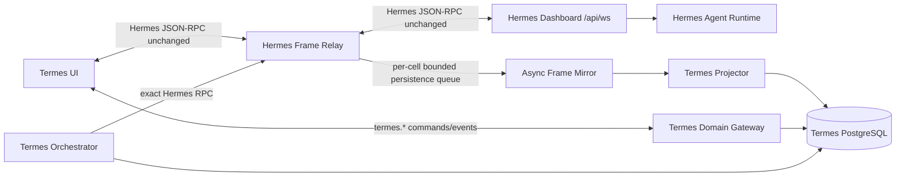

# Hermes × Termes Parity-First Master Plan

## 1. 최종 목표

Termes의 최종 제품 목표는 다음 두 시스템의 장점을 한 제품에서 동시에 제공하는 것이다.

```text
Hermes Agent
  정확한 세션·도구·스트림·모바일/데스크톱 실행 경험
                         +
Termes
  Project First + 전문 에이전트 능동 생성 + Task Graph + Orchestration
  + Device Runtime + Approval + Artifact + Verification
```

Hermes 기능을 Termes식으로 재해석하여 일부만 구현하는 것이 아니다. Hermes의 현재 코드에 존재하는 protocol, session semantics, UI state, tool representation, interaction, performance behavior를 먼저 호환 계층에서 보존하고, Termes 기능을 그 위에 확장한다.

### 성공 정의

- Hermes의 실제 등록 method가 모두 Termes 경유로 동일하게 호출됨
- Hermes의 event name, session scope, payload, 순서가 변경되지 않음
- Hermes Desktop/Mobile에서 가능한 기능이 Termes에서도 접근 가능함
- Hermes의 성능 측정 도구로 Termes를 측정했을 때 환경 변동 범위 안에서 동등함
- Termes가 전문 에이전트를 생성하고 Hermes runtime에 정확히 배치함
- Termes Orchestrator가 Project/Task/Plan/Device/Verification을 관리함
- Hermes runtime 코드를 임의로 단순화하거나 추측으로 재구현하지 않음
- OpenAI 인증은 ChatGPT/Codex OAuth만 사용함
- 1차는 단일 Termes 내부 계정으로 안정화하고, 이후 내부 계정·workspace sandbox를 분리함

## 2. 이 문서의 우선순위

이 문서는 Hermes 통합의 정본이다.

실제 구현 순서, 작업 티켓, 단계별 안정화 Gate는
[`hermes-termes-implementation-execution-plan.md`](./hermes-termes-implementation-execution-plan.md)를 따른다.
실행 계획은 이 문서의 결정을 구체화하며, 두 문서가 충돌하면 이 문서가 우선한다.

다음 문서와 충돌하면 이 문서가 우선한다.

- `hermes-app-termes-recommended-architecture.md`
- `hermes-app-termes-integration-plan.md`
- `hermes-mobile-ui-design-system.md`
- `docs/hermes-os/*`

기존 문서의 분석 결과는 유지하되 다음 이전 설계는 폐기한다.

- Hermes event를 Termes event 이름으로 바꿔 UI에 전달하는 구조
- Hermes 실시간 frame을 Redis Stream과 DB projection을 거친 뒤 UI에 전달하는 구조
- Hermes client/reducer를 Termes에서 새로 비슷하게 작성하는 구조
- `/v1/runs` polling과 `/v1/chat/completions`를 제품 실행 경로로 유지하는 구조
- API Key와 OAuth를 동등한 provider 선택지로 제공하는 구조

## 3. 확인된 코드 기준

### 3.1 Upstream 고정 기준

- Repository: <https://github.com/realfishsam/hermes-agent>
- 기준 commit: [`7fb875451bcef8c379ece6779c6b147eef42c05d`](https://github.com/realfishsam/hermes-agent/tree/7fb875451bcef8c379ece6779c6b147eef42c05d)
- License: MIT, Copyright 2025 Nous Research
- 실시간 server: `hermes dashboard`의 `/api/ws`
- Protocol dispatcher: `tui_gateway/server.py`
- WebSocket transport: `tui_gateway/ws.py`
- Shared JSON-RPC client: `apps/shared/src/json-rpc-gateway.ts`
- Desktop stream reducer: `apps/desktop/src/app/session/hooks/use-message-stream.ts`
- Message model: `apps/desktop/src/lib/chat-messages.ts`
- Desktop route registry: `apps/desktop/src/app/routes.ts`
- Mobile styles: `apps/mobile/src/styles.css`
- Theme: `apps/desktop/src/themes/*`

### 3.2 정적 코드 추출 결과

기준 commit에서 직접 추출한 값이다.

| 항목 | 확인 값 | 추출 근거 |
| --- | ---: | --- |
| 직접 JSON-RPC method | 112 | `@method("...")` decorator unique count |
| project wrapper method | 11 | `@_projects_method("...")`이 내부에서 `method(name)` 등록 |
| 총 runtime method | 123 | 직접 112 + wrapper 11, generated manifest 기준 |
| 명시 Gateway event | 20 | `GatewayEventName` string union |
| 확장 event | 허용 | `GatewayEventName`의 `(string & {})` |
| Desktop route | 9 + session | `APP_ROUTES`와 dynamic session route |
| Desktop test file | 124 | `apps/desktop/src/**/*.test.ts(x)` |
| TUI gateway test file | 16 | `tests/tui_gateway/test_*.py` |
| Stream delta flush floor | 33ms | `STREAM_DELTA_FLUSH_MS` |

이 숫자는 upstream commit이 바뀌면 다시 생성한다. 사람이 숫자나 목록을 직접 관리하지 않는다.

### 3.3 Hermes event frame

Hermes gateway의 event frame은 다음 shape다.

```json
{
  "jsonrpc": "2.0",
  "method": "event",
  "params": {
    "type": "message.delta",
    "session_id": "runtime-session-id",
    "payload": {
      "text": "delta"
    }
  }
}
```

Termes 경유 frame도 이 구조를 유지한다.

다음처럼 변경하지 않는다.

```text
method: event          → runtime.event
type: tool.start       → tool.started
session_id             → runtimeSessionId only
payload.text           → payload.append
```

Termes ID와 Project/Task 관계는 frame을 수정하지 않고 server-side mapping table과 별도 `termes.*` event로 관리한다.

## 4. Architecture: Exact Hermes Core + Termes Extension Plane



### 4.1 Hermes Compatibility Core

Hermes Compatibility Core의 역할:

- Hermes dashboard와 동일 JSON-RPC method 제공
- request ID, result, error code, event frame 보존
- session create/resume/branch/interrupt/steer semantics 보존
- prompt busy/queue/interrupt semantics 보존
- message/reasoning/tool/clarify/approval/sudo/secret event 보존
- file/image/pdf attachment semantics 보존
- process, project tree, rollback, skills, tools, cron, plugins 기능 보존
- 알지 못하는 신규 event도 삭제하지 않고 그대로 전달

Hermes Core에 Termes domain logic을 삽입하지 않는다.

### 4.2 Termes Extension Plane

Termes 기능은 별도 namespace와 저장소를 사용한다.

```text
termes.project.*
termes.task.*
termes.agent_blueprint.*
termes.agent_instance.*
termes.plan.*
termes.device.*
termes.artifact.*
termes.verification.*
termes.policy.*
```

Hermes method/event 이름과 충돌하지 않는다.

### 4.3 Critical path와 Async projection 분리

UI streaming critical path:

```text
Hermes Agent → Dashboard → Frame Relay → Hermes client/reducer → UI
```

Termes durable projection:

```text
Frame Relay → Redis Stream XADD 확인 → UI 전달
                    ↓
              Projector → PostgreSQL
```

DB, Projector, Orchestrator 처리 완료를 기다린 뒤 delta를 UI에 보내지 않는다. 다만 전달된 frame을 복구 불가능하게 잃지 않도록 Redis Stream XADD 성공은 UI 전달보다 먼저 확정한다. 이 queue는 runtime cell별로 분리하여 한 Cell의 Redis 지연·포화가 다른 Cell의 relay queue를 점유하지 않게 한다.

### 4.4 Frame Relay

외부 endpoint:

```text
wss://<termes>/api/hermes/ws?ticket=<single-use-termes-ticket>
```

연결 순서:

1. Termes 사용자 인증
2. Project/profile 접근 권한 확인
3. single-use Termes WebSocket ticket 소비
4. server-side Hermes dashboard ticket 발급
5. Hermes `/api/ws` 연결
6. client ↔ Hermes frame 양방향 relay
7. server가 event frame을 async mirror에 복사

Relay 불변 조건:

- JSON을 parse해 검증할 수 있으나 전달 frame을 재작성하지 않음
- request ID를 변경하지 않음
- Hermes error code/message를 다른 코드로 바꾸지 않음
- event payload 필드를 삭제·축약하지 않음
- delta를 추가 batch하지 않음
- 연결별 backpressure를 명시적으로 처리
- slow client를 위해 Hermes 전체 session을 지연시키지 않음
- mirror publish는 runtime cell별 bounded queue를 사용하고 XADD 성공 뒤 client에 전달

### 4.5 Reconnect

Termes 전용 reconnect 알고리즘을 새로 만들지 않는다. Hermes Desktop의 gateway boot와 session resume 동작을 코드 기준으로 가져온다.

- connection state: idle/connecting/open/closed/error
- connect timeout: upstream client 값 유지
- pending request disconnect rejection 유지
- profile connection lifecycle 유지
- session resume/history hydrate 유지
- visibility/network/wake 처리 유지

Termes domain snapshot 복구는 Hermes reconnect가 끝난 뒤 별도로 수행한다.

### 4.6 단일 계정 안정화 후 Account Cell 확장

구현은 다음 두 배포 단계로 나눈다.

```text
Stage A — Single Account Stability
  shared ChatGPT/Codex OAuth
  + one Termes internal account
  + one default workspace
  + one Hermes runtime cell

Stage B — Account/Workspace Isolation
  same shared OpenAI account authority
  + N Termes internal accounts
  + account-owned workspaces
  + account-scoped runtime cells
  + workspace-scoped execution sandboxes
```

Stage A에서 relay, reducer, reconnect, session mapping, projection을 먼저 안정화한다. Stage B는 이 Hermes compatibility contract를 변경하지 않고 routing과 실행 경계를 확장한다.

Hermes profile은 다음 상태를 분리하는 upstream 기능으로 사용한다.

- config와 model 설정
- memory와 session database
- skills와 plugins
- logs, cron, projects
- profile-scoped `HERMES_HOME`

하지만 Hermes profile 자체를 Termes 내부 계정의 보안 sandbox로 간주하지 않는다. Upstream의 machine dashboard는 여러 profile을 조회·관리할 수 있으며 profile 인증은 global-root auth를 읽는 경로가 있기 때문이다.

Stage B의 보안 경계는 최소한 다음을 함께 분리해야 한다.

```text
internal_account_id
→ account runtime cell
→ account HERMES_HOME / HOME
→ account session/process namespace
→ workspace_id
→ workspace root mount
→ task/agent execution sandbox
```

공유 OpenAI OAuth는 inference identity plane이고, Termes 내부 계정은 authorization/data/execution plane이다. OpenAI 계정을 공유한다는 이유로 내부 계정 간 workspace, session, memory, artifact, secret, process 접근을 허용하지 않는다.

Stage A에서도 모든 소유 관계를 명시적인 default account/default workspace에 귀속한다. global workspace path, owner 없는 runtime session, 사용자가 지정한 임의 profile을 허용하는 API를 새 계약으로 만들지 않는다.

## 5. Source Reuse와 Upstream Sync

### 5.1 재작성하지 않을 핵심 코드

다음 모듈은 동작을 참고해 새로 작성하지 않고, upstream source를 provenance와 함께 동기화하여 재사용한다.

- `apps/shared/src/json-rpc-gateway.ts`
- `apps/desktop/src/lib/chat-messages.ts`
- `apps/desktop/src/lib/chat-runtime.ts`
- `apps/desktop/src/app/session/hooks/use-message-stream.ts`
- session ID와 gateway event helper
- composer queue/input-history 핵심 store
- clarify/approval tool binding logic
- theme color calculation과 적용 순서

React component 결합 때문에 그대로 import할 수 없는 파일도 임의 재구현하지 않는다. upstream snapshot에 명시적 patch series를 적용해 Termes package를 생성한다.

### 5.2 Compatibility source layout

```text
vendor/hermes-compat/upstream/
  apps/shared/src/json-rpc-gateway.ts
  apps/desktop/src/lib/chat-messages.ts
  apps/desktop/src/lib/chat-runtime.ts
  apps/desktop/src/app/session/hooks/use-message-stream.ts
  ...

vendor/hermes-compat/patches/
  0001-termes-import-paths.patch
  0002-termes-domain-slots.patch

packages/hermes-compat/
  generated source

hermes-compat-lock.json
```

`hermes-compat-lock.json`:

```json
{
  "repository": "https://github.com/realfishsam/hermes-agent.git",
  "commit": "7fb875451bcef8c379ece6779c6b147eef42c05d",
  "license": "MIT",
  "files": {},
  "methodManifestSha256": "generated",
  "eventManifestSha256": "generated",
  "routeManifestSha256": "generated"
}
```

실제 file SHA는 sync script가 생성한다. 문서에서 추정 값을 쓰지 않는다.

### 5.3 Sync pipeline

```text
pnpm hermes:sync
  → pinned commit checkout
  → selected source copy
  → license/provenance header 확인
  → patch series 적용
  → method/event/route manifest 생성
  → generated package build
  → upstream tests/Termes contract tests
  → parity report 생성
```

Patch 없는 파일은 upstream과 byte-identical이어야 한다. Patch가 있는 파일은 patch 목적과 관련 test를 필수로 연결한다.

### 5.4 Upstream update

새 commit으로 이동할 때:

1. lock commit 변경
2. manifest diff 생성
3. 신규/삭제/변경 method 확인
4. event payload trace diff 확인
5. route/settings/theme diff 확인
6. patch 재적용
7. upstream test 실행
8. parity test 실행
9. performance A/A와 A/B 재측정
10. 모든 차이가 해소된 뒤 commit 승인

manifest diff가 남은 상태로 release하지 않는다.

## 6. Feature Parity Registry

### 6.1 Registry는 코드에서 생성

수동 `features: { ... }` object를 source of truth로 사용하지 않는다.

추출 대상:

- `tui_gateway/server.py`의 `@method`
- `GatewayEventName`
- `APP_ROUTES`
- settings view constants
- skills/toolsets/plugins command surface
- Desktop bridge API type
- mobile override selector와 capability bridge
- tests와 benchmark scripts

생성물:

```text
artifacts/hermes-parity/methods.json
artifacts/hermes-parity/events.json
artifacts/hermes-parity/routes.json
artifacts/hermes-parity/settings.json
artifacts/hermes-parity/tests.json
artifacts/hermes-parity/performance-scenarios.json
artifacts/hermes-parity/report.md
```

### 6.2 Parity 상태

```ts
type ParityStatus =
  | "exact"
  | "adapted_with_equivalence_test"
  | "not_yet_parity"
  | "blocked_by_upstream";
```

- `exact`: frame/API/source behavior가 동일
- `adapted_with_equivalence_test`: Termes 결합을 위해 변경됐지만 upstream trace와 결과가 동일
- `not_yet_parity`: 아직 동등하지 않음. release gate 실패
- `blocked_by_upstream`: upstream 자체가 실행 불가능하며 코드·issue·test 증거가 있음

`unsupported`, `later`, `probably equivalent` 같은 모호한 판정은 사용하지 않는다.

### 6.3 UI 배치와 기능 보존을 구분

Hermes 기능을 Termes 주 화면에서 모두 같은 깊이로 노출할 필요는 없지만 기능 자체는 제거하지 않는다.

| Termes 위치 | Hermes 기능 |
| --- | --- |
| Conversation | prompt, stream, reasoning, tool, clarify, approval, attachments |
| Activity | process, tree, rollback, artifacts, terminal, tool detail |
| Agent Studio | profiles, agents, skills, tools, plugins, delegation |
| Automations | cron, background prompt, jobs |
| Channels | messaging |
| Settings | model, config, theme, voice, runtime |
| Operator | setup, billing, diagnostics, protocol, raw compatibility surface |

Pet, billing 등 Termes 핵심 작업면에 적합하지 않은 기능도 parity registry에서 삭제하지 않는다. Advanced/Operator 영역에 배치하고 exact compatibility를 유지한다.

## 7. Hermes UI Runtime Parity

### 7.1 Message state

Termes는 Hermes의 rich message semantics를 유지한다.

- ordered text/reasoning/tool parts
- stable tool ID upsert
- tool start/progress/generating/complete
- tool 전 delta flush로 순서 보장
- clarify/approval race 처리
- live final text reconciliation
- background session needs-input
- stored transcript hydrate
- subagent/delegation state

단일 `content: string` message로 축소하지 않는다.

### 7.2 Streaming boundary

Hermes code의 33ms flush floor와 render boundary를 유지한다.

- `ChatRuntimeBoundary`에 고빈도 구독 제한
- App shell, Project rail, Task list는 token store 구독 금지
- `requestAnimationFrame`/timer flush behavior 유지
- tool/boundary event 전 강제 flush 유지
- completion 시 buffer flush와 reconcile 유지

성능 측정 전 임의로 16ms, 50ms 등 다른 값으로 바꾸지 않는다.

### 7.3 DOM compatibility

Upstream benchmark와 UI test를 재사용할 수 있도록 핵심 DOM contract를 유지한다.

```text
data-slot="composer-rich-input"
data-slot="aui_assistant-message-root"
data-slot="aui_thread-content"
data-slot="aui_thread-viewport"
data-slot="aui_turn-pair"
```

Termes visual theme는 변경할 수 있지만 interaction과 measurement selector는 유지한다.

### 7.4 Mobile

Hermes Mobile의 현재 실제 구현은 Desktop renderer를 WebView에서 재사용한다. Termes는 이 사실을 기준으로 기능 parity를 검증한다.

- 동일 conversation runtime 사용
- full-screen mobile overlay semantics 유지
- safe area, 44pt tap target, 16px form input 유지
- desktop-only control을 숨길 때 기능 접근 경로를 별도로 제공
- mobile에서 silent no-op bridge를 만들지 않음

Termes의 visual system은 `hermes-mobile-ui-design-system.md`를 따르되 Hermes 기능과 interaction을 제거하지 않는다.

## 8. OpenAI OAuth-only

OpenAI 사용은 ChatGPT/Codex OAuth로 고정한다.

```text
provider = openai-codex
runtime = codex_app_server
auth mode = chatgpt/oauth
```

API Key, OpenRouter, Anthropic은 OpenAI OAuth 실패 시 대체 경로가 아니다.

Hermes upstream이 다른 provider 기능을 포함하더라도 Termes 제품의 OpenAI 실행 정책은 마스터가 지정한 OAuth-only를 따른다. 이것은 숨은 parity 누락이 아니라 명시적으로 승인된 유일한 제품 정책 차이다.

Parity report에 다음과 같이 기록한다.

```text
provider-key-auth: intentionally disabled by Termes master requirement
openai-codex-oauth: exact
codex-app-server-runtime: exact
```

## 9. Termes 전문 에이전트 능동 생성

### 9.1 역할 분리

Hermes가 소유하는 것:

- agent conversation runtime
- session lifecycle
- model/tool/skill execution
- streaming
- tool callbacks
- delegation/subagent runtime
- transcript

Termes가 소유하는 것:

- Project와 Task intent
- 전문 역할 결정
- Agent Blueprint 생성
- Task Graph와 dependency
- capability/policy/device 배정
- 실행 우선순위와 concurrency
- artifact와 verification contract
- 여러 Hermes session/subagent의 상위 orchestration

### 9.2 Agent Blueprint

```ts
type AgentBlueprint = {
  id: string;
  projectId: string;
  taskId: string;
  taskNodeId: string;
  role: string;
  objective: string;
  workspaceRootId: string;
  hermesProfile: string;
  model: string;
  provider: "openai-codex";
  reasoningEffort: string;
  fast: boolean;
  skillIds: string[];
  toolsetIds: string[];
  capabilityPackageIds: string[];
  memoryScopeIds: string[];
  policyId: string;
  verificationContractId: string;
  parentAgentInstanceId: string | null;
};
```

실제 enum과 필드는 Hermes/Termes 코드 schema를 추출한 뒤 확정한다. 위 type은 소유 관계를 설명하는 설계 shape이며 구현 전에 shared Zod schema로 검증한다.

### 9.3 능동 생성 흐름

```text
Task intent
  → Termes Context Engine
  → capability/skill/tool/device 후보 조회
  → Task Graph 생성
  → 각 node의 전문 역할 결정
  → Agent Blueprint 생성·감사 기록
  → Hermes profile/session 생성
  → exact prompt.submit
  → Hermes delegation/subagent 실행
  → Termes Artifact/Verification projection
  → 실패 원인에 따라 graph 재계획 또는 사용자 승인
```

### 9.4 Hermes method를 기준으로 생성

전문 에이전트 생성기가 존재하지 않는 Hermes parameter를 만들어내지 않는다.

기준 commit의 `session.create`가 직접 받는 것으로 확인된 주요 값:

- `cols`
- `messages`
- `title`
- `parent_session_id`
- `cwd`
- `source`
- `profile`
- `model`
- `provider`
- `reasoning_effort`
- `fast`
- `close_on_disconnect`

Blueprint를 Hermes에 반영할 때 이 실제 계약, `config.*`, `skills.*`, `tools.*`, profile 기능을 사용한다. Blueprint 필드에 대응하는 공식 hook이 없으면 다음 중 하나만 허용한다.

1. upstream에 기능을 구현하고 test와 함께 반영
2. Termes initial prompt/context로 명시적으로 전달
3. parity report에 `not_yet_parity`로 기록하고 release 차단

upstream 내부 파일 문자열 치환이나 존재하지 않는 parameter 전달로 해결하지 않는다.

### 9.5 Subagent 결합

Hermes에 이미 존재하는 다음 runtime을 다시 구현하지 않는다.

- `delegation.pause`
- `delegation.status`
- `subagent.interrupt`
- `spawn_tree.list/load/save`
- subagent event/store

Termes Task Graph node와 Hermes runtime ID를 mapping한다.

```text
task_node_id
  ↔ agent_blueprint_id
  ↔ agent_instance_id
  ↔ hermes stored_session_id
  ↔ hermes live session_id
  ↔ hermes subagent/task identity
```

Hermes가 node 내부 실행을 담당하고 Termes는 node 간 dependency와 검증을 담당한다.

## 10. Orchestration

### 10.1 단일 실행 경로

초기 Task와 후속 사용자 메시지를 다른 runtime path로 처리하지 않는다.

```text
Task initial execution → Hermes session.create/prompt.submit
Follow-up             → same Hermes session/prompt.submit
Steer                 → session.steer
Interrupt             → session.interrupt
Branch                → session.branch or session.create parent_session_id
```

`/v1/runs` polling path를 제거한다.

### 10.2 Projector

Projector는 Hermes event를 바꾸지 않고 관찰하여 Termes 상태를 갱신한다.

- session mapping
- turn/message final boundary
- tool/artifact link
- approval/clarify pending state
- Task/Plan state
- Device command link
- Verification result

`message.delta`를 token 단위로 PostgreSQL에 저장하지 않는다. Hermes transcript가 conversation source이고, Termes DB는 Project/Task/Verification projection을 소유한다.

### 10.3 Orchestration 실패 처리

- Hermes error를 Termes가 성공으로 바꾸지 않음
- OAuth 실패 시 다른 provider로 전환하지 않음
- tool 실패를 임의로 completed 처리하지 않음
- validation에 실패한 event를 현재 Task에 추측해서 붙이지 않음
- session ID가 불명확하면 projection을 중단하고 trace를 보존
- 재계획은 Hermes 실패를 숨기는 fallback이 아니라 새 Termes Plan revision으로 기록

## 11. Performance Parity

### 11.1 임의 목표 수치 금지

현재 Hermes와 Termes를 동일 환경에서 측정한 결과가 없으므로 이 문서는 latency millisecond나 FPS 합격 숫자를 추정하지 않는다.

성능 gate는 실제 측정으로 만든다.

### 11.2 Upstream 측정 도구

기준 code에 존재하는 측정 도구를 사용한다.

- `measure-submit.mjs`
  - composer clear latency
  - user message render latency
  - next paint latency
- `measure-real-stream.mjs`
  - real first stream start
  - rAF frame histogram
  - slow/very slow frame
  - long task count/duration
  - streaming message mutation rate p50/p95
  - text growth rate
- `leak-typing.mjs`
  - JS heap
  - DOM node
  - event listener
  - layout/style recalculation growth
- `measure-latency.mjs`
- `measure-synthetic-stream.mjs`
- `profile-real-stream.mjs`
- `profile-typing.mjs`
- `measure-jump.mjs`

### 11.3 측정 환경

Hermes와 Termes를 다음 조건으로 맞춘다.

- 동일 machine
- 동일 OS/runtime version
- 동일 browser/Electron version
- 동일 Hermes commit/image
- 동일 ChatGPT OAuth account/workspace
- 동일 model/reasoning/fast 설정
- 동일 prompt corpus
- 동일 repository/session history
- 동일 network window
- 동일 warm/cold run 구분

### 11.4 A/A 후 A/B

환경 변동을 추정으로 정하지 않는다.

1. Hermes를 두 독립 run group으로 반복 측정
2. Hermes A/A 분산과 confidence interval 계산
3. Hermes와 Termes A/B 측정
4. Termes 차이가 Hermes A/A 변동 envelope 안인지 판정

합격 margin은 임의의 5%, 10ms로 정하지 않고 A/A 결과에서 산출한다.

### 11.5 Critical path budget

각 구간을 별도 trace한다.

```text
composer input
→ client request serialization
→ Termes relay ingress
→ Hermes dashboard ingress
→ prompt accepted
→ message.start
→ first message.delta
→ Termes relay egress
→ reducer flush
→ DOM mutation
→ paint
```

Termes 고유 overhead는 relay ingress/egress와 extension slot뿐이어야 한다. DB, Redis, Projector 시간은 streaming critical path에 포함되지 않아야 한다.

## 12. Test Parity

### 12.1 Upstream test를 기준으로 사용

현재 확인된 test file count는 기준 commit에서 Desktop 124, TUI gateway 16이다. 다음 sync에서 숫자를 고정하지 않고 manifest로 갱신한다.

Test 분류:

- JSON-RPC envelope/error/transport
- session create/resume/branch/history/undo
- prompt/queue/interrupt/steer
- tool/reasoning/message stream
- clarify/approval
- composer/IME/attachment
- route/reconnect/session cache
- project tree/file/review/terminal
- skills/tools/settings/profile/theme
- subagent/delegation
- mobile bridge/overlay
- performance/leak

### 12.2 Golden trace

실제 Hermes gateway session을 recording하여 secret을 제거한 golden trace를 만든다.

```text
request frames
response frames
event frames
timestamps
session mapping
expected rich message projection
expected DOM state
```

같은 trace를 upstream reducer와 Termes compatibility reducer에 재생한다.

검증:

- frame equality
- event order equality
- message part equality
- tool state equality
- interaction state equality
- final transcript equality
- DOM semantic snapshot equality

### 12.3 Unknown event

`GatewayEventName`이 확장 string을 허용하므로 Termes도 unknown event를 drop하지 않는다.

- relay: 그대로 전달
- compatibility client: onAny 전달
- projector: 저장 가능한 bounded audit metadata 기록
- UI: 일반 화면을 깨지 않고 operator trace에서 확인

## 13. Parity Release Gate

Release 전 자동 생성 report가 다음을 만족해야 한다.

```text
methods: 123/123 exact or adapted_with_equivalence_test
events: 20/20 known + unknown passthrough
routes: upstream route manifest fully mapped
tests: selected upstream suites passing
golden traces: no unexplained diff
performance: within measured Hermes A/A envelope
oauth: openai-codex authenticated
termes extensions: Project/Task/Agent/Plan/Device/Verification passing
```

upstream update로 총 runtime method가 124개가 되면 gate도 자동으로 124개를 요구한다.

허용되는 미해결 항목:

- upstream 자체 test로 재현되는 upstream bug
- 마스터가 명시적으로 승인한 OAuth-only provider 정책

그 외 `not_yet_parity`가 하나라도 있으면 parity release로 표시하지 않는다.

## 14. 구현 순서

구현은 **단일 내부 계정에서 연결·데이터를 안정화한 뒤 계정·workspace sandbox를 분리하고, 그 위에 기능과 UI를 올리는 순서**로 고정한다.
상세 작업과 Gate는 `hermes-termes-implementation-execution-plan.md`가 정본이다.

### Phase 0. Upstream lock과 manifest

- `hermes-compat-lock.json`
- method/event/route/test extractor
- parity report generator
- MIT license/provenance 보존

Gate:

- 기준 commit의 직접 method 112개, project wrapper method 11개, 총 123개와 known event 20개가 자동 추출됨

### Phase 1. ChatGPT/Codex OAuth-only readiness

- device-code login broker
- ChatGPT OAuth status
- openai-codex/codex_app_server readiness
- API Key/provider alternative 제거

Gate:

- API key 없는 환경에서 OAuth login → Hermes prompt 실행
- token이 client, log, DB, event에 노출되지 않음

### Phase 2. Exact Frame Relay

- Termes ticket/auth
- Hermes dashboard ticket
- unchanged bidirectional relay
- non-blocking mirror
- frame recording harness

Gate:

- representative JSON-RPC frame byte/semantic equality
- error code와 event payload diff 없음

### Phase 3. Hermes compatibility package

- JSON-RPC client
- message model/reducer
- session/prompt stores
- clarify/approval binding
- reconnect logic

Gate:

- golden trace projection equality
- selected upstream unit tests 통과

### Phase 4. Session continuity와 async projection

- reconnect/session resume/history hydrate
- bounded non-blocking mirror
- idempotent Termes projector
- Task ↔ Hermes stored/live session mapping
- 장애 주입과 golden trace

Gate:

- reconnect 후 동일 transcript로 수렴
- projector 장애가 streaming을 막지 않음
- 재처리에도 durable projection 중복 없음

### Phase 5. 연결·데이터 안정화 통합 Gate

- OAuth, relay, reducer, reconnect, projector E2E
- slow client, dashboard restart, network cut, queue saturation test
- direct Hermes와 Termes golden trace 비교

Gate:

- unexplained trace diff 없음
- 기존 REST/SSE 실행 경로 없이 E2E 통과
- 이 Gate 전에는 제품 visual UI 재설계를 시작하지 않음

### Phase 6. Internal Account Cell과 workspace sandbox

- 기존 데이터를 명시적인 default account/default workspace에 귀속
- internal account → workspace → project → task → runtime session 소유권
- account-scoped runtime cell, `HERMES_HOME`, `HOME`, process/session namespace
- workspace-scoped mount와 task execution sandbox
- shared OpenAI OAuth credential owner의 단일 refresh 경계
- account별 relay, backpressure, projector, artifact/secret/device scope

Gate:

- S0~S5의 단일 계정 golden trace가 격리 routing 후에도 동일
- cross-account REST/WS/DB/filesystem/process 접근 전부 거부
- 한 account의 crash/resource exhaustion이 다른 account에 영향 없음
- OAuth refresh token 복제와 refresh 경쟁 없음
- Hermes machine dashboard/profile switch가 Termes authorization을 우회하지 못함

### Phase 7. Hermes capability parity

- conversation/composer
- sessions/profiles/models
- attachments
- tool/reasoning/interaction
- files/review/terminal/artifacts
- skills/tools/plugins
- cron/messaging/agents
- settings/theme/voice

Gate:

- generated route/feature manifest 전체 매핑

### Phase 8. Termes active specialist agents

- Task intent/context
- Agent Blueprint
- capability/skill/tool/device assignment
- Hermes profile/session creation
- subagent/task-node mapping

Gate:

- Task가 요구 역할에 맞는 전문 agent graph를 생성
- 모든 실행은 exact Hermes RPC 사용

### Phase 9. Termes orchestration/verification

- dependency graph
- approvals
- device execution
- artifacts/checkpoints
- verification contract
- re-plan revision

Gate:

- Project → Task → specialist agents → Hermes execution → verification E2E
- `/v1/runs` polling과 blocking completion 실행 경로 제거

### Phase 10. UI Design System과 Desktop 적용

- rich conversation runtime boundary
- Hermes feature 접근 경로
- Termes Project/Task/Agent Graph 정보 구조
- typography, theme, spacing, component token
- Activity/Artifact/Verification workspace

Gate:

- token마다 app shell rerender 없음
- Desktop 기능 manifest 전체 접근 가능
- semantic DOM/benchmark slot 유지

### Phase 11. Mobile parity와 UI 정제

- same compatibility runtime
- list/conversation/detail
- safe area/keyboard/touch
- mobile bridge capability

Gate:

- mobile 기능 manifest 전체 매핑
- silent no-op 없음

### Phase 12. Performance parity

- upstream script import
- Hermes A/A baseline
- Hermes/Termes A/B
- critical path tracing
- memory/leak gate

Gate:

- Termes 결과가 측정된 Hermes A/A envelope 안에 있음

### Phase 13. Release cutover

- S0~S12 evidence 동결
- production-like account/workspace migration 검증
- exact JSON-RPC write path 전환
- legacy runtime caller/endpoint 제거
- OAuth-only smoke/doctor와 generated parity report 실행

Gate:

- generated parity report에 미해결 diff 없음
- legacy REST/SSE와 provider API key 실행 경로가 남지 않음
- cross-account authorization/sandbox test 전체 통과

## 15. 현재 Termes에서 우선 제거·변경할 항목

- `services/orchestrator/src/main.ts`
  - `/v1/runs` 생성·750ms polling
- `apps/api/src/server.ts`
  - blocking `/v1/chat/completions` 후 최종 text만 저장하는 Task message path
- `apps/web/src/api.ts`
  - Hermes event를 `event/data` compact string으로만 처리하는 parser/UI
- `apps/web/src/main.tsx`
  - string-only chat message rendering
  - event마다 전체 runtime refetch
- `services/hermes-manager/src/main.ts`
  - upstream frame을 Termes식 subset API로 재구성하는 중심 역할
  - API Key 또는 OAuth readiness
  - auth file 직접 parsing
- `infra/hermes-agent/Dockerfile`
  - `latest` image
  - upstream 내부 source 문자열 patch
- `infra/compose/docker-compose.yml`
  - OpenAI/OpenRouter/Anthropic provider key 전달

변경 후 `hermes-manager`는 upstream lifecycle, OAuth readiness, control connection을 관리하되 UI frame critical path를 재해석하지 않는다.

## 16. 완료 정의

> 2026-07-12 구현 메모: 실제 Docker dashboard, 단일 ChatGPT OAuth authority, `gpt-5.6-sol`, exact JSON-RPC 경로에서 3개 전문 agent 병렬 협업과 verified mobile response가 완료됐다. A/B Account Cell은 별도 Hermes home·workspace·run mount·network로 동시 실행됐고, HttpOnly account session principal로 공개 UI·REST·SSE·ticket·GitHub·workspace 경계가 전환됐다. 로그인 후 A/B 실제 Hermes Task가 각각 기대 문자열을 반환하고 8/11 frame을 자기 workspace에만 저장했다. 전역 Hermes operator state와 공유 OAuth mutation은 OAuth admin 전용이며, account/task-scoped Raw Operator에서 119 exact method를 실행할 수 있다. B의 실제 `session.list`는 B stored session 4개만 반환했다. 첫 frame race, mirror 무음 유실, cell 간 queue 결합, projector 역순 경쟁, 개별 RPC timeout, OAuth refresh token 복제, outbox DLQ, SSE scope/resume race, 초기 replay refetch 폭주, Nginx WebSocket upgrade 누락을 수정했다. 전체 테스트 36개, 공식 인증 smoke 14개 그룹, Projector 강제 재시작 복구, production build 및 실행 서비스 health를 통과했다. 상세 증거는 `hermes-termes-implementation-execution-plan.md` 2.0을 정본으로 삼는다.

다음 시나리오가 실제 코드와 측정으로 모두 증명되어야 한다.

1. ChatGPT/Codex OAuth 로그인
2. Project 선택과 Task 생성
3. Termes가 Task Graph와 전문 Agent Blueprint 생성
4. Hermes profile/session을 실제 contract로 생성
5. prompt.submit과 streaming frame이 변경 없이 UI에 전달
6. reasoning/tool/clarify/approval/subagent가 Hermes와 동일하게 동작
7. Termes가 Plan/Device/Artifact/Verification을 별도 확장 계층으로 연결
8. session resume/branch/interrupt/steer가 동일하게 동작
9. Desktop/Mobile의 기능 registry가 upstream과 일치
10. golden trace에 unexplained diff 없음
11. 성능 결과가 Hermes A/A 변동 envelope 안에 있음
12. upstream method/event 추가 시 Termes release gate가 자동 실패하고 구현을 요구함
13. API Key 없이 전 기능이 동작함
14. Hermes 장점과 Termes 능동 전문 에이전트·오케스트레이션이 한 Task에서 동시에 작동함
15. 공유 OpenAI OAuth 아래 내부 계정별 runtime cell, workspace, session, process, artifact가 교차 노출 없이 격리됨
