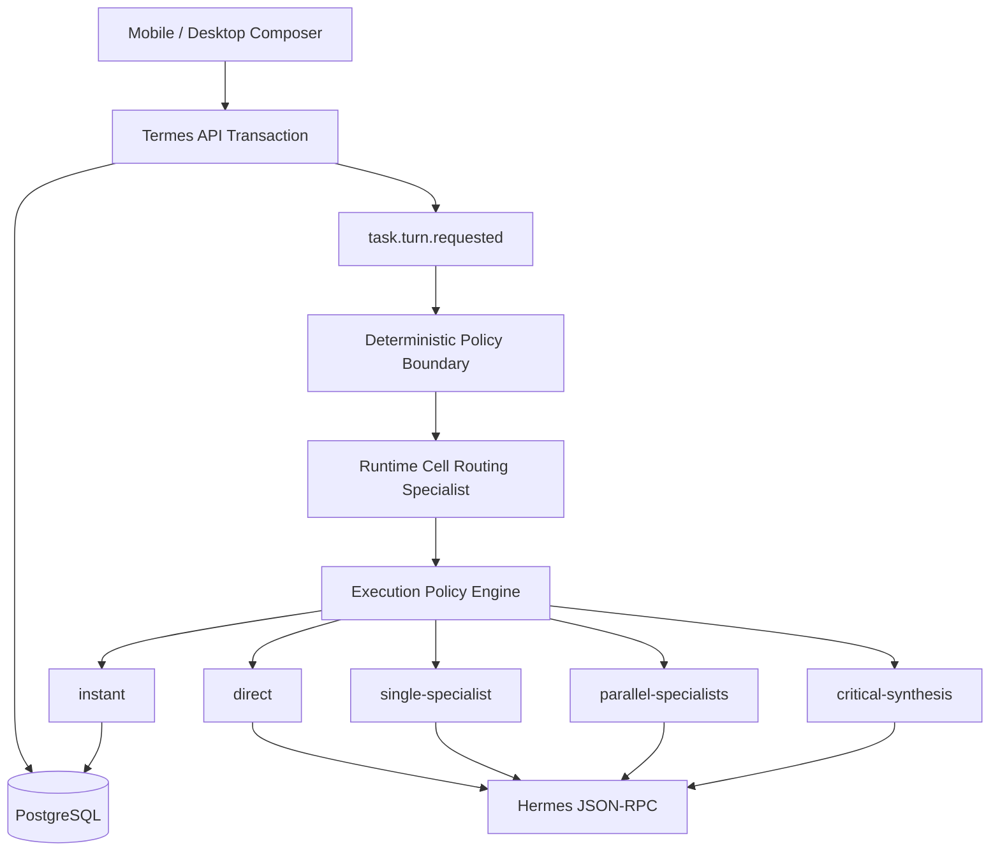

# Termes 상시 Routing Specialist 구현 계획

## 1. 문서 목적

이 문서는 Termes의 질문 분류와 실행 경로 선택을 현재의 정규식 기반 동적 위임 구조에서 다음 구조로 전환하기 위한 구현 정본이다.

```text
결정적 정책 경계
→ Runtime Cell별 상시 준비형 Routing Specialist
→ Execution Policy Engine
→ 즉시 응답 / 직접 Hermes 응답 / 단일 전문가 / 병렬 협업 / 중요 작업 검증
```

최종 목표는 짧고 단순한 질문을 불필요한 전문 에이전트 생성 없이 빠르게 응답하면서, 제품 코드 작성·완성·보안·운영 작업은 현재 코드와 실행 증거를 기반으로 필요한 전문 에이전트를 정확하게 구성하는 것이다.

이 문서의 완료 조건은 계획 작성이 아니라 아래 구현 Gate 전체 통과다.

## 2. 확정 목표

### 2.1 제품 목표

1. 질문을 분류하는 전문 에이전트는 질문마다 생성하지 않는다.
2. 각 Termes Runtime Cell은 독립된 Routing Specialist 세션을 상시 준비 상태로 유지한다.
3. `응답해볼래?`와 같은 대화형 요청은 Coordinator와 동적 전문 에이전트를 생성하지 않고 한 번의 Routing Specialist 응답으로 완료한다.
4. 일반 설명·요약은 기존 Task Hermes 세션을 재사용하는 direct 경로에서 처리한다.
5. 코드 작성·수정·완성 요청은 `implementation`으로 분류하고 현재 코드 확인, 구현, 테스트, 빌드, 실행 검증을 완료 조건으로 강제한다.
6. 보안·OAuth·운영 배포·삭제·마이그레이션·계정 격리 작업은 중요 경로보다 낮게 분류할 수 없다.
7. 전문 에이전트는 실제 독립 작업 경계가 있을 때만 생성한다.
8. 질문별 분류 결과와 실행 증거를 Turn 단위 불변 이력으로 보존한다.
9. 계정·Workspace·Runtime Cell 격리는 기존 보안 경계를 그대로 유지한다.
10. OpenAI 실행 인증은 기존 ChatGPT/Codex OAuth만 사용하며 API Key 경로를 추가하지 않는다.

### 2.2 성능 목표

운영 서버에서 실제 ChatGPT OAuth와 Hermes Runtime을 사용해 다음 기준을 만족해야 한다.

| 구간 | 목표 |
| --- | ---: |
| 결정적 정책 경계 | p95 10ms 이하 |
| 상시 Routing Specialist 분류 완료 | p95 2초 이하 |
| `instant` 전체 응답 완료 | p95 3초 이하 |
| `direct` 첫 텍스트 이벤트 | p95 4초 이하 |
| 단일 전문 에이전트 시작 | p95 6초 이하 |
| 질문 접수부터 실행 경로 결정 | p99 3초 이하 |
| Scheduler polling으로 추가되는 대기 | 0ms |

성능 수치는 최소 100개 Turn 실행 결과로 계산한다. 평균값만으로 통과 처리하지 않는다.

### 2.3 정확성 목표

| 항목 | 완료 기준 |
| --- | --- |
| 작업 제목에 의한 현재 질문 오분류 | 0건 |
| 중요 위험 질문의 `instant`/`direct` 오분류 | 0건 |
| 명시적 코드 변경 요청의 비실행 경로 오분류 | 0건 |
| 단순 대화의 전문 에이전트 생성 | 0건 |
| 계정 간 Router 문맥 또는 Session 혼입 | 0건 |
| 완료 증거 없는 제품 완성 판정 | 0건 |
| 동일 Turn 중복 실행 | 0건 |

정확성은 실제 사용 문장을 포함한 고정 Golden Dataset과 운영 Shadow 결과의 confusion matrix로 판정한다.

## 3. 현재 코드 기준 문제 정의

현재 구현은 다음 동작을 한다.

1. `buildSpecialistBlueprint(title, instructions)`가 오래된 Task 제목과 현재 요청을 같은 비중으로 합친다.
2. 정규식에 한 번 일치하면 의미나 문장 관계와 무관하게 도메인을 추가한다.
3. `light`도 최소 한 명의 전문 에이전트를 만든다.
4. `collaboration: direct`여도 Coordinator prompt가 `delegate_task`를 정확히 한 번 호출하도록 강제한다.
5. 질문마다 Coordinator Soul, Runtime Session, Agent Run을 새로 만든다.
6. `executeHermesJsonRpcRun`은 질문마다 WebSocket 연결과 `session.create`를 수행한다.
7. 정상 완료는 필수 `subagent.complete` 수와 delegation ledger를 전제로 한다.
8. 후속 메시지는 기존 Task Plan과 Orchestration Blueprint를 삭제해 질문별 결정 이력을 잃는다.
9. Orchestrator는 Runtime Cell마다 1초 polling으로 새 작업을 발견한다.
10. direct 대화에도 Task Plan, Checkpoint, Artifact, Verification이 생성된다.

이 구조에서는 분류 이름만 `direct`일 뿐 실제 실행은 direct가 아니다.

## 4. 설계 불변 조건

다음 조건은 구현 과정에서 변경하지 않는다.

- Hermes JSON-RPC method, event 이름과 payload 의미를 Termes가 재정의하지 않는다.
- ChatGPT/Codex OAuth authority는 Hermes Manager가 소유한다.
- Router는 다른 Account Cell의 Task, Session, Workspace를 조회할 수 없다.
- 모델 출력만으로 보안·운영·파괴 위험의 최소 실행 등급을 낮출 수 없다.
- Router는 파일, 터미널, 브라우저, 웹 도구를 호출하지 않는다.
- 코드 작성 에이전트는 작업 직전 현재 코드를 다시 읽는다.
- 검증되지 않은 구현을 `completed`로 저장하거나 UI에 완료로 표시하지 않는다.
- 알 수 없는 분류 결과를 임의의 direct 응답으로 처리하지 않는다.
- 분류 실패는 다른 provider나 API Key로 전환하지 않고 같은 OAuth Runtime에서 명시적으로 복구한다.

## 5. 목표 아키텍처



### 5.1 Runtime Cell별 Router

현재 Account Cell 실행 격리를 그대로 사용해 Router를 다음 단위로 소유한다.

```text
Router identity = runtime_cell_id + router_policy_version
```

단일 계정 안정화 단계에는 active Runtime Cell당 Router lane 1개를 둔다. 현재 Orchestrator가 Cell당 하나의 실행만 허용하므로 동시성 의미가 일치한다. 향후 Cell 내 동시 Task를 허용할 때만 lane pool을 확장한다.

Router lifecycle:

```text
Orchestrator startup
→ active Runtime Cell 조회
→ scoped realtime ticket 발급
→ WebSocket 연결
→ router 전용 session.create 1회
→ session.info 준비 확인
→ ready
→ Turn마다 prompt.submit
→ 응답 완료 후 사용자 이력 절단
→ disconnect 시 같은 stored session을 session.resume
→ Cell 비활성화 시 drain 후 session close
```

Router 세션은 다음 설정을 사용한다.

- source: `termes-routing-specialist`
- title: `Termes Routing Specialist`
- cwd: 해당 Cell의 허용된 Workspace root
- `close_on_disconnect: false`
- 도구 사용 금지 지시
- 구조화된 JSON 출력만 허용
- 현재 운영에서 검증된 `openai-codex` 모델 사용
- reasoning effort와 service tier는 실제 Runtime capability 검증 후 명시적으로 고정

### 5.2 문맥 격리

Router는 Task 전체 transcript를 누적 학습 문맥처럼 사용하지 않는다.

입력은 다음으로 제한한다.

```text
current_request
recent_turn_summary
task_state
project_capabilities
policy_minimums
```

작업 제목은 `display_context`로만 전달하며 도메인·위험 점수의 직접 입력으로 사용하지 않는다. 각 분류 완료 후 Hermes의 `truncate_before_user_ordinal` 계약으로 이전 사용자 Turn을 제거한다.

## 6. 질문 분류 계약

### 6.1 RouteDecision

공유 패키지에 다음 계약을 추가한다.

```ts
export type RouteIntent =
  | "conversation"
  | "question"
  | "analysis"
  | "implementation"
  | "operation"
  | "destructive"
  | "control";

export type ExecutionRoute =
  | "system-control"
  | "instant"
  | "direct"
  | "single-specialist"
  | "parallel-specialists"
  | "critical-synthesis"
  | "clarification";

export interface RouteDecision {
  version: 2;
  turnId: string;
  intent: RouteIntent;
  route: ExecutionRoute;
  primaryDomain: QuestionDomain;
  secondaryDomains: QuestionDomain[];
  riskSignals: RiskSignal[];
  evidenceRequirement: "none" | "context" | "tool" | "independent-review";
  contextRequirement: "current-turn" | "recent-summary" | "project-state";
  specialistRoles: SpecialistRole[];
  reasonCodes: string[];
  directAnswer?: string;
}
```

Router 출력은 JSON Schema로 검증한다. 스키마와 맞지 않는 출력은 DB에 결정으로 저장하지 않고 동일 Turn의 routing attempt로 기록한 뒤 같은 Router 세션에서 교정 요청한다. 정해진 횟수 내 유효한 결정을 생성하지 못하면 Turn status를 `failed`, failure code를 `routing_invalid_output`으로 확정한다.

### 6.2 실행 경로

| 경로 | 용도 | Hermes 추론 | 동적 전문가 | 증거 |
| --- | --- | ---: | ---: | --- |
| `system-control` | 중지·취소·세션 제어 | 0 | 0 | API 결과 |
| `instant` | 인사·응답 확인·짧은 대화 | Router 1회 | 0 | 없음 |
| `direct` | 설명·요약·글쓰기·일반 추론 | Direct Session 1회 | 0 | 문맥 |
| `single-specialist` | 단일 영역 분석·구현·검증 | Coordinator + 1 | 1 | 도구 증거 |
| `parallel-specialists` | 2개 이상 독립 영역 | Coordinator + 최대 3 | 2~3 | 교차 검증 |
| `critical-synthesis` | 보안·운영·파괴·격리 | Coordinator + 3 | 3 | 독립 검토 |
| `clarification` | 실행 목표가 결정 불가능 | Router 1회 | 0 | 필요한 입력 명시 |

### 6.3 제품 코드 작성·완성 분류

다음 동사가 실제 변경 목적어와 결합되면 `implementation`으로 분류한다.

```text
작성, 구현, 수정, 적용, 연결, 교체, 마이그레이션, 배포, 완성
```

설명 요청과 실행 요청을 구분한다.

| 요청 | 분류 |
| --- | --- |
| “이 구현이 무엇인지 설명해” | `question/direct` |
| “현재 구현을 분석해” | `analysis/single-specialist` |
| “현재 구현을 수정해” | `implementation/single-specialist` |
| “UI와 API를 연결해 완성해” | `implementation/parallel-specialists` |
| “OAuth 계정 격리를 구현하고 운영 배포해” | `implementation/critical-synthesis` |

`완성` 요청에는 다음 실행 계약을 강제로 추가한다.

```text
현재 코드 재확인
→ 영향 범위 확정
→ 구현
→ 관련 테스트
→ 타입 검사
→ production build
→ 실제 실행 검증
→ 회귀 확인
→ 요청 완료 조건 대조
→ 증거 저장
```

하나라도 실패하거나 수행되지 않으면 `completed`로 전환하지 않는다.

### 6.4 결정적 최소 경로 정책

Execution Policy Engine은 Router의 의미 판단에 다음 하한선을 적용한다.

| 신호 | 허용되는 최소 경로 |
| --- | --- |
| 인사·감사·응답 확인 | `instant` |
| 설명·요약, 도구 불필요 | `direct` |
| 코드·파일·로그의 현재 상태 확인 | `single-specialist` |
| 코드 변경 | `single-specialist` |
| UI+API, API+DB 등 독립 영역 2개 이상 | `parallel-specialists` |
| 운영 배포 | `critical-synthesis` |
| OAuth·권한·비밀정보 변경 | `critical-synthesis` |
| 삭제·DROP·데이터 마이그레이션 | `critical-synthesis` |
| 계정·Workspace·Sandbox 격리 | `critical-synthesis` |

실행 도중 더 높은 위험이 확인되면 다음 방향으로만 승격할 수 있다.

```text
direct → single-specialist → parallel-specialists → critical-synthesis
```

## 7. 데이터 모델 변경

다음 migration 번호는 현재 최신 `013_account_scope_constraints.sql` 다음인 `014`로 고정한다.

### 7.1 `task_turns`

```sql
create table task_turns (
  id uuid primary key default gen_random_uuid(),
  account_id uuid not null references users(id),
  workspace_id uuid not null references account_workspaces(id),
  runtime_cell_id uuid not null references runtime_cells(id),
  project_id uuid not null references projects(id),
  task_id uuid not null references tasks(id) on delete cascade,
  user_message_id uuid not null unique references chat_messages(id) on delete cascade,
  status text not null check (status in (
    'requested', 'routing', 'routed', 'running', 'waiting_approval',
    'completed', 'failed', 'cancelled'
  )),
  failure_code text,
  failure_message text,
  created_at timestamptz not null default now(),
  routed_at timestamptz,
  started_at timestamptz,
  completed_at timestamptz
);
```

상태:

```text
requested
routing
routed
running
waiting_approval
completed
failed
cancelled
```

`runtime_cells(id, account_id, workspace_id)` unique index와 `task_turns`의 대응 composite foreign key를 함께 추가한다. `task_turns(task_id, account_id, workspace_id)`는 migration 013에서 만든 Task 복합 소유권 key를 참조한다. 이 제약으로 애플리케이션 검증과 별개로 Cell과 Task의 계정 경계가 DB에서 강제된다.

### 7.2 `routing_sessions`

Router는 특정 Task 소유가 아니므로 현재 `runtime_sessions.task_id not null`을 완화하지 않는다. 별도 테이블로 Cell 수명주기를 표현한다.

```sql
create table routing_sessions (
  id uuid primary key default gen_random_uuid(),
  account_id uuid not null references users(id),
  workspace_id uuid not null references account_workspaces(id),
  runtime_cell_id uuid not null references runtime_cells(id),
  policy_version integer not null,
  hermes_stored_session_id text,
  hermes_live_session_id text,
  status text not null check (status in ('creating', 'warming', 'ready', 'busy', 'recovering', 'failed', 'closed')),
  last_ready_at timestamptz,
  last_used_at timestamptz,
  created_at timestamptz not null default now(),
  updated_at timestamptz not null default now(),
  unique (runtime_cell_id, policy_version)
);
```

### 7.3 `routing_attempts`와 `route_decisions`

유효하지 않은 모델 출력과 재시도 원인을 원문 없이 추적한다.

```sql
create table routing_attempts (
  id uuid primary key default gen_random_uuid(),
  turn_id uuid not null references task_turns(id) on delete cascade,
  routing_session_id uuid not null references routing_sessions(id),
  attempt integer not null,
  status text not null check (status in ('running', 'valid', 'invalid', 'failed')),
  duration_ms integer,
  error_code text,
  output_hash text,
  created_at timestamptz not null default now(),
  completed_at timestamptz,
  unique (turn_id, attempt)
);
```

```sql
create table route_decisions (
  id uuid primary key default gen_random_uuid(),
  turn_id uuid not null unique references task_turns(id) on delete cascade,
  routing_session_id uuid not null references routing_sessions(id),
  policy_version integer not null,
  intent text not null,
  route text not null,
  primary_domain text not null,
  secondary_domains jsonb not null,
  risk_signals jsonb not null,
  evidence_requirement text not null,
  context_requirement text not null,
  specialist_roles jsonb not null,
  reason_codes jsonb not null,
  routing_duration_ms integer not null,
  decision_hash text not null,
  created_at timestamptz not null default now()
);
```

원문 Router 응답에는 사용자 정보가 포함될 수 있으므로 그대로 중복 저장하지 않는다. 검증된 필드와 canonical JSON hash만 저장한다.

### 7.4 `turn_dispatch_outbox`

기존 `EventOutboxDispatcher`는 Redis Pub/Sub에 발행하므로 구독자가 재시작 중일 때 실행 wake-up 자체는 보존되지 않는다. Turn 실행 요청은 별도 durable dispatch outbox와 Redis Stream consumer group을 사용한다.

```sql
create table turn_dispatch_outbox (
  turn_id uuid primary key references task_turns(id) on delete cascade,
  attempts integer not null default 0,
  available_at timestamptz not null default now(),
  enqueued_at timestamptz,
  last_error text,
  created_at timestamptz not null default now()
);
```

API transaction은 user message, Task Turn, domain event, `turn_dispatch_outbox`를 함께 저장한다. Dispatcher는 `termes.turns` Redis Stream에 Turn ID와 Runtime Cell ID를 기록한 뒤 `enqueued_at`을 설정한다. Orchestrator consumer group은 DB Turn을 claim한 다음에만 `XACK`한다. XADD 이후 DB update 전 장애로 중복 frame이 생겨도 Turn 상태 조건부 update가 중복 실행을 차단한다.

### 7.5 기존 테이블 변경

- `orchestration_blueprints.task_id unique`를 제거한다.
- `orchestration_blueprints.turn_id unique not null`을 추가한다.
- `collaboration`을 실제 실행 경로와 분리하고 `execution_route`를 추가한다.
- `specialist_assignments`는 direct 경로에서 0개를 정상으로 허용한다.
- Task 소유 `runtime_sessions`에는 `purpose = conversation | orchestration`을 추가한다.
- Router Session은 별도 `routing_sessions`에서 `runtime_cell_id + policy_version`으로 하나만 존재하게 한다.

기존 Blueprint와 실행 이력은 migration 중 삭제하지 않는다. 기존 row는 해당 Task의 가장 최근 user message에 연결해 보존한다.

## 8. 이벤트 계약

공유 event type에 다음을 추가한다.

```text
task.turn.requested
routing.started
routing.ready
routing.decided
routing.failed
execution.direct.started
execution.specialists.planned
execution.escalated
task.turn.completed
task.turn.failed
```

흐름:

```text
chat.message.created
→ task.turn.requested
→ routing.started
→ routing.decided
→ execution.*.started
→ Hermes message/subagent events
→ chat.message.completed
→ task.turn.completed
```

API는 user message, `task_turns`, transactional event, `turn_dispatch_outbox` 생성을 하나의 DB transaction으로 처리한다. Orchestrator는 `termes.turns` Redis Stream consumer group으로 즉시 깨어나며 DB row를 `FOR UPDATE SKIP LOCKED`로 claim한다. 1초 Scheduler는 critical path에서 제거하고 장시간 미처리 Turn 정합성 검사만 수행한다.

## 9. 서비스별 구현 범위

### 9.1 `packages/shared`

- Route intent, execution route, risk, domain 계약 추가
- `TaskTurnSummary`, `RouteDecisionSummary` 추가
- routing/turn event type 추가
- API와 UI가 동일 enum을 사용하도록 단일 소스화

### 9.2 `apps/api`

- Task 생성과 후속 message 생성 시 `task_turns`를 함께 생성
- 기존 Blueprint/Plan 삭제 로직 제거
- Turn별 runtime summary 반환
- account/workspace/runtime cell 복합 소유권 검증
- `task.turn.requested` transactional outbox 기록
- `turn_dispatch_outbox` 동시 기록
- 실행 중인 동일 Task의 메시지 정책을 Turn queue 계약으로 명시

초기 구현에서는 Task당 동시에 하나의 active Turn만 허용한다. 다음 Turn은 현재 Turn 완료 뒤 시작하며, Hermes의 busy submit 자동 interrupt 동작에 의존하지 않는다.

### 9.3 `services/orchestrator`

새 모듈:

```text
routing-contract.ts
deterministic-policy.ts
routing-supervisor.ts
execution-policy.ts
turn-dispatcher.ts
```

변경:

- `buildSpecialistBlueprint` 입력을 `RouteDecision + current request`로 변경
- Task title 기반 정규식 분류 제거
- direct Blueprint는 specialist 0명을 생성
- Cell별 Router lifecycle과 health state 추가
- event-driven Turn wake-up 추가
- Redis Stream consumer group과 DB idempotent claim 추가
- instant/direct/specialist runner 분리
- Turn별 상태 전이와 idempotency key 적용
- routing, first-token, specialist-start latency 계측

### 9.4 `hermes-json-rpc-runner`

현재 단일 실행 함수를 다음 책임으로 분리한다.

```text
HermesConnection
HermesPersistentSession
HermesDirectRun
HermesSpecialistRun
```

필수 변경:

- 기존 WebSocket connection 재사용
- 새 세션 생성과 기존 세션 resume 명시적 구분
- direct 완료는 `message.complete`로 판정
- specialist 완료는 필수 `subagent.complete`와 evidence barrier로 판정
- direct 재접속 복구는 assistant final message를 사용
- specialist 재접속 복구는 기존 delegation ledger를 유지
- 서로 다른 session event를 같은 Turn에 결합하지 않음
- JSON-RPC request timeout과 전체 Turn timeout을 분리

### 9.5 `services/hermes-manager`

- Cell별 Router readiness를 Orchestrator가 확인할 수 있는 내부 상태 계약 제공
- OAuth readiness와 Router readiness를 구분
- Router가 refresh token이나 auth file 원문에 접근하지 않도록 기존 token broker 경계 유지
- Cell drain 시 Router Session과 WebSocket 종료 순서 보장

### 9.6 `apps/web`

- `분류 중`, `직접 응답 중`, `전문가 구성 중`, `협업 검증 중` 상태 구분
- instant/direct 질문에 전문 에이전트 UI를 표시하지 않음
- Route Decision 상세는 기본 접힘 상태로 제공
- 제품 구현 경로에는 전문가 역할, 검증 단계, 완료 증거 표시
- Turn 단위 SSE 업데이트와 중복 event reducer 검증

## 10. 단계별 구현 계획

### Phase 0 — 기준선과 Golden Dataset

작업:

- 현재 분류 함수에 characterization test 추가
- 운영에서 발생한 단순 질문 지연 trace를 fixture로 고정
- 최소 200개 질문을 intent/route/domain/risk 정답으로 라벨링
- 제목과 현재 질문이 충돌하는 사례 포함
- 한국어, 영어, 혼합 문장과 짧은 후속 질문 포함

Gate R0:

- 현재 오분류가 자동 테스트로 재현됨
- Golden Dataset에 모든 execution route가 포함됨
- 계정·보안 관련 중요 질문 최소 40개 포함

### Phase 1 — Turn 데이터 모델

작업:

- migration 014 작성
- shared type과 event 추가
- API user message transaction에 Turn 생성 결합
- 기존 Blueprint 삭제 제거
- runtime summary를 Turn 기반으로 확장

Gate R1:

- 초기 질문과 후속 질문마다 서로 다른 Turn 생성
- 동일 user message 중복 Turn 0건
- 기존 Blueprint 이력 보존
- A/B Account 교차 조회·변경 403 또는 404 유지
- migration forward 검증 통과
- Stream 중복 delivery에서도 Turn 실행 1회

### Phase 2 — 결정적 정책과 RouteDecision

작업:

- 의미 분류가 아닌 최소 경로 정책 구현
- RouteDecision JSON Schema와 validator 구현
- implementation completion contract 구현
- Golden Dataset policy unit test 작성

Gate R2:

- 중요 위험 질문 direct 분류 0건
- 단순 대화 specialist 분류 0건
- 제목 충돌 오분류 0건
- invalid decision이 DB에 저장되지 않음

### Phase 3 — 상시 Routing Specialist

작업:

- Runtime Cell별 RoutingSupervisor 구현
- boot create/prewarm, ready, prompt, history truncate, resume 구현
- 도구 호출이 발생하면 해당 routing attempt 실패 처리
- Router readiness를 health endpoint에 노출
- Router output latency 계측

Gate R3:

- 질문 100회 동안 Router Session 생성 1회
- 각 질문 이전 사용자 문맥 잔존 0건
- A/B Router stored/live session 완전 분리
- Router `subagent.*`, `tool.*` 이벤트 0건
- WebSocket 강제 단절 후 같은 stored session으로 복구
- p95 분류 2초 이하

### Phase 4 — instant와 direct 실행

작업:

- Router가 `instant` 응답을 RouteDecision에 포함
- direct Hermes Session을 Task별로 유지·resume
- direct runner의 완료·재접속 계약 구현
- direct 경로의 불필요한 Plan, Specialist, Artifact 생성 제거
- assistant source와 verification metadata 분리

Gate R4:

- `응답해볼래?`에 specialist 0명, tool 0회
- instant p95 3초 이하
- direct 첫 텍스트 p95 4초 이하
- direct WebSocket 단절 후 응답 중복 없이 복구
- 후속 direct 질문이 같은 Task Session 문맥을 유지

### Phase 5 — 전문 실행 경로 재구성

작업:

- single/parallel/critical Blueprint 생성기 구현
- 실제 독립 작업 경계에 따른 역할 선택
- 최대 child 3 계약 유지
- 실행 도중 단방향 승격 구현
- evidence/critic/verifier 완료 장벽 유지

Gate R5:

- 단일 코드 수정은 전문가 1명만 생성
- UI+API 통합은 필요한 역할만 생성
- 운영 OAuth 변경은 critical보다 낮게 실행되지 않음
- 필수 전문가 실패 시 전체 Turn completed 금지
- evidence 요구 작업에서 tool count 0이면 실패

### Phase 6 — 제품 코드 완성 계약

작업:

- implementation Task Plan template 구현
- inspect/implement/test/typecheck/build/runtime/regression 단계 기록
- 각 단계의 command, file, test result를 Turn verification에 연결
- “완성” 응답 전에 completion contract 평가

Gate R6:

- 코드만 작성하고 테스트하지 않은 Turn은 completed 불가
- 테스트만 통과하고 production build가 실패한 Turn은 completed 불가
- UI 작업은 지정 viewport 실제 렌더 검증 없이 completed 불가
- 운영 배포 요청은 원격 health/smoke 검증 없이 completed 불가
- 변경 사항과 증거가 같은 Turn에 연결됨

### Phase 7 — 이벤트 기반 실행과 UI

작업:

- 새 Turn event consumer 구현
- polling을 reconciliation scan으로 축소
- routing/execution 상태를 SSE와 mobile UI에 연결
- 중복·역순 event reducer 보강

Gate R7:

- Scheduler 대기 0ms
- 동일 Turn 중복 실행 0건
- instant/direct에서 specialist UI 미표시
- parallel/critical에서 실제 child 상태와 UI 상태 일치
- 390x844 모바일 viewport 회귀 통과

### Phase 8 — 운영 검증과 전환

작업:

- 기존 분류기와 새 Router를 Shadow 실행해 결과 비교
- Golden Dataset, 부하, disconnect, restart, OAuth refresh 시험
- 단일 계정 운영 검증 후 Account Cell A/B 격리 검증
- 운영 서버에서 100개 실제 Turn latency 측정
- 문서와 support matrix 갱신

Gate R8:

- 전체 성능·정확성 목표 통과
- 공식 Hermes smoke 14개 그룹 유지
- 전체 typecheck, build, test 통과
- Compose config와 핵심 container health 통과
- Orchestrator/Manager/Projector 강제 재시작 후 미완료 Turn 복구
- A/B 데이터, Session, event, Router context overlap 0건

## 11. 검증 시나리오

### 11.1 단순 대화

```text
Task title: 테스트2
Current request: 응답해볼래?
Expected: conversation / instant / general / specialist 0 / tool 0
```

### 11.2 설명과 실행 구분

```text
이 OAuth 코드가 하는 일을 설명해
Expected: question / direct

이 OAuth 코드를 수정하고 테스트해
Expected: implementation / single-specialist 이상
```

### 11.3 제품 완성

```text
모바일 질문 입력부터 전문 에이전트 결과 표시까지 완성해
Expected: implementation / parallel-specialists
Required: inspect + implement + test + build + mobile runtime verification
```

### 11.4 중요 작업

```text
공유 OpenAI OAuth 계정 아래 Workspace 샌드박스 격리를 구현하고 운영에 배포해
Expected: implementation / critical-synthesis
Domains: security + software + operations
Required: independent review and runtime evidence
```

### 11.5 문맥 후속 요청

```text
Turn 1: 로그인 화면의 오류 상태를 분석해
Turn 2: 그 부분을 수정하고 완성해
Expected Turn 2: implementation, referenced target resolved from recent summary
```

### 11.6 격리

```text
Account A와 B가 같은 문장을 동시에 제출
Expected: 서로 다른 Router Session, Turn, event, response ownership
```

## 12. 관측 지표

필수 metric:

```text
termes_routing_duration_ms
termes_routing_decision_total{route,intent,domain}
termes_routing_invalid_output_total
termes_router_session_create_total{runtime_cell_id}
termes_router_resume_total{runtime_cell_id}
termes_turn_queue_duration_ms
termes_first_text_duration_ms{route}
termes_specialist_start_duration_ms
termes_specialist_tool_total{role}
termes_execution_escalation_total{from,to}
termes_turn_completion_total{route,status}
```

모든 log와 metric label에는 OAuth token, access code, 사용자 질문 원문을 넣지 않는다. 질문 내용은 Turn ID로만 상관관계를 추적한다.

## 13. 운영 구현 체크포인트 — 2026-07-13

| Gate | 운영 구현 상태 | 검증 증거 |
| --- | --- | --- |
| R0 기준선 | 완료 | 기존 지연 구간과 Hermes JSON-RPC 경로를 분리 측정하고 공식 smoke를 기준선으로 고정 |
| R1 Turn schema | 완료 | migration 014의 `task_turns`, `routing_sessions`, `route_decisions`, attempt, dispatch outbox 적용 |
| R2 policy contract | 완료 | 결정적 위험 하한과 current-turn 우선 정책, 제목 비오염 capability 정책을 자동 테스트로 고정 |
| R3 warm Router | 완료 | Runtime Cell별 저장 세션을 유지하는 상시 Routing Specialist와 stale live/stored session 재생성 적용 |
| R4 instant/direct | 완료 | `응답해볼래?` 운영 응답 140ms, `instant`, routing 0ms, specialist/plan/artifact 0건 |
| R5 specialist routes | 완료 | single/parallel/critical blueprint, 실제 `delegate_task`, 필수 specialist·도구 증거 장벽 적용 |
| R6 implementation completion | 완료 | 제품 완성 요청에 inspect·implement·test·build·runtime verification 계약 강제 |
| R7 event/UI | 완료 | Turn/route/specialist 상태를 durable event와 모바일 runtime 화면에 표시하고 direct 경로에서는 숨김 |
| R8 production verification | 현재 운영 기준 완료 | ai-turtle 운영 배포, 자동 테스트 58개, 공식 Hermes smoke 14그룹, device orchestration smoke 통과 |

이번 운영 검증에서 추가로 확정한 사항은 다음과 같다.

- capability는 Task 제목이 아니라 현재 사용자 지시문만으로 선택한다. 운영용 `smoke` 제목이 `local-mock-device`를 오선택하던 문제를 제거했다.
- 오케스트레이터의 내부 디바이스 명령은 서비스 토큰 외에도 Account ID, Workspace ID, Runtime Cell ID의 활성 조합을 DB에서 검증한다.
- 실행 시작 전에 Hermes stored session이 외부에서 삭제된 경우 `session.resume` 실패 후 동일 workspace에 새 세션을 만들고 현재 Turn을 계속한다.
- Task Plan 조회는 쓰기를 만들지 않는다. 스모크와 UI는 durable dispatch 이후 생성되는 계획을 비동기로 관측한다.
- 프로젝트 삭제 직후 생성·선택 이벤트가 겹쳐도 삭제된 ID를 재사용하지 않으며, 늦게 도착한 목록 응답이 현재 프로젝트와 채팅을 덮어쓰지 않는다.
- 라우터는 실행 경로를 직접 선택하지 않고 `action`, `target`, `scope`, 변경·검사 필요성을 의미 프레임으로 추출한다. 정책 엔진이 경로 상·하한을 적용하며 프로젝트 이름·경로 조회는 `system-context-direct`로 고정한다.
- Orchestration Blueprint와 Runtime Session은 Task가 아니라 Turn ID에 연결한다. 후속 질문의 전문 에이전트 상태가 이전 Turn의 분류와 섞이지 않는다.
- 운영 UI는 `http://100.64.0.9:4180`, API는 host loopback `127.0.0.1:4181`이며, turtlesrv는 사용하지 않는다.

여기서 “완료”는 현재 단일 계정 운영 안정화와 정적 Account Cell 경계에 대한 판정이다. 동적 Account Cell lifecycle, 장시간 p95 표본, Hermes 전체 기능 registry의 최종 cutover는 상위 실행 계획의 후속 release gate로 별도 추적한다.

## 14. 구현 순서와 의존 관계

```text
R0 기준선
→ R1 Turn schema
→ R2 policy contract
→ R3 warm Router
→ R4 instant/direct
→ R5 specialist routes
→ R6 implementation completion
→ R7 event/UI
→ R8 production verification
```

R1 이전에 Router를 붙이지 않는다. Turn ID 없이 분류기를 먼저 구현하면 기존 Task 단위 덮어쓰기 문제를 고착시킨다.

R4 이전에 기존 전문 경로를 제거하지 않는다. direct 완료·복구 계약이 별도로 검증된 다음 경로별 dispatcher를 전환한다.

R8 통과 전에는 전체 트래픽을 새 경로로 확정하지 않는다. Shadow 결과는 사용자 응답을 바꾸지 않고 정확성 비교에만 사용한다.

## 15. 최종 완료 정의

이 계획은 다음 상태에서만 완료된다.

1. Runtime Cell별 Routing Specialist가 상시 ready 상태다.
2. 단순 질문은 3초 p95 안에 전문 에이전트 없이 응답한다.
3. 코드 작성 요청은 실제 변경과 검증 경로로 분류된다.
4. 제품 완성 요청은 구현·테스트·빌드·실행·회귀 증거 없이는 완료되지 않는다.
5. 보안·운영·파괴 작업은 독립 검증 경로를 거친다.
6. 모든 질문의 Route Decision, Blueprint, 실행 결과가 Turn 단위로 보존된다.
7. direct와 specialist의 완료·재접속 의미가 각각 자동 테스트로 검증된다.
8. 모바일 UI가 실제 실행 경로를 과장하거나 축소하지 않고 표시한다.
9. 단일 계정 안정화와 A/B Account Cell 격리 시험을 모두 통과한다.
10. 운영 서버의 실제 ChatGPT OAuth/Hermes 경로에서 성능·정확성 Gate를 통과한다.

이 상태가 Termes 질문 처리 재설계의 확정 목표다.
